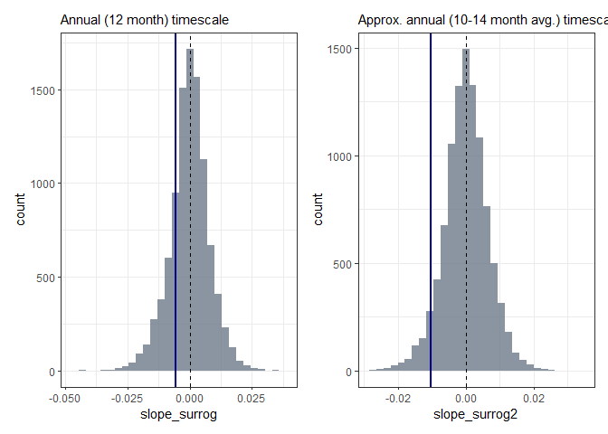

Q: Is there is a decrease in annual timescale synchrony of mosquitos?
================
last edited “2023-12-14”

### Preparation

``` r
### LOAD LIBRARIES ###
library(wsyn)
library(stringr)
library(doParallel) # for paralell processing of surrogate slopes

# libraries for data viz
library(ggplot2)
library(patchwork)
```

``` r
### SET DIRECTORIES ###
#getwd()

# define directories
workDir <- file.path(".")
datDir <- file.path(workDir, "data")

## get time for output end:
hms <- format(Sys.time(), format="%H%M%S")
```

``` r
set.seed(1)
```

## Part I: Culex tarsalis surveillance records

``` r
times<-1:45

############# cx tarsalis data ############# 

dat<-as.matrix(read.csv(file.path(datDir, "neon_cx_tarsalis.csv"), header = T))
dat2<-dat[,-1] ## removes tBin
dat2<-dat2[,-3] ## removes JORN
dat2<-t(dat2)

x<-cleandat(dat2,times,3)$cdat
# 3: time series are (individually) linearly detrended and de-meaned, and variances are standardized to 1
```

#### Step 1 mosquito wpmf

``` r
moswpmf<-wpmf(x,times = times,sigmethod = "aaft")

# get value matrix
gwpmf<-abs(moswpmf$value)
```

##### Details:

<details>
<summary>
Show synchrony value matrix
</summary>

|           |           |           |           |           |           |           |           |           |           |           |           |           |           |           |           |           |           |           |           |           |           |           |           |           |           |           |           |           |           |           |           |           |           |           |           |           |           |           |           |           |           |           |           |           |           |
|----------:|----------:|----------:|----------:|----------:|----------:|----------:|----------:|----------:|----------:|----------:|----------:|----------:|----------:|----------:|----------:|----------:|----------:|----------:|----------:|----------:|----------:|----------:|----------:|----------:|----------:|----------:|----------:|----------:|----------:|----------:|----------:|----------:|----------:|----------:|----------:|----------:|----------:|----------:|----------:|----------:|----------:|----------:|----------:|----------:|----------:|
|       NaN |       NaN |       NaN |       NaN |       NaN |       NaN |       NaN |       NaN |       NaN |       NaN |       NaN |       NaN |       NaN |       NaN |       NaN |       NaN |       NaN |       NaN |       NaN |       NaN |       NaN |       NaN |       NaN |       NaN |       NaN |       NaN |       NaN |       NaN |       NaN |       NaN |       NaN |       NaN |       NaN |       NaN |       NaN |       NaN |       NaN |       NaN |       NaN |       NaN |       NaN |       NaN |       NaN |       NaN |       NaN |       NaN |
|       NaN |       NaN |       NaN |       NaN |       NaN |       NaN |       NaN |       NaN |       NaN |       NaN |       NaN |       NaN |       NaN |       NaN |       NaN |       NaN |       NaN |       NaN |       NaN |       NaN |       NaN |       NaN |       NaN |       NaN |       NaN |       NaN |       NaN |       NaN |       NaN |       NaN |       NaN |       NaN |       NaN |       NaN |       NaN |       NaN |       NaN |       NaN |       NaN |       NaN |       NaN |       NaN |       NaN |       NaN |       NaN |       NaN |
|       NaN |       NaN |       NaN |       NaN |       NaN |       NaN |       NaN |       NaN |       NaN |       NaN |       NaN |       NaN |       NaN |       NaN |       NaN |       NaN |       NaN |       NaN |       NaN |       NaN |       NaN |       NaN |       NaN |       NaN |       NaN |       NaN |       NaN |       NaN |       NaN |       NaN |       NaN |       NaN |       NaN |       NaN |       NaN |       NaN |       NaN |       NaN |       NaN |       NaN |       NaN |       NaN |       NaN |       NaN |       NaN |       NaN |
| 0.1111111 | 0.1558888 | 0.2361581 | 0.3252592 | 0.3988862 |       NaN |       NaN |       NaN |       NaN |       NaN |       NaN |       NaN |       NaN |       NaN |       NaN |       NaN |       NaN |       NaN |       NaN |       NaN |       NaN |       NaN |       NaN |       NaN |       NaN |       NaN |       NaN |       NaN |       NaN |       NaN |       NaN |       NaN |       NaN |       NaN |       NaN |       NaN |       NaN |       NaN |       NaN |       NaN |       NaN |       NaN |       NaN |       NaN |       NaN |       NaN |
| 0.1111111 | 0.1229191 | 0.1415883 | 0.1140867 | 0.3054366 | 0.3357869 | 0.4023583 | 0.4551149 | 0.4185162 | 0.3445372 | 0.2650301 |       NaN |       NaN |       NaN |       NaN |       NaN |       NaN |       NaN |       NaN |       NaN |       NaN |       NaN |       NaN |       NaN |       NaN |       NaN |       NaN |       NaN |       NaN |       NaN |       NaN |       NaN |       NaN |       NaN |       NaN |       NaN |       NaN |       NaN |       NaN |       NaN |       NaN |       NaN |       NaN |       NaN |       NaN |       NaN |
| 0.1111111 | 0.0929409 | 0.0480720 | 0.0616017 | 0.1905323 | 0.3117310 | 0.3717156 | 0.4004095 | 0.3889305 | 0.3180337 | 0.2203674 | 0.2111257 | 0.2288120 | 0.2419402 | 0.2498092 | 0.2602336 |       NaN |       NaN |       NaN |       NaN |       NaN |       NaN |       NaN |       NaN |       NaN |       NaN |       NaN |       NaN |       NaN |       NaN |       NaN |       NaN |       NaN |       NaN |       NaN |       NaN |       NaN |       NaN |       NaN |       NaN |       NaN |       NaN |       NaN |       NaN |       NaN |       NaN |
| 0.1111111 | 0.0707549 | 0.0295094 | 0.0152787 | 0.0504880 | 0.3075730 | 0.3421693 | 0.3685829 | 0.3799351 | 0.3728025 | 0.2002927 | 0.2304487 | 0.2481579 | 0.2529217 | 0.2433732 | 0.2133786 | 0.1606345 | 0.3055189 | 0.3440882 | 0.3949006 |       NaN |       NaN |       NaN |       NaN |       NaN |       NaN |       NaN |       NaN |       NaN |       NaN |       NaN |       NaN |       NaN |       NaN |       NaN |       NaN |       NaN |       NaN |       NaN |       NaN |       NaN |       NaN |       NaN |       NaN |       NaN |       NaN |
| 0.1111111 | 0.0952331 | 0.0201115 | 0.0688411 | 0.1549648 | 0.2574753 | 0.3213171 | 0.3460064 | 0.3458052 | 0.3377030 | 0.3047604 | 0.2822278 | 0.2811710 | 0.2725297 | 0.2472184 | 0.1984226 | 0.1782752 | 0.2537434 | 0.3286961 | 0.4057901 | 0.4753775 | 0.5194373 | 0.5351233 |       NaN |       NaN |       NaN |       NaN |       NaN |       NaN |       NaN |       NaN |       NaN |       NaN |       NaN |       NaN |       NaN |       NaN |       NaN |       NaN |       NaN |       NaN |       NaN |       NaN |       NaN |       NaN |       NaN |
| 0.1111111 | 0.1176427 | 0.0075641 | 0.0930877 | 0.1643041 | 0.2467696 | 0.3297153 | 0.3394948 | 0.2901897 | 0.2693671 | 0.2969296 | 0.3223574 | 0.3254502 | 0.3055584 | 0.2704455 | 0.2120873 | 0.1645932 | 0.2035513 | 0.3025740 | 0.4192067 | 0.5074390 | 0.5470675 | 0.5513230 | 0.5204776 | 0.4659228 | 0.4319201 |       NaN |       NaN |       NaN |       NaN |       NaN |       NaN |       NaN |       NaN |       NaN |       NaN |       NaN |       NaN |       NaN |       NaN |       NaN |       NaN |       NaN |       NaN |       NaN |       NaN |
| 0.1111111 | 0.0570701 | 0.0282306 | 0.1376828 | 0.1554864 | 0.2597774 | 0.4027627 | 0.3523791 | 0.1388751 | 0.1545901 | 0.2522971 | 0.3654468 | 0.3872743 | 0.3543741 | 0.3164871 | 0.2333953 | 0.1166811 | 0.1662577 | 0.2878363 | 0.4452272 | 0.5500525 | 0.5771025 | 0.5699942 | 0.5371401 | 0.4871304 | 0.4382310 | 0.3648916 | 0.2000057 |       NaN |       NaN |       NaN |       NaN |       NaN |       NaN |       NaN |       NaN |       NaN |       NaN |       NaN |       NaN |       NaN |       NaN |       NaN |       NaN |       NaN |       NaN |
| 0.1111111 | 0.0723692 | 0.0544228 | 0.0521686 | 0.2308283 | 0.3178276 | 0.2940218 | 0.3868261 | 0.1504395 | 0.1228158 | 0.2472355 | 0.5434320 | 0.5081454 | 0.4517755 | 0.3916182 | 0.2705804 | 0.0475202 | 0.2831336 | 0.4228818 | 0.5487171 | 0.6030967 | 0.6083381 | 0.5901847 | 0.5547964 | 0.5036000 | 0.4382975 | 0.3418867 | 0.1812423 | 0.0935750 | 0.3621180 |       NaN |       NaN |       NaN |       NaN |       NaN |       NaN |       NaN |       NaN |       NaN |       NaN |       NaN |       NaN |       NaN |       NaN |       NaN |       NaN |
| 0.1111111 | 0.1104322 | 0.1351044 | 0.1420198 | 0.2375343 | 0.3993859 | 0.4872563 | 0.4230526 | 0.2862884 | 0.2281204 | 0.4519521 | 0.6242461 | 0.6678815 | 0.5906038 | 0.4772438 | 0.3647506 | 0.0466724 | 0.3594774 | 0.4525020 | 0.6162225 | 0.6513820 | 0.6372312 | 0.6102254 | 0.5728858 | 0.5181360 | 0.4352942 | 0.3216624 | 0.1835795 | 0.1823375 | 0.3321624 | 0.6783493 | 0.7880276 |       NaN |       NaN |       NaN |       NaN |       NaN |       NaN |       NaN |       NaN |       NaN |       NaN |       NaN |       NaN |       NaN |       NaN |
| 0.1111111 | 0.0826785 | 0.0877416 | 0.1835896 | 0.2838437 | 0.3878497 | 0.4714805 | 0.4143301 | 0.3503338 | 0.3084012 | 0.5264601 | 0.6601928 | 0.6494254 | 0.6031421 | 0.5304519 | 0.4656991 | 0.4175955 | 0.4043997 | 0.3811121 | 0.5935816 | 0.6829457 | 0.6597347 | 0.6285298 | 0.5916610 | 0.5339084 | 0.4302336 | 0.3006151 | 0.2040994 | 0.2500076 | 0.3778144 | 0.6199738 | 0.7710154 | 0.8745456 | 0.9125643 |       NaN |       NaN |       NaN |       NaN |       NaN |       NaN |       NaN |       NaN |       NaN |       NaN |       NaN |       NaN |
| 0.1111111 | 0.0646911 | 0.1025416 | 0.1888586 | 0.2572027 | 0.2939139 | 0.2362693 | 0.3281617 | 0.3369753 | 0.3142609 | 0.3300285 | 0.5212867 | 0.5807151 | 0.5819336 | 0.5504465 | 0.5122152 | 0.4843665 | 0.4537410 | 0.4081856 | 0.4455184 | 0.6987825 | 0.6729647 | 0.6439373 | 0.6114642 | 0.5550747 | 0.4216974 | 0.2734854 | 0.2197771 | 0.2529871 | 0.3685637 | 0.5537627 | 0.7458711 | 0.8710832 | 0.9011024 | 0.9124479 | 0.9197997 |       NaN |       NaN |       NaN |       NaN |       NaN |       NaN |       NaN |       NaN |       NaN |       NaN |
| 0.3333333 | 0.2566444 | 0.1953514 | 0.1909163 | 0.1990845 | 0.1961491 | 0.2128776 | 0.2784005 | 0.3191774 | 0.2961099 | 0.3150963 | 0.4068206 | 0.5038066 | 0.5551305 | 0.5571698 | 0.5389329 | 0.5217482 | 0.5057316 | 0.4955620 | 0.5682277 | 0.6837460 | 0.6763087 | 0.6558599 | 0.6315236 | 0.5871170 | 0.4028609 | 0.2365233 | 0.2293978 | 0.2450997 | 0.3421269 | 0.4816793 | 0.7111113 | 0.8658024 | 0.8859176 | 0.8905887 | 0.8643269 | 0.7825736 |       NaN |       NaN |       NaN |       NaN |       NaN |       NaN |       NaN |       NaN |       NaN |
| 0.3333333 | 0.2814097 | 0.1965927 | 0.1498196 | 0.1357170 | 0.1343335 | 0.1452290 | 0.1581250 | 0.2053529 | 0.2445174 | 0.2721737 | 0.3323514 | 0.4431578 | 0.5405524 | 0.5619957 | 0.5570342 | 0.5492587 | 0.5436338 | 0.5466553 | 0.5902025 | 0.6578555 | 0.6730881 | 0.6644204 | 0.6491190 | 0.6255151 | 0.3586909 | 0.1907135 | 0.2392571 | 0.2305595 | 0.3132017 | 0.4033628 | 0.6434161 | 0.8515622 | 0.8670939 | 0.8666748 | 0.8198280 | 0.7634205 | 0.7953662 |       NaN |       NaN |       NaN |       NaN |       NaN |       NaN |       NaN |       NaN |
| 0.3333333 | 0.2246062 | 0.0702193 | 0.0444250 | 0.0616304 | 0.0705661 | 0.0740702 | 0.0797323 | 0.1350962 | 0.2009941 | 0.2409231 | 0.2751231 | 0.3606235 | 0.5489392 | 0.5655420 | 0.5682790 | 0.5678397 | 0.5677945 | 0.5711540 | 0.5966862 | 0.6430246 | 0.6685486 | 0.6705330 | 0.6619097 | 0.6422973 | 0.4836318 | 0.1741988 | 0.1294398 | 0.2133979 | 0.2891681 | 0.3414697 | 0.4335243 | 0.8163992 | 0.8456612 | 0.8436412 | 0.7960096 | 0.7578073 | 0.7841024 | 0.7935311 | 0.7868978 |       NaN |       NaN |       NaN |       NaN |       NaN |       NaN |
| 0.1111111 | 0.1217588 | 0.0696792 | 0.0189236 | 0.0242071 | 0.0491858 | 0.0718137 | 0.1014556 | 0.1455591 | 0.1972217 | 0.2456505 | 0.2940312 | 0.3855303 | 0.5277391 | 0.5590915 | 0.5712515 | 0.5776610 | 0.5823600 | 0.5808754 | 0.5963642 | 0.6351309 | 0.6657894 | 0.6755197 | 0.6709237 | 0.6472844 | 0.5132686 | 0.2564946 | 0.0893709 | 0.2002044 | 0.2732298 | 0.3190629 | 0.4843609 | 0.7698939 | 0.8235257 | 0.8234877 | 0.7835679 | 0.7562736 | 0.7751951 | 0.7839509 | 0.7723737 | 0.6108591 |       NaN |       NaN |       NaN |       NaN |       NaN |
| 0.1111111 | 0.0926615 | 0.0579721 | 0.0241873 | 0.0282670 | 0.0581565 | 0.0877966 | 0.1188437 | 0.1567283 | 0.2041097 | 0.2599772 | 0.3229603 | 0.4007939 | 0.4885290 | 0.5411777 | 0.5633223 | 0.5763095 | 0.5913046 | 0.5763625 | 0.5890685 | 0.6302060 | 0.6655100 | 0.6802948 | 0.6782136 | 0.6569738 | 0.5119174 | 0.3156508 | 0.1445782 | 0.1955417 | 0.2637839 | 0.3202114 | 0.5000200 | 0.7323654 | 0.8026890 | 0.8068362 | 0.7763369 | 0.7557991 | 0.7680349 | 0.7742983 | 0.7533016 | 0.4880890 | 0.3949080 |       NaN |       NaN |       NaN |       NaN |
| 0.1111111 | 0.1039956 | 0.0786076 | 0.0463771 | 0.0408606 | 0.0688727 | 0.0981326 | 0.1211489 | 0.1540693 | 0.2023383 | 0.2676385 | 0.3336172 | 0.3996457 | 0.4698003 | 0.5211842 | 0.5399515 | 0.5478326 | 0.6010143 | 0.5425155 | 0.5735763 | 0.6266817 | 0.6674534 | 0.6848463 | 0.6836801 | 0.6697492 | 0.6438585 | 0.3710982 | 0.1973619 | 0.2012650 | 0.2557180 | 0.3203992 | 0.5017958 | 0.7083166 | 0.7843674 | 0.7934099 | 0.7715123 | 0.7553567 | 0.7619831 | 0.7645402 | 0.7316160 | 0.4621071 | 0.3371430 | 0.0667001 |       NaN |       NaN |       NaN |
| 0.1111111 | 0.1610199 | 0.1132625 | 0.0773262 | 0.0397538 | 0.0775487 | 0.1141719 | 0.0838610 | 0.1267071 | 0.1846286 | 0.2577334 | 0.3097956 | 0.3935406 | 0.4619846 | 0.5063197 | 0.5027118 | 0.3960783 | 0.3938163 | 0.4624126 | 0.5516987 | 0.6249256 | 0.6713189 | 0.6883840 | 0.6852938 | 0.6741515 | 0.6343043 | 0.4221609 | 0.2462667 | 0.2193188 | 0.2379594 | 0.3093106 | 0.4973906 | 0.6948448 | 0.7687276 | 0.7826125 | 0.7677956 | 0.7545415 | 0.7565099 | 0.7547110 | 0.7124085 | 0.4436517 | 0.2939870 | 0.0539475 | 0.2671599 |       NaN |       NaN |
| 0.3333333 | 0.2831852 | 0.2620233 | 0.2859334 | 0.1726017 | 0.1021937 | 0.1667918 | 0.0945636 | 0.0892654 | 0.2009019 | 0.0775676 | 0.2578487 | 0.3893463 | 0.4584204 | 0.5014618 | 0.5222955 | 0.2891429 | 0.1540788 | 0.3662676 | 0.5307586 | 0.6269851 | 0.6771169 | 0.6898051 | 0.6810184 | 0.6670647 | 0.6229237 | 0.4563169 | 0.2899014 | 0.2519360 | 0.1628048 | 0.2860733 | 0.4853451 | 0.6859606 | 0.7553065 | 0.7738589 | 0.7645385 | 0.7531808 | 0.7512381 | 0.7448871 | 0.6990224 | 0.4169391 | 0.2701713 | 0.0937899 | 0.2708010 | 0.3702497 |       NaN |
| 0.3333333 | 0.3352312 | 0.2420328 | 0.3206697 | 0.2615931 | 0.2079102 | 0.0906876 | 0.2329900 | 0.3029979 | 0.1447867 | 0.0200582 | 0.2837972 | 0.3805672 | 0.4523598 | 0.4941970 | 0.4956649 | 0.3622533 | 0.1537284 | 0.3046804 | 0.5210774 | 0.6361167 | 0.6851339 | 0.6878941 | 0.6696240 | 0.6524404 | 0.6171947 | 0.4742762 | 0.3238877 | 0.2867847 | 0.1285141 | 0.2540135 | 0.4348749 | 0.6717969 | 0.7437249 | 0.7666907 | 0.7613954 | 0.7512126 | 0.7459421 | 0.7351453 | 0.6899146 | 0.3754470 | 0.2675778 | 0.1429775 | 0.2583993 | 0.3670091 | 0.4465868 |
| 0.3333333 | 0.2858678 | 0.3681575 | 0.3076175 | 0.2752429 | 0.3078579 | 0.3943369 | 0.5055024 | 0.3814489 | 0.2552553 | 0.1524115 | 0.1823627 | 0.3976117 | 0.4668652 | 0.4887814 | 0.4773396 | 0.3969795 | 0.2082114 | 0.2962606 | 0.5270631 | 0.6558717 | 0.6955335 | 0.6808108 | 0.6500184 | 0.6310388 | 0.6138514 | 0.4713345 | 0.3410890 | 0.2804410 | 0.1669892 | 0.2208325 | 0.3647000 | 0.6492482 | 0.7341581 | 0.7607718 | 0.7581743 | 0.7486424 | 0.7405266 | 0.7255716 | 0.6804853 | 0.3796361 | 0.2832560 | 0.1908930 | 0.2486199 | 0.3647400 |       NaN |
| 0.1111111 | 0.2892716 | 0.3174429 | 0.3146525 | 0.3156767 | 0.3648179 | 0.4975518 | 0.5297490 | 0.4304222 | 0.3313749 | 0.2828666 | 0.5210721 | 0.5431078 | 0.5110125 | 0.4954443 | 0.4780391 | 0.4315490 | 0.2608750 | 0.2528819 | 0.5492141 | 0.6861129 | 0.7081282 | 0.6642629 | 0.6212133 | 0.6002377 | 0.5965013 | 0.4378192 | 0.3389858 | 0.1774180 | 0.1583834 | 0.2019765 | 0.3963260 | 0.6273086 | 0.7272508 | 0.7558249 | 0.7547652 | 0.7455223 | 0.7349974 | 0.7163098 | 0.6687012 | 0.4489800 | 0.3105947 | 0.2345930 | 0.2495686 |       NaN |       NaN |
| 0.3333333 | 0.3460525 | 0.3549871 | 0.3420051 | 0.3304202 | 0.3418799 | 0.3509562 | 0.4415810 | 0.4556134 | 0.4610940 | 0.4041651 | 0.5211695 | 0.5834610 | 0.5366372 | 0.5040363 | 0.4854441 | 0.4682891 | 0.4167911 | 0.3763843 | 0.4720522 | 0.7084712 | 0.7247463 | 0.6268784 | 0.5845847 | 0.5598885 | 0.4739144 | 0.3962593 | 0.3276215 | 0.1866400 | 0.1341411 | 0.1623628 | 0.3955029 | 0.6115441 | 0.7236596 | 0.7515532 | 0.7511055 | 0.7419361 | 0.7294272 | 0.7075739 | 0.6567816 | 0.4871507 | 0.3427737 | 0.2737931 |       NaN |       NaN |       NaN |
| 0.3333333 | 0.4361718 | 0.4011925 | 0.3575260 | 0.3331017 | 0.3397267 | 0.3669098 | 0.4132372 | 0.4777665 | 0.5322840 | 0.5271415 | 0.5371173 | 0.5533571 | 0.5342105 | 0.5060200 | 0.4913439 | 0.4968817 | 0.5456748 | 0.5861058 | 0.5901288 | 0.7053302 | 0.7514157 | 0.5620498 | 0.5468521 | 0.5182177 | 0.4272272 | 0.3767695 | 0.3168127 | 0.2061665 | 0.1383465 | 0.1720895 | 0.3856601 | 0.6027000 | 0.7234386 | 0.7475873 | 0.7471632 | 0.7379870 | 0.7239221 | 0.6995928 | 0.6470127 | 0.5093292 | 0.3750227 |       NaN |       NaN |       NaN |       NaN |
| 0.5555556 | 0.5083159 | 0.4267416 | 0.3607672 | 0.3305406 | 0.3521329 | 0.3920162 | 0.4262651 | 0.4878104 | 0.5404668 | 0.5600432 | 0.5586829 | 0.5469127 | 0.5241146 | 0.4997308 | 0.4903476 | 0.5141343 | 0.5928388 | 0.6183754 | 0.6299540 | 0.6809719 | 0.6402340 | 0.5334443 | 0.5164556 | 0.4837935 | 0.4035717 | 0.3421277 | 0.3056153 | 0.2186852 | 0.1628764 | 0.1908860 | 0.3762499 | 0.6025672 | 0.7251227 | 0.7434996 | 0.7429319 | 0.7337853 | 0.7185924 | 0.6925369 | 0.6399672 | 0.5249379 |       NaN |       NaN |       NaN |       NaN |       NaN |
| 0.5555556 | 0.4936907 | 0.4105715 | 0.3427295 | 0.2903137 | 0.1839016 | 0.3583703 | 0.4304935 | 0.4946652 | 0.5413915 | 0.5622840 | 0.5667039 | 0.5468750 | 0.5102632 | 0.4832834 | 0.4739999 | 0.4981081 | 0.5852247 | 0.6134464 | 0.6231837 | 0.6522348 | 0.6174734 | 0.5313826 | 0.4948348 | 0.4581834 | 0.3755018 | 0.1929085 | 0.0983094 | 0.2238719 | 0.2013604 | 0.2186984 | 0.3801267 | 0.6377887 | 0.7250473 | 0.7389065 | 0.7384325 | 0.7294395 | 0.7135331 | 0.6864809 | 0.6352970 |       NaN |       NaN |       NaN |       NaN |       NaN |       NaN |
| 0.3333333 | 0.4058932 | 0.3880393 | 0.3370162 | 0.2540229 | 0.2314315 | 0.3409892 | 0.4362233 | 0.5040770 | 0.5333551 | 0.5426691 | 0.5552786 | 0.5423645 | 0.4792834 | 0.4508448 | 0.4294989 | 0.3737156 | 0.5116483 | 0.5844953 | 0.5794298 | 0.6323583 | 0.5918876 | 0.5206926 | 0.4770790 | 0.4383919 | 0.3340037 | 0.1108873 | 0.0881926 | 0.2262610 | 0.2598081 | 0.2732060 | 0.4121108 | 0.6270859 | 0.7197311 | 0.7336154 | 0.7337156 | 0.7250495 | 0.7088136 |       NaN |       NaN |       NaN |       NaN |       NaN |       NaN |       NaN |       NaN |
| 0.7777778 | 0.6923053 | 0.5713560 | 0.4500073 | 0.3180773 | 0.2783837 | 0.3577649 | 0.4596214 | 0.5508613 | 0.6560756 | 0.5839733 | 0.4486974 | 0.3557555 | 0.4072347 | 0.3997107 | 0.3662335 | 0.3511636 | 0.4797156 | 0.5458196 | 0.5179475 | 0.4916758 | 0.5354514 | 0.4988925 | 0.4580457 | 0.4140596 | 0.1784852 | 0.0489498 | 0.0996527 | 0.2286243 | 0.3222278 | 0.3750973 | 0.4609859 | 0.6168810 | 0.7102143 | 0.7277084 | 0.7288594 | 0.7207024 |       NaN |       NaN |       NaN |       NaN |       NaN |       NaN |       NaN |       NaN |       NaN |
| 0.7777778 | 0.7478044 | 0.8278732 | 0.6052776 | 0.3863748 | 0.3153169 | 0.3859683 | 0.5055299 | 0.6390278 | 0.7468570 | 0.5145623 | 0.3729278 | 0.3171180 | 0.3384730 | 0.3409903 | 0.3014792 | 0.3348503 | 0.4489626 | 0.5082161 | 0.5200429 | 0.4468956 | 0.4837206 | 0.4729574 | 0.4360202 | 0.3744765 | 0.1740433 | 0.0574138 | 0.1128984 | 0.2291342 | 0.3521494 | 0.4462975 | 0.5067680 | 0.6205885 | 0.7002820 | 0.7214880 | 0.7239618 |       NaN |       NaN |       NaN |       NaN |       NaN |       NaN |       NaN |       NaN |       NaN |       NaN |
| 0.7777778 | 0.7780561 | 0.7062645 | 0.4877069 | 0.3466549 | 0.3012024 | 0.4108314 | 0.5483346 | 0.6390263 | 0.4941933 | 0.2801985 | 0.2880120 | 0.2987783 | 0.3050879 | 0.2779470 | 0.2016785 | 0.1408739 | 0.3659147 | 0.4594564 | 0.5354365 | 0.4079738 | 0.4525853 | 0.4497054 | 0.4140104 | 0.3422614 | 0.2018946 | 0.0986707 | 0.1261204 | 0.2266450 | 0.3610315 | 0.4846330 | 0.5435944 | 0.6269367 | 0.6921898 |       NaN |       NaN |       NaN |       NaN |       NaN |       NaN |       NaN |       NaN |       NaN |       NaN |       NaN |       NaN |
| 0.7777778 | 0.6824967 | 0.6204389 | 0.4978454 | 0.0896148 | 0.1984306 | 0.4217263 | 0.6715603 | 0.6185532 | 0.3988130 | 0.1936948 | 0.2322393 | 0.2815062 | 0.2346469 | 0.0466246 | 0.0963823 | 0.1465717 | 0.2825714 | 0.3803384 | 0.4926561 | 0.4385186 | 0.4404780 | 0.4321777 | 0.3962618 | 0.3262603 | 0.2187714 | 0.1324471 | 0.1404907 | 0.2238507 | 0.3620111 | 0.5163361 | 0.5723059 |       NaN |       NaN |       NaN |       NaN |       NaN |       NaN |       NaN |       NaN |       NaN |       NaN |       NaN |       NaN |       NaN |       NaN |
| 0.1111111 | 0.2706746 | 0.4345925 | 0.4248456 | 0.3095503 | 0.2461067 | 0.3388856 | 0.3924374 | 0.4686297 | 0.3076374 | 0.1752831 | 0.0644350 | 0.1972376 | 0.1311970 | 0.0155668 | 0.0803495 | 0.1467898 | 0.2305025 | 0.2894873 | 0.5079084 | 0.4573345 | 0.4358378 | 0.4200660 | 0.3843369 | 0.3198886 | 0.2321839 | 0.1593969 | 0.1572295 | 0.2285430 | 0.3547494 |       NaN |       NaN |       NaN |       NaN |       NaN |       NaN |       NaN |       NaN |       NaN |       NaN |       NaN |       NaN |       NaN |       NaN |       NaN |       NaN |
| 0.1111111 | 0.1828032 | 0.2913868 | 0.3127800 | 0.1818009 | 0.2128551 | 0.2432783 | 0.2428566 | 0.1648732 | 0.1876545 | 0.1698780 | 0.1259767 | 0.1495848 | 0.0973808 | 0.0802270 | 0.1065696 | 0.1460038 | 0.2029425 | 0.2944449 | 0.4571265 | 0.4489636 | 0.4287386 | 0.4117645 | 0.3775441 | 0.3182048 | 0.2437312 | 0.1823094 | 0.1757497 |       NaN |       NaN |       NaN |       NaN |       NaN |       NaN |       NaN |       NaN |       NaN |       NaN |       NaN |       NaN |       NaN |       NaN |       NaN |       NaN |       NaN |       NaN |
| 0.1111111 | 0.1454731 | 0.1752028 | 0.1717129 | 0.1649769 | 0.1779718 | 0.1773166 | 0.1435779 | 0.0873130 | 0.1250174 | 0.2110143 | 0.2034412 | 0.2028260 | 0.1839565 | 0.1375383 | 0.1280984 | 0.1422719 | 0.1740806 | 0.2325657 | 0.4107650 | 0.4175022 | 0.4163747 | 0.4061376 | 0.3746113 | 0.3181188 | 0.2535710 |       NaN |       NaN |       NaN |       NaN |       NaN |       NaN |       NaN |       NaN |       NaN |       NaN |       NaN |       NaN |       NaN |       NaN |       NaN |       NaN |       NaN |       NaN |       NaN |       NaN |
| 0.1111111 | 0.0810032 | 0.1482386 | 0.1719659 | 0.1736283 | 0.1610774 | 0.1286775 | 0.0670492 | 0.0632136 | 0.2461098 | 0.2654132 | 0.2531859 | 0.2426078 | 0.2142749 | 0.1671678 | 0.1393615 | 0.1356525 | 0.1467909 | 0.1625032 | 0.2701190 | 0.3724478 | 0.4004056 | 0.4030691 |       NaN |       NaN |       NaN |       NaN |       NaN |       NaN |       NaN |       NaN |       NaN |       NaN |       NaN |       NaN |       NaN |       NaN |       NaN |       NaN |       NaN |       NaN |       NaN |       NaN |       NaN |       NaN |       NaN |
| 0.1111111 | 0.1543292 | 0.1876905 | 0.1897432 | 0.1788350 | 0.1547548 | 0.1031650 | 0.0603404 | 0.1433338 | 0.2382140 | 0.2576688 | 0.2608861 | 0.2639137 | 0.2312502 | 0.1759189 | 0.1411385 | 0.1286178 | 0.1329065 | 0.1562839 | 0.2351385 |       NaN |       NaN |       NaN |       NaN |       NaN |       NaN |       NaN |       NaN |       NaN |       NaN |       NaN |       NaN |       NaN |       NaN |       NaN |       NaN |       NaN |       NaN |       NaN |       NaN |       NaN |       NaN |       NaN |       NaN |       NaN |       NaN |
| 0.3333333 | 0.2992549 | 0.2390826 | 0.1999137 | 0.1752261 | 0.1609689 | 0.1109504 | 0.0916719 | 0.0736422 | 0.1774019 | 0.2010282 | 0.2129440 | 0.2340357 | 0.2158574 | 0.1642180 | 0.1349503 |       NaN |       NaN |       NaN |       NaN |       NaN |       NaN |       NaN |       NaN |       NaN |       NaN |       NaN |       NaN |       NaN |       NaN |       NaN |       NaN |       NaN |       NaN |       NaN |       NaN |       NaN |       NaN |       NaN |       NaN |       NaN |       NaN |       NaN |       NaN |       NaN |       NaN |
| 0.3333333 | 0.3083320 | 0.2520915 | 0.1977479 | 0.1542760 | 0.1124222 | 0.0484774 | 0.0322784 | 0.0281060 | 0.0998906 | 0.1349702 |       NaN |       NaN |       NaN |       NaN |       NaN |       NaN |       NaN |       NaN |       NaN |       NaN |       NaN |       NaN |       NaN |       NaN |       NaN |       NaN |       NaN |       NaN |       NaN |       NaN |       NaN |       NaN |       NaN |       NaN |       NaN |       NaN |       NaN |       NaN |       NaN |       NaN |       NaN |       NaN |       NaN |       NaN |       NaN |
| 0.3333333 | 0.3182851 | 0.2733735 | 0.2130757 | 0.1515783 |       NaN |       NaN |       NaN |       NaN |       NaN |       NaN |       NaN |       NaN |       NaN |       NaN |       NaN |       NaN |       NaN |       NaN |       NaN |       NaN |       NaN |       NaN |       NaN |       NaN |       NaN |       NaN |       NaN |       NaN |       NaN |       NaN |       NaN |       NaN |       NaN |       NaN |       NaN |       NaN |       NaN |       NaN |       NaN |       NaN |       NaN |       NaN |       NaN |       NaN |       NaN |
|       NaN |       NaN |       NaN |       NaN |       NaN |       NaN |       NaN |       NaN |       NaN |       NaN |       NaN |       NaN |       NaN |       NaN |       NaN |       NaN |       NaN |       NaN |       NaN |       NaN |       NaN |       NaN |       NaN |       NaN |       NaN |       NaN |       NaN |       NaN |       NaN |       NaN |       NaN |       NaN |       NaN |       NaN |       NaN |       NaN |       NaN |       NaN |       NaN |       NaN |       NaN |       NaN |       NaN |       NaN |       NaN |       NaN |
|       NaN |       NaN |       NaN |       NaN |       NaN |       NaN |       NaN |       NaN |       NaN |       NaN |       NaN |       NaN |       NaN |       NaN |       NaN |       NaN |       NaN |       NaN |       NaN |       NaN |       NaN |       NaN |       NaN |       NaN |       NaN |       NaN |       NaN |       NaN |       NaN |       NaN |       NaN |       NaN |       NaN |       NaN |       NaN |       NaN |       NaN |       NaN |       NaN |       NaN |       NaN |       NaN |       NaN |       NaN |       NaN |       NaN |
|       NaN |       NaN |       NaN |       NaN |       NaN |       NaN |       NaN |       NaN |       NaN |       NaN |       NaN |       NaN |       NaN |       NaN |       NaN |       NaN |       NaN |       NaN |       NaN |       NaN |       NaN |       NaN |       NaN |       NaN |       NaN |       NaN |       NaN |       NaN |       NaN |       NaN |       NaN |       NaN |       NaN |       NaN |       NaN |       NaN |       NaN |       NaN |       NaN |       NaN |       NaN |       NaN |       NaN |       NaN |       NaN |       NaN |

</details>

##### wpmf plot:

<!-- -->

#### Step 2: Extract timescale values

Extract 12-month timescale (V38) as a function of time, and the average
across approx. 9-14 months (V33-V40). This is synchrony at or near the
annual timescale, as a function of time:


``` r
# at 12 month time scale
gwpmf12<-gwpmf[,38]

# approx. annual timescales (mean)
gwpmf10_14<-rowMeans(gwpmf[,33:40], na.rm = T)
```

#### Step 3 mos wpmf slope

Regress (linear) against time, take the slope call it slope_real

``` r
# 12 month time scale
out1<-lm(gwpmf12 ~ times)
slope_real<- out1$coefficients[2] # times = slope

# approx. annual timescales (mean)
out2<-lm(gwpmf10_14 ~ times)
slope_real2 <- out2$coefficients[2]

slopes_wpmf <- cbind(slope_real, slope_real2)
```

##### real slopes

|       | slope_real | slope_real2 |
|:------|-----------:|------------:|
| times | -0.0058577 |  -0.0102113 |

## Part II: Surrogate data:

#### Step 1 generate surrogates

``` r
## Get synchrony preserving aaft surrogates of your mosquito data
nsurrogs <- 10000  
surrtype <- "aaft"
syncpres <- TRUE
sur <- surrog(x,nsurrogs,surrtype, syncpres) 
```

#### Step 2 sur wpmf slope

``` r
# prepare 
sur_slopes <- data.frame(matrix(nrow = 0, ncol = 2))
colnames(sur_slopes) <- c("slope_surrog","slope_surrog2")
```

``` r
# Define a function to process each iteration

## Note to myself: make column selection dynamic, pull slopes by name rather than index 
## Amy, 12/14/2023

process_iteration <- function(i) {
  x <- i  # Surrogate data
  
  moswpmf <- wpmf(x, times = times, sigmethod = "none")
  
  g <- abs(moswpmf$value)
  g12 <- g[, 38]
  g10_14 <- rowMeans(g[, 33:40], na.rm = TRUE)
  
  out1 <- lm(g12 ~ times)
  slope_surrog <- out1$coefficients[2] # here times = the slope but we get a error when putting in times
  names(slope_surrog) <- "slope_surrog"
  
  out2 <- lm(g10_14 ~ times)
  slope_surrog2 <- out2$coefficients[2]
  names(slope_surrog2) <- "slope_surrog2"
  
  # Return the calculated slopes for this iteration
  return(c(slope_surrog, slope_surrog2))
}
```

``` r
#Set the number of cores for parallel processing
num_cores <- 2  # Adjust as needed
#num_cores <- detectCores(logical = FALSE)

# Create a parallel cluster and register it
cl <- makeCluster(num_cores)
#cl <- makeCluster(floor(0.75 * num_cores)
registerDoParallel(cl)

# Apply the function in parallel
results <- foreach(j = 1:length(sur), .combine = rbind, .packages = "wsyn") %dopar% {
  process_iteration(sur[[j]])
}

# Stop the parallel cluster
stopCluster(cl)


# Combine the results into a data frame
sur_slopes <- as.data.frame(results)

# Save the resulting slope data frame
file.name <- str_c("Surrogate_slopes_", surrtype, "_", length(sur), "_", hms, ".csv")
write.csv(sur_slopes, file.path(datDir, file.name))
```

#### Step 3 wpmf histogram

Make a histogram of slope_surrog -should cluster around 0. Plot the
values slope_real on this histogram and see where it sits. If it’s way
out in the right tail, there’s a significant increase in
annual-timescale synchrony for this system\*

<!-- -->

The dashed line is drawn at x=0.0, the blue line represents the real
slope for the mosquito data for the respective timescale (wpmf)

### objects:

``` r
save(list = c("times", "x", "moswpmf", "sur", "sur_slopes"), file = file.path(datDir, "Cx_tarsalis_10k_rev_dat.RData"))
```
