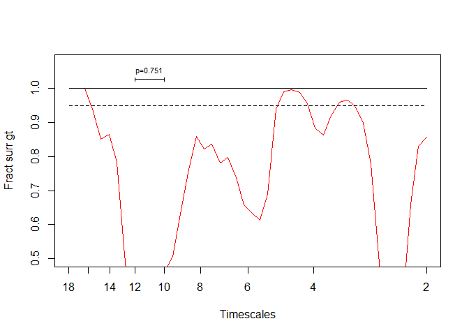

Broadscale spatial synchrony in a West Nile virus mosquito vector across
multiple timescales
================
Amy Bauer,
last edited 2024-04-24

### Preparation

``` r
### LOAD LIBRARIES ###
library(tidyverse)
library(wsyn)
library(stringr)
library(doParallel) # for paralell processing of surrogate slopes

# libraries for data viz
library(ggplot2)
library(patchwork)
library(viridis)
```

``` r
# to make analyses reproducible
set.seed(1)
```

------------------------------------------------------------------------

## Prepare data for analyses

### *Culex tarsalis* data

Monthly mean number of *Culex tarsalis* mosquitoes per trap hour (mmpth)
were calculated for each of the 9 included NEON surveillance sites
(`data/Cx_tarsalis_syn_monthly_mmpth_new.csv`).We then imputed `NA`
values with `0` in preparation of the spatial wavelet analyses
(`data/input/Cx_tarsalis_syn_monthly_mmpth_new_filled.csv`).

<!-- -->

| year | month | tBin |   CLBJ |   CPER |   KONZ |   MOAB |    OAES |   ONAQ |   SRER |   UKFS |    WOOD |
|-----:|------:|-----:|-------:|-------:|-------:|-------:|--------:|-------:|-------:|-------:|--------:|
| 2016 |     4 |    4 | 0.1649 | 0.0000 | 0.0000 | 0.0000 |  0.0358 | 0.1254 | 0.0000 | 0.0000 |  0.0000 |
| 2016 |     5 |    5 | 0.1952 | 0.0000 | 0.0103 | 0.0067 |  0.2105 | 0.0000 | 0.0000 | 0.0056 |  0.0000 |
| 2016 |     6 |    6 | 0.2554 | 0.0054 | 0.2515 | 0.1835 |  1.1251 | 0.0121 | 0.0000 | 0.0344 |  1.6416 |
| 2016 |     7 |    7 | 0.0078 | 0.0407 | 0.0419 | 0.0000 |  0.1136 | 0.0043 | 0.0000 | 0.0142 |  2.1833 |
| 2016 |     8 |    8 | 0.0013 | 0.0374 | 0.6942 | 0.1090 |  0.0268 | 0.0054 | 0.0000 | 0.0118 |  6.9308 |
| 2016 |     9 |    9 | 0.2696 | 0.0761 | 0.3900 | 0.0000 |  0.0530 | 0.0017 | 0.0148 | 0.4827 |  0.1693 |
| 2016 |    10 |   10 | 0.3408 | 0.0000 | 0.0142 | 0.0000 |  1.5665 | 0.0000 | 0.0073 | 0.0036 |  0.0015 |
| 2016 |    11 |   11 | 0.0143 | 0.0000 | 0.0000 | 0.0000 |  0.0063 | 0.0000 | 0.0000 | 0.0000 |  0.0000 |
| 2016 |    12 |   12 | 0.0000 | 0.0000 | 0.0000 | 0.0000 |  0.0000 | 0.0000 | 0.0000 | 0.0000 |  0.0000 |
| 2017 |     1 |   13 | 0.0000 | 0.0000 | 0.0000 | 0.0000 |  0.0000 | 0.0000 | 0.0000 | 0.0000 |  0.0000 |
| 2017 |     2 |   14 | 0.0000 | 0.0000 | 0.0000 | 0.0000 |  0.0000 | 0.0000 | 0.0000 | 0.0000 |  0.0000 |
| 2017 |     3 |   15 | 0.0339 | 0.0000 | 0.0000 | 0.0000 |  0.0103 | 0.0584 | 0.0000 | 0.0000 |  0.0000 |
| 2017 |     4 |   16 | 0.1139 | 0.0000 | 0.0036 | 0.0000 |  0.1248 | 0.0000 | 0.0075 | 0.0196 |  0.0000 |
| 2017 |     5 |   17 | 0.0229 | 0.0000 | 0.1515 | 0.0373 |  1.3935 | 0.0077 | 0.0000 | 0.0745 |  0.0000 |
| 2017 |     6 |   18 | 0.0076 | 0.0197 | 0.0613 | 0.7120 |  0.7051 | 0.0205 | 0.0000 | 0.0045 |  0.1980 |
| 2017 |     7 |   19 | 0.0000 | 0.0549 | 0.0137 | 0.7937 |  0.0167 | 0.0314 | 0.0000 | 0.0000 |  4.7135 |
| 2017 |     8 |   20 | 0.0048 | 0.2215 | 0.1722 | 0.5659 |  0.0191 | 0.1077 | 0.0000 | 0.0181 |  1.4401 |
| 2017 |     9 |   21 | 0.2956 | 0.0456 | 0.1659 | 0.0323 |  5.4598 | 0.0097 | 0.0089 | 0.0992 |  0.0107 |
| 2017 |    10 |   22 | 0.1149 | 0.0000 | 0.0018 | 0.0000 |  0.4987 | 0.0000 | 0.0000 | 0.0900 |  0.0000 |
| 2017 |    11 |   23 | 0.0017 | 0.0000 | 0.0000 | 0.0000 |  0.0000 | 0.0000 | 0.0000 | 0.0000 |  0.0000 |
| 2017 |    12 |   24 | 0.0000 | 0.0000 | 0.0000 | 0.0000 |  0.0000 | 0.0000 | 0.0049 | 0.0000 |  0.0000 |
| 2018 |     1 |   25 | 0.0000 | 0.0000 | 0.0000 | 0.0000 |  0.0000 | 0.0000 | 0.0082 | 0.0000 |  0.0000 |
| 2018 |     2 |   26 | 0.0035 | 0.0000 | 0.0000 | 0.0000 |  0.0000 | 0.0000 | 0.0089 | 0.0000 |  0.0000 |
| 2018 |     3 |   27 | 0.0421 | 0.0000 | 0.0000 | 0.0000 |  0.0083 | 0.0000 | 0.0000 | 0.0000 |  0.0000 |
| 2018 |     4 |   28 | 0.2771 | 0.0000 | 0.0000 | 0.1449 |  0.0487 | 0.0000 | 0.0000 | 0.0000 |  0.0000 |
| 2018 |     5 |   29 | 0.0569 | 0.0058 | 0.1804 | 0.0943 |  0.1777 | 0.0000 | 0.0000 | 0.0000 |  0.0336 |
| 2018 |     6 |   30 | 0.0041 | 0.0219 | 0.0080 | 0.0383 |  0.0699 | 0.0167 | 0.0000 | 0.0076 |  2.3765 |
| 2018 |     7 |   31 | 0.0025 | 0.0219 | 0.0435 | 0.3435 |  0.0968 | 0.0248 | 0.0000 | 0.0000 | 10.4721 |
| 2018 |     8 |   32 | 0.0201 | 0.1605 | 1.1205 | 0.3238 |  0.2431 | 0.0447 | 0.0000 | 0.4375 |  8.2475 |
| 2018 |     9 |   33 | 0.0670 | 0.0000 | 0.0725 | 0.0000 |  0.9914 | 0.0136 | 0.0000 | 0.0612 |  0.0000 |
| 2018 |    10 |   34 | 0.0579 | 0.0000 | 0.0000 | 0.0000 |  0.9777 | 0.0000 | 0.0000 | 0.0872 |  0.0000 |
| 2018 |    11 |   35 | 0.0067 | 0.0000 | 0.0000 | 0.0000 |  0.0000 | 0.0000 | 0.0089 | 0.0000 |  0.0000 |
| 2018 |    12 |   36 | 0.0000 | 0.0000 | 0.0000 | 0.0000 |  0.0000 | 0.0000 | 0.0098 | 0.0000 |  0.0000 |
| 2019 |     1 |   37 | 0.0000 | 0.0000 | 0.0000 | 0.0000 |  0.0000 | 0.0000 | 0.0000 | 0.0000 |  0.0000 |
| 2019 |     2 |   38 | 0.0000 | 0.0000 | 0.0000 | 0.0000 |  0.0000 | 0.0000 | 0.0368 | 0.0000 |  0.0000 |
| 2019 |     3 |   39 | 0.0036 | 0.0000 | 0.0000 | 0.0000 |  0.0000 | 0.0000 | 0.0000 | 0.0000 |  0.0000 |
| 2019 |     4 |   40 | 0.0889 | 0.0000 | 0.0000 | 0.0000 |  0.0000 | 0.0920 | 0.0049 | 0.0000 |  0.0000 |
| 2019 |     5 |   41 | 0.2065 | 0.0000 | 0.5441 | 0.0000 | 10.7210 | 0.0060 | 0.0000 | 0.0000 |  0.0000 |
| 2019 |     6 |   42 | 0.1623 | 0.0780 | 1.5665 | 0.4110 |  7.3684 | 0.0000 | 0.0000 | 0.0327 |  0.0453 |
| 2019 |     7 |   43 | 0.0000 | 0.4724 | 0.7668 | 5.1243 |  0.2478 | 0.0380 | 0.0000 | 0.0260 |  6.6209 |
| 2019 |     8 |   44 | 0.0000 | 0.1266 | 0.0385 | 0.4810 |  0.1095 | 0.2152 | 0.0000 | 0.0343 |  6.3359 |
| 2019 |     9 |   45 | 0.0000 | 0.0000 | 0.4944 | 0.0000 |  0.0371 | 0.3317 | 0.0000 | 0.2281 |  0.0148 |
| 2019 |    10 |   46 | 0.1639 | 0.0000 | 0.0110 | 0.0000 |  0.0529 | 0.0000 | 0.0000 | 0.0000 |  0.0033 |
| 2019 |    11 |   47 | 0.0000 | 0.0000 | 0.0000 | 0.0000 |  0.0000 | 0.0000 | 0.0046 | 0.0000 |  0.0000 |
| 2019 |    12 |   48 | 0.0000 | 0.0000 | 0.0000 | 0.0000 |  0.0000 | 0.0000 | 0.0057 | 0.0000 |  0.0000 |

### Load and transpose data

``` r
# list of environmental variables included in analyses
env <- c("prec", "tmin", "tmax", "rmin", "rmax") 


### Prepare data for analyses

# pattern in env. variable data file names
p <- "_for_wsyn_times_45.csv"

# list all data files in data folder:
input.files <- list.files(inDir, pattern = ".csv")
input.files
```

    ## [1] "acc_prec_for_wsyn_times_45.csv"              
    ## [2] "Cx_tarsalis_syn_monthly_mmpth_new_filled.csv"
    ## [3] "rmax_for_wsyn_times_45.csv"                  
    ## [4] "rmin_for_wsyn_times_45.csv"                  
    ## [5] "tmax_for_wsyn_times_45.csv"                  
    ## [6] "tmin_for_wsyn_times_45.csv"

``` r
## loop through all files
# remove unnecessary columns, transpose & save as matrix objects in the dat.list list

dat.list <- list() # store all data in this list

for(f in input.files){
  
  # load data
  d <- read.csv(file.path(inDir, f))
  
  # if file = species data
  if(str_detect(f, "Cx_tar")){
    
    v.name <- "cx_tar"
    
    d1 <- d %>% 
      arrange(tBin) %>% select(-c(tBin, year, month)) %>% t() 
    
    dat.list[[v.name]] <- d1
  }
  
  # if file = env data
  if(str_detect(f, p)){
    
    v.name <- f %>% str_remove(p) %>% word(-1, sep = "_")

    d1 <- d %>% 
      arrange(tBin) %>% select(-c(tBin, year, month)) %>% t() 
    
    dat.list[[v.name]] <- d1
  }
  
  # save data as .RDS object
  if(f == last(input.files)){
    
    # rearrange list objects:
    dat <- dat.list[c("cx_tar", env)] 
    saveRDS(dat, file.path(inDir, "cxtar_wsyn45_data.RDS"))
    
    }
}
```

### Prepare for synchrony analyses

To prepare the data for subsequent analyses, the monthly *Cx. tarsalis*
and environmental variable timeseries are each de-meaned, detrended, and
variances are standardized to 1 using `wsyn::cleandat()` with `clev==3`.

``` r
dat <- readRDS(file.path(inDir, "cxtar_wsyn45_data.RDS"))
# define timesteps
times <- 1:45

# clean spatio-temporal data
dat <- lapply(FUN=function(x){cleandat(x,times,3)$cdat},X=dat)
```

# Wavelet phasor mean fields

Wavelet phasor mean fields (wpmf, `wsyn::wpmf()`) are computed with
`sigmethod = "aaft"` to quantify whether significant spatial synchrony
occurred at one or more timescales for monthly *Cx. tarsalis* mmpth and
the 5 included environmental variables each.

``` r
# method for significance testing in wsyn::wpmf()
sigmethod <- "aaft"
```

## *Culex tarsalis* wpmf

``` r
# compute cx tarsalis wpmf
moswpmf <- wpmf(dat$cx_tar, times = times, sigmethod = sigmethod)

# get matrix of computed values:
gwpmf <- abs(moswpmf$value)

# save wpmf plot
plotmag(moswpmf, 
        filename = file.path(outDir, str_c("cx_tar_16_19_wpmf_", sigmethod, sep = "")))
```

### plot


## Environmental wpmf

``` r
env_wpmf <- list()

for(p in env){
  
  dat2 <- dat[[p]]
  
  e_wpmf <- wpmf(dat2, times = times, sigmethod = sigmethod)
  env_wpmf[[p]] <- e_wpmf
  
  # save plot
  plotmag(e_wpmf, 
        filename = file.path(outDir, str_c("env_", p, "_16_19_wpmf_", sigmethod, sep = "")))

  if(p == last(env)){saveRDS(env_wpmf, file.path(outDir, "env_wsyn45_wlmtest.RDS"))}
} 
```


# Univariate wavelet linear models

To quantify whether spatial synchrony in a given climate variable is a
significant predictor of spatial synchrony in *Cx. tarsalis* abundance
at the same timescale, univariate wavelet linear models (wlm) are fitted
with `wsyn::wlm()` and assessed using `wsyn::wlmtest()`,
`wsyn::bandtest()` and `wsyn::plotrank()`.

``` r
# define parameters for functions used in this step:

## wsyn::wlm()
resp <- 1         # index of response variable
pred <- 2:6       # index of predictor variable
norm <- "powall"  # normalization of wavelet transforms to use

## wsyn::wlmtest() - wlmtest(wlmobj, drop, sigmethod, nrand)
n <- 10000        # nrand

## wsyn::bandtest() 
blong<-c(10,14)   # timescale of interest, i.e., ~ annual timescale, 10 to 14 months
```

``` r
### define wlm & test for significant relationship between response and predictor
# res = the significance of the variable dropped 

res.list <- list()

for(p in pred){
  
  # control:
  # cat("env. predictor:", p, "\n", sep = " ")
  
  # define wlmobj
  dat.wlm <- wlm(dat, times, resp, p, norm)
  (print)
  
  # wlmtest
  res <- wlmtest(dat.wlm, drop = 2, sigmethod, nrand= n) # drop dat.wlm$dat[2], i.e. the env covariate
  res <- bandtest(res, blong)

  k <- env[p-1] # get the variable name
  

  # saves plotrank plots in output folder
  plotrank(res,
           filename = file.path(outDir, str_c("cxtar_wlmtest", sigmethod, n, k, sep = "_")))
  
  # store in list
  res.list[[k]] <- res
  
    if(p == last(pred)){saveRDS(res.list, file.path(outDir, "cxtar_wsyn45_wlmtest.RDS"))}

}
```

## p-value summary

Summary table, sorted by *p*-values:

<table style="width:75%;">
<thead>
<tr>
<th style="text-align:left;">
env_var
</th>
<th style="text-align:right;">
p_value
</th>
<th style="text-align:left;">
sigmethod
</th>
<th style="text-align:right;">
nrand
</th>
</tr>
</thead>
<tbody>
<tr>
<td style="text-align:left;">
tmin
</td>
<td style="text-align:right;">
0.0494
</td>
<td style="text-align:left;">
aaft
</td>
<td style="text-align:right;">
10000
</td>
</tr>
<tr>
<td style="text-align:left;">
rmin
</td>
<td style="text-align:right;">
0.0896
</td>
<td style="text-align:left;">
aaft
</td>
<td style="text-align:right;">
10000
</td>
</tr>
<tr>
<td style="text-align:left;">
tmax
</td>
<td style="text-align:right;">
0.1247
</td>
<td style="text-align:left;">
aaft
</td>
<td style="text-align:right;">
10000
</td>
</tr>
<tr>
<td style="text-align:left;">
rmax
</td>
<td style="text-align:right;">
0.4724
</td>
<td style="text-align:left;">
aaft
</td>
<td style="text-align:right;">
10000
</td>
</tr>
<tr>
<td style="text-align:left;">
prec
</td>
<td style="text-align:right;">
0.7250
</td>
<td style="text-align:left;">
aaft
</td>
<td style="text-align:right;">
10000
</td>
</tr>
</tbody>
</table>

## Percent synchrony explained

Percent synchrony explained is now computed for significant and
marginally significant climate variables, which include *tmin, rmin,
tmax*.

``` r
## update data to include only appropriate env variables
dat2 <- dat[names(dat) %in% c("cx_tar", env.sig)]

# define parameters for functions used in this step:
## wsyn::wlm()
resp <- 1                     # index of response variable
pred <- 2:(length(env.sig)+1) # index of predictor variable
norm <- "powall"  # normalization of wavelet transforms to use

blong<-c(10,14)   # timescale of interest, i.e., ~ annual timescale, 10 to 14 months
```

``` r
# adjust data/parameter 
## include only appropriate env variables
dat2 <- dat[names(dat) %in% c("cx_tar", env.sig)]
# pred:
pred <- 2:(length(env.sig)+1)

syn.expl <- data.frame()

for(p in pred){

  # define wlmobj
  dat.wlm <- wlm(dat2, times, resp, p, norm)
  
  se_env <- syncexpl(dat.wlm)
  se_long_env <- se_env[se_env$timescales>=blong[1] & se_env$timescales<=blong[2],]
  d1 <-round(100*colMeans(se_long_env[,c(3:6)])/mean(se_long_env$sync),4)
  
  # get syn explained values for each predictor var
  se <- data.frame(se.names = names(d1), 
                   se.vals = round(d1,3)) %>% 
    mutate(env_var = names(dat.wlm$dat[2])) %>% 
    pivot_wider(names_from = se.names, values_from = se.vals)
  se <- se[, -max(ncol(se))]
  
  syn.expl <- rbind(syn.expl, se)

}

syn.expl <- syn.expl %>% 
  arrange(env_var)

# save summary of p-values
write.csv(syn.expl, file.path(outDir, str_c("cxtar_wsyn45_", sigmethod, n, "syncexpl.csv", sep="_")), row.names = F)
```

<br>

<table style="width:75%;">
<thead>
<tr>
<th style="text-align:left;">
env_var
</th>
<th style="text-align:right;">
syncexpl
</th>
<th style="text-align:right;">
crossterms
</th>
<th style="text-align:right;">
resids
</th>
</tr>
</thead>
<tbody>
<tr>
<td style="text-align:left;">
rmin
</td>
<td style="text-align:right;">
42.769
</td>
<td style="text-align:right;">
35.837
</td>
<td style="text-align:right;">
21.394
</td>
</tr>
<tr>
<td style="text-align:left;">
tmax
</td>
<td style="text-align:right;">
100.676
</td>
<td style="text-align:right;">
-2.303
</td>
<td style="text-align:right;">
1.627
</td>
</tr>
<tr>
<td style="text-align:left;">
tmin
</td>
<td style="text-align:right;">
99.490
</td>
<td style="text-align:right;">
-1.212
</td>
<td style="text-align:right;">
1.722
</td>
</tr>
</tbody>
</table>

# Slopes

To test whether a significant decrease in the strength of spatial
synchrony across the study period occurred at the annual timescale, we
generate `n==10000` wpmf synchrony preserving surrogates
(`wsyn::surrog()`, with `surrtype = "aaft"`). We then calculate the
slope of synchrony values at the 12 month and averaged 10 to 14 month
timescales for the observed and generated (`surrog`) data before
calculating the proportion of the 10,000 surrogate slopes less than or
equal to the observed slopes to obtain a p-value (ɑ \< 0.05).

``` r
## Function to get slopes for parallel-computed surrogate data

# Define a function to process each iteration
process_iteration <- function(i) {
  x <- i  # Surrogate data
  
  v.wpmf <- wpmf(x, times = times, sigmethod = "none")
  
  g <- abs(v.wpmf$value)
  g12 <- g[, 38]
  g10_14 <- rowMeans(g[,34:41], na.rm = TRUE)
  
  out1 <- lm(g12 ~ times)
  slope_surrog <- out1$coefficients[2]
  names(slope_surrog) <- "slope_surrog"
  
  out2 <- lm(g10_14 ~ times)
  slope_surrog2 <- out2$coefficients[2]
  names(slope_surrog2) <- "slope_surrog2"
  
  # Return the calculated slopes for this iteration
  return(c(slope_surrog, slope_surrog2))
}

## Note: 
# the function should be updated to dynamic column selection 
# (select columns/values by name rather than index)
# to improve its applicability and reduce risk of erroneously pulling the wrong information
```

## *Culex tarsalis* slopes

``` r
# 12 month time scale
gwpmf12 <- gwpmf[,38]

# 10 to 14 month timescales average
gwpmf10_14 <- rowMeans(gwpmf[,34:41], na.rm = T)


# Regress (linear) against time, take the slope call it slope_real
# 12 month time scale
out1<-lm(gwpmf12 ~ times)
slope_real<- out1$coefficients[2] # times = slope

# 10 to 14 month timescales average
out2<-lm(gwpmf10_14 ~ times)
slope_real2 <- out2$coefficients[2]

slopes_wpmf <- cbind(slope_real, slope_real2)
```

``` r
# generate surrogate data:
sur <- surrog(dat[[1]],nsurrogs = n,surrtype = sigmethod, syncpres = TRUE) 

# Create a parallel cluster and register it

#Set the number of cores for parallel processing
num_cores <- 2  # Adjust as needed
cl <- makeCluster(num_cores)

# num_cores <- detectCores(logical = FALSE)
# cl <- makeCluster(floor(0.75 * num_cores)

registerDoParallel(cl)

# Apply the function in parallel
results <- foreach(j = 1:length(sur), .combine = rbind, .packages = "wsyn") %dopar% {
  process_iteration(sur[[j]])
}

# Stop the parallel cluster
stopCluster(cl)

# Combine the results into a data frame
df_slope <- as.data.frame(results)

# Save the resulting slope data frame
file.name <- str_c("Surrogate_slopes_cxtar_", sigmethod, "_", n, ".csv")
write.csv(df_slope, file.path(outDir, file.name), row.names = F)
```

<!-- -->

## Environmental slopes:

We then test whether a significant decrease in the strength of annual
spatial synchrony occured in the climate variables:

``` r
env_sur <- list()

for(p in env){
  
  # get matrix of computed values:
  moswpmf <- env_wpmf[[p]]
  gwpmf<- abs(moswpmf$value)
  
  # 12 month time scale
  gwpmf12 <- gwpmf[,38]
  gwpmf12
  
  # 10 to 14 month timescales average
  gwpmf10_14 <- rowMeans(gwpmf[,34:41], na.rm = T)
  gwpmf10_14
  
  # Regress (linear) against time, take the slope call it slope_real
  # 12 month time scale
  out1<-lm(gwpmf12 ~ times)
  slope_real<- out1$coefficients[2] # times = slope
  
  # 10 to 14 month timescales average
  out2<-lm(gwpmf10_14 ~ times)
  slope_real2 <- out2$coefficients[2]
  
  slopes_wpmf <- cbind(slope_real, slope_real2)
  
  env_sur[[p]]$real <- slopes_wpmf
  
  
  ## surrogate slopes
  
  # generate surrogate data
  sur <- surrog(dat[[p]], nsurrogs = n, surrtype = sigmethod, syncpres = TRUE) 

  # calculate surrog slopes - parallel 
  num_cores <- 2  # Adjust as needed
  cl <- makeCluster(num_cores)
  registerDoParallel(cl)
  
  # Apply the function in parallel
  results <- foreach(j = 1:length(sur), .combine = rbind, .packages = "wsyn") %dopar% {
    process_iteration(sur[[j]])
  }
  
  # Stop the parallel cluster
  stopCluster(cl)
  
  # Combine the results into a data frame
  sur_slope <- as.data.frame(results)

  env_sur[[p]]$sur <- sur_slope
  
  if(p == last(env)){saveRDS(env_sur, file.path(outDir, str_c("Surrogate_slopes_env_", sigmethod, "_", n, ".RDS")))}

} 
```

``` r
env_sur <- readRDS(file.path(outDir, str_c("Surrogate_slopes_env_", sigmethod, "_", n, ".RDS")))

for(e in env){
  
  slopes <- env_sur[[e]]
  
  # 12 month:
  slope_r1 <- slopes$real[1]
  slopes_s1 <- slopes$sur$slope_surrog[slopes$sur$slope_surrog <= slope_r1]
  
  # 10 to 14 month:
  slope_r2 <- slopes$real[2]
  slopes_s2 <- slopes$sur$slope_surrog2[slopes$sur$slope_surrog2 <= slope_r2]
  
} 
```

## Slope summary

#### Annual timescale

<table style="width:75%;">
<thead>
<tr>
<th style="text-align:left;">
var_name
</th>
<th style="text-align:right;">
obs_slope
</th>
<th style="text-align:right;">
p_value
</th>
</tr>
</thead>
<tbody>
<tr>
<td style="text-align:left;">
cx_tar
</td>
<td style="text-align:right;">
-0.00491
</td>
<td style="text-align:right;">
0.242
</td>
</tr>
<tr>
<td style="text-align:left;">
prec
</td>
<td style="text-align:right;">
-0.01786
</td>
<td style="text-align:right;">
0.063
</td>
</tr>
<tr>
<td style="text-align:left;">
rmax
</td>
<td style="text-align:right;">
0.00526
</td>
<td style="text-align:right;">
0.562
</td>
</tr>
<tr>
<td style="text-align:left;">
rmin
</td>
<td style="text-align:right;">
0.01632
</td>
<td style="text-align:right;">
0.668
</td>
</tr>
<tr>
<td style="text-align:left;">
tmax
</td>
<td style="text-align:right;">
0.00000
</td>
<td style="text-align:right;">
0.442
</td>
</tr>
<tr>
<td style="text-align:left;">
tmin
</td>
<td style="text-align:right;">
-0.00001
</td>
<td style="text-align:right;">
0.466
</td>
</tr>
</tbody>
</table>

<br>

#### Approx. annual timescale

<table style="width:75%;">
<thead>
<tr>
<th style="text-align:left;">
var_name
</th>
<th style="text-align:right;">
obs_slope
</th>
<th style="text-align:right;">
p_value
</th>
</tr>
</thead>
<tbody>
<tr>
<td style="text-align:left;">
cx_tar
</td>
<td style="text-align:right;">
-0.00778
</td>
<td style="text-align:right;">
0.096
</td>
</tr>
<tr>
<td style="text-align:left;">
prec
</td>
<td style="text-align:right;">
-0.00777
</td>
<td style="text-align:right;">
0.164
</td>
</tr>
<tr>
<td style="text-align:left;">
rmax
</td>
<td style="text-align:right;">
0.00963
</td>
<td style="text-align:right;">
0.740
</td>
</tr>
<tr>
<td style="text-align:left;">
rmin
</td>
<td style="text-align:right;">
0.02055
</td>
<td style="text-align:right;">
0.837
</td>
</tr>
<tr>
<td style="text-align:left;">
tmax
</td>
<td style="text-align:right;">
-0.00002
</td>
<td style="text-align:right;">
0.421
</td>
</tr>
<tr>
<td style="text-align:left;">
tmin
</td>
<td style="text-align:right;">
-0.00003
</td>
<td style="text-align:right;">
0.484
</td>
</tr>
</tbody>
</table>

------------------------------------------------------------------------

### R software and package references

All analyses were done in R version 4.3.2 (R Core Team 2023).

<br>

<div id="refs" class="references csl-bib-body hanging-indent">

<div id="ref-R-doParallel" class="csl-entry">

Corporation, Microsoft, and Steve Weston. 2022. *doParallel: Foreach
Parallel Adaptor for the Parallel Package*.
<https://github.com/RevolutionAnalytics/doparallel>.

</div>

<div id="ref-R-viridis" class="csl-entry">

Garnier, Simon. 2023. *Viridis: Colorblind-Friendly Color Maps for r*.
<https://sjmgarnier.github.io/viridis/>.

</div>

<div id="ref-viridis2023" class="csl-entry">

Garnier, Simon, Ross, Noam, Rudis, Robert, Camargo, et al. 2023.
*<span class="nocase">viridis(Lite)</span> - Colorblind-Friendly Color
Maps for r*. <https://doi.org/10.5281/zenodo.4679424>.

</div>

<div id="ref-R-patchwork" class="csl-entry">

Pedersen, Thomas Lin. 2022. *Patchwork: The Composer of Plots*.
<https://patchwork.data-imaginist.com>.

</div>

<div id="ref-R-base" class="csl-entry">

R Core Team. 2023. *R: A Language and Environment for Statistical
Computing*. Vienna, Austria: R Foundation for Statistical Computing.
<https://www.R-project.org/>.

</div>

<div id="ref-ggplot22016" class="csl-entry">

Wickham, Hadley. 2016. *Ggplot2: Elegant Graphics for Data Analysis*.
Springer-Verlag New York. <https://ggplot2.tidyverse.org>.

</div>

<div id="ref-R-tidyverse" class="csl-entry">

———. 2023. *Tidyverse: Easily Install and Load the Tidyverse*.
<https://tidyverse.tidyverse.org>.

</div>

<div id="ref-tidyverse2019" class="csl-entry">

Wickham, Hadley, Mara Averick, Jennifer Bryan, Winston Chang, Lucy
D’Agostino McGowan, Romain François, Garrett Grolemund, et al. 2019.
“Welcome to the <span class="nocase">tidyverse</span>.” *Journal of Open
Source Software* 4 (43): 1686. <https://doi.org/10.21105/joss.01686>.

</div>

<div id="ref-R-ggplot2" class="csl-entry">

Wickham, Hadley, Winston Chang, Lionel Henry, Thomas Lin Pedersen,
Kohske Takahashi, Claus Wilke, Kara Woo, Hiroaki Yutani, and Dewey
Dunnington. 2023. *Ggplot2: Create Elegant Data Visualisations Using the
Grammar of Graphics*. <https://ggplot2.tidyverse.org>.

</div>

</div>
