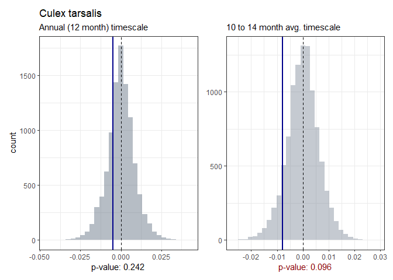

Broadscale spatial synchrony in a West Nile virus mosquito vector across
multiple timescales
================
Amy Bauer,
last edited 2024-01-30

### Preparation

``` r
### LOAD LIBRARIES ###
library(tidyverse)
library(wsyn)
library(stringr)
library(doParallel) # for paralell processing of surrogate slopes

# libraries for data viz
library(ggplot2)
library(patchwork)
library(viridis)
```

``` r
# to make analyses reproducible
set.seed(1)
```

------------------------------------------------------------------------

## Prepare data for analyses

### *Culex tarsalis* data

*Culex tarsalis* data ready for spatial wavelet analyses. Surveillance
records were binned into continuous monthly bins (`tBin`), and mean
number of mosquitoes per trap hour per month (mmpth) was calculated for
each of the included NEON surveillance sites. `NA` values were then
replaced with `0` in preparation of the analyses.

| tBin |   CLBJ |   CPER |   KONZ |   MOAB |    OAES |   ONAQ |   SRER |   UKFS |    WOOD |
|-----:|-------:|-------:|-------:|-------:|--------:|-------:|-------:|-------:|--------:|
|    4 | 0.1492 | 0.0000 | 0.0000 | 0.0000 |  0.0358 | 0.1080 | 0.0000 | 0.0000 |  0.0000 |
|    5 | 0.2175 | 0.0000 | 0.0101 | 0.0046 |  0.2061 | 0.0000 | 0.0000 | 0.0074 |  0.0000 |
|    6 | 0.3510 | 0.0078 | 0.2505 | 0.1529 |  1.0519 | 0.0131 | 0.0000 | 0.0306 |  1.7385 |
|    7 | 0.0038 | 0.0390 | 0.0402 | 0.5136 |  0.1112 | 0.0032 | 0.0020 | 0.0126 |  2.2861 |
|    8 | 0.0012 | 0.0385 | 0.6038 | 0.1551 |  0.0268 | 0.0057 | 0.0000 | 0.0091 |  6.7437 |
|    9 | 0.2663 | 0.0687 | 0.3814 | 0.0000 |  0.0550 | 0.0016 | 0.0071 | 0.4114 |  0.1994 |
|   10 | 0.3337 | 0.0000 | 0.0528 | 0.0000 |  1.4720 | 0.0000 | 0.0034 | 0.0029 |  0.0017 |
|   11 | 0.0116 | 0.0000 | 0.0000 | 0.0000 |  0.0063 | 0.0000 | 0.0000 | 0.0000 |  0.0000 |
|   12 | 0.0000 | 0.0000 | 0.0000 | 0.0000 |  0.0000 | 0.0000 | 0.0000 | 0.0000 |  0.0000 |
|   13 | 0.0000 | 0.0000 | 0.0000 | 0.0000 |  0.0000 | 0.0000 | 0.0000 | 0.0000 |  0.0000 |
|   14 | 0.0000 | 0.0000 | 0.0000 | 0.0000 |  0.0000 | 0.0000 | 0.0000 | 0.0000 |  0.0000 |
|   15 | 0.0332 | 0.0000 | 0.0000 | 0.0000 |  0.0103 | 0.0524 | 0.0000 | 0.0000 |  0.0000 |
|   16 | 0.1101 | 0.0000 | 0.0036 | 0.0000 |  0.1250 | 0.0000 | 0.0027 | 0.0198 |  0.0000 |
|   17 | 0.0224 | 0.0000 | 0.1536 | 0.0201 |  1.3947 | 0.0188 | 0.0000 | 0.0607 |  0.0000 |
|   18 | 0.0070 | 0.0196 | 0.0597 | 0.1974 |  0.1026 | 0.0225 | 0.0000 | 0.0040 |  0.2073 |
|   19 | 0.0000 | 0.0506 | 0.0119 | 0.0899 |  0.0468 | 0.2362 | 0.0026 | 0.0000 |  4.8317 |
|   20 | 0.0060 | 0.2301 | 0.1630 | 0.9031 |  0.0204 | 0.1850 | 0.0000 | 0.0161 |  1.4138 |
|   21 | 0.2958 | 0.0457 | 0.1662 | 0.0179 |  5.1726 | 0.0098 | 0.0027 | 0.0975 |  0.0126 |
|   22 | 0.1120 | 0.0000 | 0.0035 | 0.0000 |  0.4991 | 0.0000 | 0.0000 | 0.0812 |  0.0000 |
|   23 | 0.0016 | 0.0000 | 0.0000 | 0.0000 |  0.0000 | 0.0000 | 0.0000 | 0.0000 |  0.0000 |
|   24 | 0.0000 | 0.0000 | 0.0000 | 0.0000 |  0.0000 | 0.0000 | 0.0016 | 0.0000 |  0.0000 |
|   25 | 0.0000 | 0.0000 | 0.0000 | 0.0000 |  0.0000 | 0.0000 | 0.0030 | 0.0000 |  0.0000 |
|   26 | 0.0035 | 0.0000 | 0.0000 | 0.0000 |  0.0000 | 0.0000 | 0.0031 | 0.0000 |  0.0000 |
|   27 | 0.0377 | 0.0000 | 0.0000 | 0.0000 |  0.0083 | 0.0000 | 0.0022 | 0.0000 |  0.0000 |
|   28 | 0.2818 | 0.0000 | 0.0000 | 0.0152 |  0.0488 | 0.0000 | 0.0000 | 0.0000 |  0.0000 |
|   29 | 0.0631 | 0.0059 | 0.1736 | 0.0354 |  0.1847 | 0.0000 | 0.0000 | 0.0000 |  0.0336 |
|   30 | 0.0039 | 0.0220 | 0.0080 | 0.0929 |  0.0702 | 0.0198 | 0.0000 | 0.0076 |  3.1569 |
|   31 | 0.0025 | 0.0260 | 0.0219 | 0.0772 |  0.1301 | 0.0209 | 0.0000 | 0.0000 | 12.5744 |
|   32 | 0.0190 | 0.1608 | 1.0928 | 0.2671 |  0.2124 | 0.0572 | 0.0000 | 0.4014 |  9.9534 |
|   33 | 0.0704 | 0.0031 | 0.0726 | 0.0000 |  0.9868 | 0.0068 | 0.0000 | 0.0612 |  0.0000 |
|   34 | 0.0580 | 0.0000 | 0.0000 | 0.0000 |  1.2268 | 0.0000 | 0.0032 | 0.0873 |  0.0000 |
|   35 | 0.0067 | 0.0000 | 0.0000 | 0.0000 |  0.0000 | 0.0000 | 0.0031 | 0.0000 |  0.0000 |
|   36 | 0.0000 | 0.0000 | 0.0000 | 0.0000 |  0.0000 | 0.0000 | 0.0030 | 0.0000 |  0.0000 |
|   37 | 0.0000 | 0.0000 | 0.0000 | 0.0000 |  0.0000 | 0.0000 | 0.0000 | 0.0000 |  0.0000 |
|   38 | 0.0000 | 0.0000 | 0.0000 | 0.0000 |  0.0000 | 0.0000 | 0.0248 | 0.0000 |  0.0000 |
|   39 | 0.0036 | 0.0000 | 0.0000 | 0.0000 |  0.0000 | 0.0000 | 0.0000 | 0.0000 |  0.0000 |
|   40 | 0.0869 | 0.0000 | 0.0000 | 0.0000 |  0.0000 | 0.0800 | 0.0034 | 0.0000 |  0.0000 |
|   41 | 0.2098 | 0.0000 | 0.5485 | 0.0000 | 11.1247 | 0.0040 | 0.0000 | 0.0000 |  0.0000 |
|   42 | 0.1662 | 0.0618 | 1.5685 | 0.4204 |  7.3948 | 0.0244 | 0.0000 | 0.0261 |  0.0628 |
|   43 | 0.0000 | 0.4819 | 0.7716 | 3.4868 |  0.5445 | 0.0718 | 0.0000 | 0.0208 |  8.1850 |
|   44 | 0.0000 | 0.1356 | 0.0385 | 0.4555 |  0.1096 | 0.1881 | 0.0000 | 0.0275 |  6.2778 |
|   45 | 0.0000 | 0.0000 | 0.4981 | 0.0000 |  0.0186 | 0.3142 | 0.0000 | 0.2066 |  0.0148 |
|   46 | 0.1673 | 0.0000 | 0.0103 | 0.0000 |  0.0530 | 0.0000 | 0.0000 | 0.0000 |  0.0035 |
|   47 | 0.0000 | 0.0000 | 0.0000 | 0.0000 |  0.0000 | 0.0000 | 0.0126 | 0.0000 |  0.0000 |
|   48 | 0.0000 | 0.0000 | 0.0000 | 0.0000 |  0.0000 | 0.0000 | 0.0058 | 0.0000 |  0.0000 |

### Load and transpose data

``` r
# list of environmental variables included in analyses
env <- c("prec", "tmin", "tmax", "rmin", "rmax") 


### Prepare data for analyses

dat.list <- list() # store all data in this list

# pattern in env. variable data file names
p <- "_for_wsyn_times_45.csv"

# list all data files in data folder:
input.files <- list.files(inDir, pattern = ".csv")
input.files
```

    ## [1] "acc_prec_for_wsyn_times_45.csv" "cx_tar_16_19_13jan24.csv"      
    ## [3] "rmax_for_wsyn_times_45.csv"     "rmin_for_wsyn_times_45.csv"    
    ## [5] "tmax_for_wsyn_times_45.csv"     "tmin_for_wsyn_times_45.csv"

``` r
## loop through all files
# remove unnecessary columns, transpose & save as matrix objects in the dat.list list

for(f in input.files){
  
  # load data
  d <- read.csv(file.path(inDir, f))
  
  # if file = species data
  if(str_detect(f, "cx_tar")){
    
    v.name <- "cx_tar"
    
    d1 <- d %>% 
      arrange(tBin) %>% select(-c(tBin)) %>% t() 
    
    dat.list[[v.name]] <- d1
  }
  
  # if file = env data
  if(str_detect(f, p)){
    
    v.name <- f %>% str_remove(p) %>% word(-1, sep = "_")

    d1 <- d %>% 
      arrange(tBin) %>% select(-c(year, month, tBin)) %>% t() 
    
    dat.list[[v.name]] <- d1
  }
  
  # save data as .RDS object
  if(f == last(input.files)){
    
    # rearrange list objects:
    dat <- dat.list[c("cx_tar", env)] 
    saveRDS(dat, file.path(inDir, "cxtar_wsyn45_data.RDS"))
    
    }
}
```

### Prepare for synchrony analyses

To prepare the data for subsequent analyses, the monthly *Cx. tarsalis*
and environmental variable timeseries are each de-meaned, detrended, and
variances are standardized to 1 using `wsyn::cleandat()` with `clev==3`.

``` r
# define timesteps
times <- 1:45

# clean spatio-temporal data
dat <- lapply(FUN=function(x){cleandat(x,times,3)$cdat},X=dat)
```

# Wavelet phasor mean fields

Wavelet phasor mean fields (wpmf, `wsyn::wpmf()`) are computed with
`sigmethod = "aaft"` to quantify whether significant spatial synchrony
occurred at one or more timescales for monthly *Cx. tarsalis* mmpth and
the 5 included environmental variables each.

``` r
# method for significance testing in wsyn::wpmf()
sigmethod <- "aaft"
```

## *Culex tarsalis* wpmf

``` r
# compute cx tarsalis wpmf
moswpmf <- wpmf(dat$cx_tar, times = times, sigmethod = sigmethod)

# get matrix of computed values:
gwpmf <- abs(moswpmf$value)

# save wpmf plot
plotmag(moswpmf, 
        filename = file.path(outDir, str_c("cx_tar_16_19_wpmf_", sigmethod, sep = "")))
```

### plot


### matrix

    ##           V1         V2         V3         V4         V5        V6         V7
    ## 1        NaN        NaN        NaN        NaN        NaN       NaN        NaN
    ## 2        NaN        NaN        NaN        NaN        NaN       NaN        NaN
    ## 3        NaN        NaN        NaN        NaN        NaN       NaN        NaN
    ## 4  0.1111111 0.15046803 0.22131594 0.29187936 0.34958975       NaN        NaN
    ## 5  0.1111111 0.13127122 0.17489841 0.23397543 0.30459280 0.3343522 0.39042151
    ## 6  0.1111111 0.10540766 0.09163719 0.05819224 0.20263087 0.3391305 0.38342121
    ## 7  0.1111111 0.07606914 0.04130540 0.02452660 0.05967104 0.3274949 0.35990237
    ## 8  0.1111111 0.08506897 0.01566658 0.08094819 0.16907841 0.2749939 0.33904377
    ## 9  0.1111111 0.08536676 0.01122663 0.10319610 0.17874904 0.2609564 0.34854396
    ## 10 0.1111111 0.03933985 0.02000881 0.12401547 0.17201468 0.2504991 0.39258604
    ## 11 0.1111111 0.11087748 0.04403934 0.12861883 0.19666270 0.2964997 0.31118789
    ## 12 0.1111111 0.12699003 0.17131630 0.20534123 0.23118403 0.3130116 0.36796661
    ## 13 0.1111111 0.14220749 0.20402301 0.25776535 0.30110428 0.3487960 0.37999885
    ## 14 0.1111111 0.26721274 0.29724560 0.30530975 0.30963316 0.2961483 0.17962073
    ## 15 0.5555556 0.47709940 0.38766967 0.32359397 0.27412623 0.2220057 0.16870238
    ## 16 0.5555556 0.49077726 0.36742114 0.27481622 0.21783945 0.1738925 0.13608995
    ## 17 0.5555556 0.46288322 0.30421958 0.22403575 0.18163310 0.1474580 0.11641635
    ## 18 0.3333333 0.36068724 0.31307150 0.24805214 0.19399112 0.1538253 0.12374129
    ## 19 0.1111111 0.24553011 0.25020367 0.22701587 0.19378811 0.1613022 0.13386507
    ## 20 0.1111111 0.15299075 0.18627742 0.18919425 0.17985450 0.1618935 0.13808745
    ## 21 0.1111111 0.14987005 0.12654174 0.14074448 0.18149001 0.1485559 0.12208262
    ## 22 0.3333333 0.27834339 0.17418850 0.18514905 0.16768853 0.1024868 0.15301972
    ## 23 0.1111111 0.20058844 0.11927778 0.33800591 0.20658711 0.1256749 0.15485897
    ## 24 0.1111111 0.21065520 0.41888925 0.30957376 0.28324198 0.3274699 0.42245348
    ## 25 0.1111111 0.30390590 0.34606702 0.34785022 0.36296951 0.4250737 0.53405081
    ## 26 0.3333333 0.35881268 0.39224536 0.40472226 0.41643492 0.4492769 0.49482460
    ## 27 0.3333333 0.45705177 0.45771731 0.44920691 0.44897433 0.4653030 0.48226537
    ## 28 0.5555556 0.56486456 0.53939051 0.50053927 0.47779158 0.4899217 0.49974737
    ## 29 0.7777778 0.74034880 0.63080009 0.54038869 0.46359826 0.3268189 0.45435523
    ## 30 0.7777778 0.74074414 0.65489758 0.54809808 0.42418148 0.3632117 0.43308578
    ## 31 1.0000000 0.89595948 0.75829234 0.59731816 0.45080720 0.3925263 0.43303908
    ## 32 1.0000000 0.95221255 0.83581747 0.64491310 0.46285832 0.3932600 0.42853578
    ## 33 1.0000000 0.87200449 0.74148343 0.50823005 0.39898981 0.3397217 0.43202132
    ## 34 0.5555556 0.68847517 0.65621760 0.52811238 0.18390833 0.2569030 0.42996802
    ## 35 0.1111111 0.33766456 0.47903581 0.48571928 0.33616775 0.2955025 0.34113460
    ## 36 0.1111111 0.29499748 0.41614013 0.45958431 0.26430666 0.2856776 0.29180725
    ## 37 0.1111111 0.10967829 0.23194825 0.30216231 0.30500496 0.2859019 0.25296253
    ## 38 0.1111111 0.17794983 0.25573673 0.29980216 0.30661696 0.2793581 0.22002561
    ## 39 0.1111111 0.26523983 0.31409424 0.31922304 0.30681267 0.2745894 0.19527199
    ## 40 0.3333333 0.45995191 0.38479252 0.32512298 0.28445468 0.2625394 0.16778503
    ## 41 0.5555556 0.49816453 0.39060983 0.30042431 0.23028502 0.1589260 0.04821401
    ## 42 0.3333333 0.37294505 0.32989561 0.26084378 0.19110779       NaN        NaN
    ## 43       NaN        NaN        NaN        NaN        NaN       NaN        NaN
    ## 44       NaN        NaN        NaN        NaN        NaN       NaN        NaN
    ## 45       NaN        NaN        NaN        NaN        NaN       NaN        NaN
    ##            V8         V9        V10        V11        V12       V13       V14
    ## 1         NaN        NaN        NaN        NaN        NaN       NaN       NaN
    ## 2         NaN        NaN        NaN        NaN        NaN       NaN       NaN
    ## 3         NaN        NaN        NaN        NaN        NaN       NaN       NaN
    ## 4         NaN        NaN        NaN        NaN        NaN       NaN       NaN
    ## 5  0.43746148 0.41165046 0.34437976 0.26493867        NaN       NaN       NaN
    ## 6  0.40414162 0.39441332 0.33142466 0.22491704 0.20994725 0.2281008 0.2419007
    ## 7  0.38028262 0.38723579 0.38575177 0.20743048 0.23242737 0.2481146 0.2512605
    ## 8  0.35847793 0.34999234 0.33928202 0.31467667 0.29024824 0.2819020 0.2687028
    ## 9  0.35135592 0.28422033 0.26782166 0.31457798 0.34015645 0.3253453 0.2985165
    ## 10 0.35283561 0.10779837 0.14847900 0.30712494 0.40853101 0.3953589 0.3629876
    ## 11 0.32578478 0.06673478 0.16706345 0.31850395 0.57072396 0.5887495 0.5243669
    ## 12 0.34093342 0.18455910 0.17121312 0.41080090 0.56429391 0.6083088 0.5535328
    ## 13 0.27742181 0.22825269 0.20658817 0.44146970 0.56909309 0.5651014 0.5363366
    ## 14 0.19799691 0.20315906 0.18743433 0.21586806 0.41407647 0.4873830 0.5039746
    ## 15 0.16766362 0.16169588 0.14871960 0.18776425 0.29595130 0.4080832 0.4731989
    ## 16 0.09655426 0.08095342 0.11057766 0.14852338 0.22206368 0.3483469 0.4584772
    ## 17 0.08995573 0.08419378 0.10413189 0.13263510 0.16924122 0.2635019 0.4680970
    ## 18 0.10385857 0.10090084 0.11925057 0.15331888 0.20294175 0.3066077 0.4501497
    ## 19 0.11431831 0.10966539 0.12768874 0.16910956 0.23338366 0.3239034 0.4227505
    ## 20 0.11376244 0.10195932 0.11547810 0.16432968 0.24244224 0.3366628 0.4218292
    ## 21 0.08184337 0.06436420 0.05750709 0.10718408 0.24599107 0.3696933 0.4406122
    ## 22 0.05090705 0.03099625 0.06452208 0.15255894 0.33302575 0.4161399 0.4666006
    ## 23 0.24919887 0.31817278 0.18883823 0.09766074 0.33053372 0.4341501 0.4822088
    ## 24 0.53036203 0.41485403 0.29098625 0.19836225 0.26014971 0.4517846 0.5047414
    ## 25 0.58442459 0.45548417 0.36491456 0.34587989 0.50968487 0.6008495 0.5474643
    ## 26 0.43390479 0.46724692 0.49318859 0.48086536 0.54293530 0.6008492 0.5607379
    ## 27 0.48454733 0.52058674 0.57688782 0.57513433 0.56729398 0.5617734 0.5504797
    ## 28 0.50733420 0.54857119 0.59174850 0.60785251 0.59831742 0.5732937 0.5448806
    ## 29 0.50859375 0.55755765 0.59895924 0.62056317 0.61619422 0.5832626 0.5369173
    ## 30 0.50362112 0.55814788 0.60290363 0.61347365 0.60222412 0.5808413 0.5085498
    ## 31 0.49710452 0.55660420 0.66440008 0.59656374 0.47058165 0.3941338 0.4370205
    ## 32 0.50865839 0.68783709 0.78459749 0.49530230 0.38966201 0.3496751 0.3674327
    ## 33 0.53803615 0.67025161 0.55030931 0.29175826 0.30815581 0.3179513 0.3197065
    ## 34 0.59140224 0.62992482 0.43201404 0.21914878 0.25948243 0.2749495 0.2215314
    ## 35 0.38118487 0.45829725 0.30193620 0.14456363 0.15176389 0.2220458 0.1196450
    ## 36 0.26746788 0.17257915 0.15727575 0.11223296 0.09408734 0.1773386 0.1234888
    ## 37 0.19460972 0.11685035 0.10098149 0.15177175 0.16294523 0.1948930 0.1890069
    ## 38 0.12972196 0.01629703 0.19134029 0.21603095 0.21904601 0.2290836 0.2176558
    ## 39 0.07778281 0.06703475 0.18859953 0.22505971 0.23532476 0.2521209 0.2373607
    ## 40 0.07733251 0.06966870 0.18280332 0.18835122 0.19198352 0.2082993 0.2261660
    ## 41 0.05357064 0.07439638 0.11939706 0.13750104        NaN       NaN       NaN
    ## 42        NaN        NaN        NaN        NaN        NaN       NaN       NaN
    ## 43        NaN        NaN        NaN        NaN        NaN       NaN       NaN
    ## 44        NaN        NaN        NaN        NaN        NaN       NaN       NaN
    ## 45        NaN        NaN        NaN        NaN        NaN       NaN       NaN
    ##           V15        V16        V17         V18       V19       V20       V21
    ## 1         NaN        NaN        NaN         NaN       NaN       NaN       NaN
    ## 2         NaN        NaN        NaN         NaN       NaN       NaN       NaN
    ## 3         NaN        NaN        NaN         NaN       NaN       NaN       NaN
    ## 4         NaN        NaN        NaN         NaN       NaN       NaN       NaN
    ## 5         NaN        NaN        NaN         NaN       NaN       NaN       NaN
    ## 6  0.25026042 0.25977807        NaN         NaN       NaN       NaN       NaN
    ## 7  0.24232662 0.21369952 0.17899352 0.321840348 0.3563888 0.3964803       NaN
    ## 8  0.24592955 0.20254692 0.19262024 0.283067568 0.3430932 0.4006660 0.4783604
    ## 9  0.27027567 0.21267400 0.16728671 0.261483006 0.3236581 0.4004962 0.5174931
    ## 10 0.32307732 0.22537171 0.10393272 0.143954904 0.3344319 0.4181980 0.5750132
    ## 11 0.39670857 0.25068317 0.04748747 0.226562484 0.3864276 0.5906762 0.6263494
    ## 12 0.45477814 0.34059703 0.13785373 0.320175390 0.3733835 0.5818267 0.6527967
    ## 13 0.48032718 0.41495992 0.34947293 0.347186958 0.3051765 0.5754831 0.6645968
    ## 14 0.48656068 0.45383375 0.42465331 0.397280883 0.3591133 0.4019972 0.6701161
    ## 15 0.48763617 0.47715179 0.46239814 0.449009386 0.4480548 0.5369073 0.6582741
    ## 16 0.49028972 0.49232879 0.48668441 0.482484663 0.4943188 0.5552314 0.6373250
    ## 17 0.49361337 0.50101665 0.49930184 0.497514556 0.5124566 0.5633995 0.6282165
    ## 18 0.48988673 0.50260748 0.50003474 0.494740148 0.5144790 0.5719663 0.6288031
    ## 19 0.48029076 0.49733279 0.48697050 0.467852282 0.5060797 0.5844799 0.6342502
    ## 20 0.47596201 0.48818232 0.45659593 0.415601259 0.5650424 0.5908803 0.6399946
    ## 21 0.48330357 0.48343327 0.39519539 0.204010998 0.4574639 0.5740807 0.6439266
    ## 22 0.50092902 0.51876314 0.31109585 0.004170029 0.3485466 0.5484801 0.6483598
    ## 23 0.51274142 0.52336965 0.40030293 0.154682872 0.2804904 0.5351787 0.6583896
    ## 24 0.51708421 0.50888597 0.43610788 0.248553796 0.2852280 0.5427796 0.6791622
    ## 25 0.52448589 0.50810355 0.46509259 0.311622648 0.2494584 0.5690300 0.7116944
    ## 26 0.52922636 0.51200119 0.49340106 0.427942266 0.3421265 0.5134260 0.7377462
    ## 27 0.52771005 0.51445072 0.51544394 0.518753307 0.6026724 0.6181246 0.7343566
    ## 28 0.52085101 0.51153321 0.53349761 0.589868256 0.6412865 0.6520704 0.6975781
    ## 29 0.50551039 0.49389038 0.52085742 0.585539128 0.6392158 0.6434212 0.6598018
    ## 30 0.47348824 0.44508305 0.37652698 0.536493236 0.6151304 0.6017099 0.6350456
    ## 31 0.42093890 0.37760815 0.36838192 0.513605227 0.5814266 0.5481536 0.5098826
    ## 32 0.35834454 0.30524866 0.32622910 0.480001517 0.5484226 0.5582920 0.4635887
    ## 33 0.28129245 0.19773834 0.16404097 0.383550448 0.5112296 0.5618206 0.4133417
    ## 34 0.04177293 0.09559594 0.15249758 0.300640871 0.4740502 0.5136909 0.4371200
    ## 35 0.02252181 0.07807776 0.13930747 0.219314570 0.4875427 0.5044724 0.4491566
    ## 36 0.09299621 0.11004375 0.14318503 0.201314109 0.3739102 0.4889800 0.4389498
    ## 37 0.15006984 0.13929121 0.15199512 0.189579369 0.2577962 0.3725971 0.4051241
    ## 38 0.18082194 0.15679371 0.15519557 0.172599446 0.2006799 0.2708984 0.3618378
    ## 39 0.19277795 0.16348664 0.15438263 0.163303338 0.1899701 0.2499223       NaN
    ## 40 0.18596607 0.16143135        NaN         NaN       NaN       NaN       NaN
    ## 41        NaN        NaN        NaN         NaN       NaN       NaN       NaN
    ## 42        NaN        NaN        NaN         NaN       NaN       NaN       NaN
    ## 43        NaN        NaN        NaN         NaN       NaN       NaN       NaN
    ## 44        NaN        NaN        NaN         NaN       NaN       NaN       NaN
    ## 45        NaN        NaN        NaN         NaN       NaN       NaN       NaN
    ##          V22       V23       V24       V25       V26        V27        V28
    ## 1        NaN       NaN       NaN       NaN       NaN        NaN        NaN
    ## 2        NaN       NaN       NaN       NaN       NaN        NaN        NaN
    ## 3        NaN       NaN       NaN       NaN       NaN        NaN        NaN
    ## 4        NaN       NaN       NaN       NaN       NaN        NaN        NaN
    ## 5        NaN       NaN       NaN       NaN       NaN        NaN        NaN
    ## 6        NaN       NaN       NaN       NaN       NaN        NaN        NaN
    ## 7        NaN       NaN       NaN       NaN       NaN        NaN        NaN
    ## 8  0.5279567 0.5453527       NaN       NaN       NaN        NaN        NaN
    ## 9  0.5587310 0.5627111 0.5336260 0.4819305 0.4482163        NaN        NaN
    ## 10 0.5905075 0.5813111 0.5497811 0.5017820 0.4542934 0.38725661 0.22245403
    ## 11 0.6194586 0.5998971 0.5657661 0.5154991 0.4517387 0.37487078 0.23135599
    ## 12 0.6419387 0.6170205 0.5813503 0.5259593 0.4408318 0.35261270 0.22290399
    ## 13 0.6568673 0.6318330 0.5973130 0.5370708 0.4217729 0.29305900 0.17040591
    ## 14 0.6645493 0.6440680 0.6144926 0.5547751 0.3955865 0.20104468 0.08752704
    ## 15 0.6658552 0.6537987 0.6321867 0.5865035 0.3568104 0.14262547 0.03121903
    ## 16 0.6637188 0.6614823 0.6475120 0.6208073 0.3411073 0.10867943 0.04891845
    ## 17 0.6624551 0.6681528 0.6588102 0.6303333 0.4635771 0.11416758 0.09148222
    ## 18 0.6644646 0.6750522 0.6680316 0.6360076 0.4984829 0.20823298 0.13712379
    ## 19 0.6696813 0.6827848 0.6772320 0.6483359 0.5055222 0.28753627 0.18350433
    ## 20 0.6769457 0.6908869 0.6859482 0.6652516 0.6110366 0.35886097 0.22893028
    ## 21 0.6852225 0.6980860 0.6917527 0.6764807 0.6387437 0.42349385 0.27214989
    ## 22 0.6941772 0.7028164 0.6920434 0.6766233 0.6315669 0.46429603 0.31108321
    ## 23 0.7040350 0.7034508 0.6850407 0.6683739 0.6287120 0.48422277 0.34135623
    ## 24 0.7148295 0.6978625 0.6693247 0.6527581 0.6278319 0.48405719 0.35620263
    ## 25 0.7255754 0.6820071 0.6436312 0.6259571 0.6293408 0.46119096 0.35241425
    ## 26 0.7349934 0.6476093 0.6086570 0.5840761 0.4543864 0.42910014 0.33847465
    ## 27 0.7488689 0.5917519 0.5697311 0.5363736 0.4262981 0.40833441 0.32477504
    ## 28 0.6117835 0.5535504 0.5346367 0.4960960 0.4022931 0.19250425 0.31333285
    ## 29 0.6135086 0.5410752 0.5063375 0.4652362 0.3653738 0.15055542 0.10308231
    ## 30 0.5960453 0.5253848 0.4814213 0.4385638 0.3015445 0.09390177 0.09600377
    ## 31 0.5407276 0.4993706 0.4553009 0.4000288 0.1323451 0.03484358 0.10126561
    ## 32 0.4853697 0.4691352 0.4275470 0.3519101 0.1625137 0.04037808 0.10570692
    ## 33 0.4489038 0.4421743 0.4025510 0.3233165 0.1872537 0.08035827 0.10844905
    ## 34 0.4323502 0.4221478 0.3841078 0.3113065 0.2057173 0.11490261 0.11291447
    ## 35 0.4249023 0.4088366 0.3725830 0.3076499 0.2216377 0.14562488 0.12584618
    ## 36 0.4166730 0.4004214 0.3665213 0.3076894 0.2356866 0.17423677 0.15187004
    ## 37 0.4047003 0.3955462 0.3642748 0.3083656 0.2474612        NaN        NaN
    ## 38 0.3906127 0.3939926       NaN       NaN       NaN        NaN        NaN
    ## 39       NaN       NaN       NaN       NaN       NaN        NaN        NaN
    ## 40       NaN       NaN       NaN       NaN       NaN        NaN        NaN
    ## 41       NaN       NaN       NaN       NaN       NaN        NaN        NaN
    ## 42       NaN       NaN       NaN       NaN       NaN        NaN        NaN
    ## 43       NaN       NaN       NaN       NaN       NaN        NaN        NaN
    ## 44       NaN       NaN       NaN       NaN       NaN        NaN        NaN
    ## 45       NaN       NaN       NaN       NaN       NaN        NaN        NaN
    ##          V29       V30       V31       V32       V33       V34       V35
    ## 1        NaN       NaN       NaN       NaN       NaN       NaN       NaN
    ## 2        NaN       NaN       NaN       NaN       NaN       NaN       NaN
    ## 3        NaN       NaN       NaN       NaN       NaN       NaN       NaN
    ## 4        NaN       NaN       NaN       NaN       NaN       NaN       NaN
    ## 5        NaN       NaN       NaN       NaN       NaN       NaN       NaN
    ## 6        NaN       NaN       NaN       NaN       NaN       NaN       NaN
    ## 7        NaN       NaN       NaN       NaN       NaN       NaN       NaN
    ## 8        NaN       NaN       NaN       NaN       NaN       NaN       NaN
    ## 9        NaN       NaN       NaN       NaN       NaN       NaN       NaN
    ## 10       NaN       NaN       NaN       NaN       NaN       NaN       NaN
    ## 11 0.1466269 0.3673009       NaN       NaN       NaN       NaN       NaN
    ## 12 0.1054816 0.3444659 0.5734327 0.7821272       NaN       NaN       NaN
    ## 13 0.1003631 0.3096697 0.5244572 0.7814320 0.8821733 0.9138104       NaN
    ## 14 0.1042625 0.2674732 0.4258831 0.7640476 0.8776082 0.9011508 0.9041855
    ## 15 0.1104540 0.2268064 0.3293887 0.7088879 0.8699887 0.8847211 0.8806211
    ## 16 0.1181762 0.1992426 0.2915955 0.6298121 0.8552261 0.8647614 0.8562185
    ## 17 0.1282829 0.1875820 0.2604200 0.4324955 0.8213081 0.8423013 0.8336355
    ## 18 0.1414218 0.1876135 0.2608102 0.4745737 0.7734774 0.8191404 0.8142706
    ## 19 0.1581473 0.1936267 0.2767186 0.4925396 0.7338752 0.7971957 0.7983297
    ## 20 0.1797461 0.2004191 0.2860647 0.4956652 0.7078257 0.7777005 0.7854134
    ## 21 0.2088219 0.2023808 0.2796035 0.4933718 0.6915906 0.7609779 0.7749749
    ## 22 0.2482169 0.1695086 0.2552660 0.4863511 0.6784357 0.7468332 0.7665274
    ## 23 0.2905922 0.1045460 0.2166507 0.4386962 0.6610134 0.7351150 0.7596916
    ## 24 0.2955573 0.1573390 0.1733498 0.3863480 0.6396580 0.7260151 0.7541685
    ## 25 0.1967821 0.1528262 0.1326822 0.4056135 0.6206998 0.7199919 0.7496782
    ## 26 0.2005017 0.1443301 0.1464702 0.4033100 0.6071530 0.7174638 0.7458958
    ## 27 0.2196514 0.1605019 0.1808354 0.3914583 0.5996376 0.7182999 0.7424149
    ## 28 0.2321832 0.1918907 0.2062437 0.3817759 0.6008618 0.7209001 0.7387742
    ## 29 0.2376459 0.2354336 0.2366296 0.3882990 0.6436474 0.7215264 0.7345677
    ## 30 0.2413361 0.2977213 0.2934542 0.4236842 0.6324953 0.7167598 0.7295913
    ## 31 0.2458612 0.3622852 0.4026869 0.4733824 0.6215173 0.7076765 0.7239234
    ## 32 0.2485468 0.3977956 0.4739265 0.5177022 0.6238026 0.6979623 0.7178653
    ## 33 0.2466053 0.4172140 0.5098379 0.5518051 0.6286598 0.6898342       NaN
    ## 34 0.2384098 0.4358016 0.5358742 0.5771017       NaN       NaN       NaN
    ## 35 0.2214395 0.4620069       NaN       NaN       NaN       NaN       NaN
    ## 36       NaN       NaN       NaN       NaN       NaN       NaN       NaN
    ## 37       NaN       NaN       NaN       NaN       NaN       NaN       NaN
    ## 38       NaN       NaN       NaN       NaN       NaN       NaN       NaN
    ## 39       NaN       NaN       NaN       NaN       NaN       NaN       NaN
    ## 40       NaN       NaN       NaN       NaN       NaN       NaN       NaN
    ## 41       NaN       NaN       NaN       NaN       NaN       NaN       NaN
    ## 42       NaN       NaN       NaN       NaN       NaN       NaN       NaN
    ## 43       NaN       NaN       NaN       NaN       NaN       NaN       NaN
    ## 44       NaN       NaN       NaN       NaN       NaN       NaN       NaN
    ## 45       NaN       NaN       NaN       NaN       NaN       NaN       NaN
    ##          V36       V37       V38       V39       V40       V41       V42
    ## 1        NaN       NaN       NaN       NaN       NaN       NaN       NaN
    ## 2        NaN       NaN       NaN       NaN       NaN       NaN       NaN
    ## 3        NaN       NaN       NaN       NaN       NaN       NaN       NaN
    ## 4        NaN       NaN       NaN       NaN       NaN       NaN       NaN
    ## 5        NaN       NaN       NaN       NaN       NaN       NaN       NaN
    ## 6        NaN       NaN       NaN       NaN       NaN       NaN       NaN
    ## 7        NaN       NaN       NaN       NaN       NaN       NaN       NaN
    ## 8        NaN       NaN       NaN       NaN       NaN       NaN       NaN
    ## 9        NaN       NaN       NaN       NaN       NaN       NaN       NaN
    ## 10       NaN       NaN       NaN       NaN       NaN       NaN       NaN
    ## 11       NaN       NaN       NaN       NaN       NaN       NaN       NaN
    ## 12       NaN       NaN       NaN       NaN       NaN       NaN       NaN
    ## 13       NaN       NaN       NaN       NaN       NaN       NaN       NaN
    ## 14 0.8919650       NaN       NaN       NaN       NaN       NaN       NaN
    ## 15 0.8384095 0.7687163       NaN       NaN       NaN       NaN       NaN
    ## 16 0.8048450 0.7590422 0.7920180       NaN       NaN       NaN       NaN
    ## 17 0.7872566 0.7563581 0.7824724 0.7979966 0.7987431       NaN       NaN
    ## 18 0.7774769 0.7556539 0.7749894 0.7897192 0.7900022 0.6799498       NaN
    ## 19 0.7713516 0.7553471 0.7689003 0.7813355 0.7789334 0.6007921 0.4000581
    ## 20 0.7669856 0.7548528 0.7635884 0.7725707 0.7632447 0.4918921 0.3341894
    ## 21 0.7634631 0.7539157 0.7585672 0.7632178 0.7430157 0.4552728 0.2823427
    ## 22 0.7603051 0.7524169 0.7535027 0.7532367 0.7225309 0.4401339 0.2502958
    ## 23 0.7572427 0.7503125 0.7482114 0.7427851 0.7049530 0.4099257 0.2424793
    ## 24 0.7541151 0.7476123 0.7426418 0.7321724 0.6894345 0.3777273 0.2579376
    ## 25 0.7508203 0.7443672 0.7368445 0.7217776 0.6747637 0.4741588 0.2888891
    ## 26 0.7472910 0.7406590 0.7309349 0.7119684 0.6615664 0.5002973 0.3258332
    ## 27 0.7434852 0.7365888 0.7250547 0.7030358 0.6508626 0.5160307 0.3622104
    ## 28 0.7393858 0.7322664 0.7193416 0.6951571 0.6429158 0.5282140       NaN
    ## 29 0.7350046 0.7278005 0.7139093 0.6883942 0.6374033       NaN       NaN
    ## 30 0.7303858 0.7232920 0.7088391       NaN       NaN       NaN       NaN
    ## 31 0.7256040 0.7188296       NaN       NaN       NaN       NaN       NaN
    ## 32 0.7207562       NaN       NaN       NaN       NaN       NaN       NaN
    ## 33       NaN       NaN       NaN       NaN       NaN       NaN       NaN
    ## 34       NaN       NaN       NaN       NaN       NaN       NaN       NaN
    ## 35       NaN       NaN       NaN       NaN       NaN       NaN       NaN
    ## 36       NaN       NaN       NaN       NaN       NaN       NaN       NaN
    ## 37       NaN       NaN       NaN       NaN       NaN       NaN       NaN
    ## 38       NaN       NaN       NaN       NaN       NaN       NaN       NaN
    ## 39       NaN       NaN       NaN       NaN       NaN       NaN       NaN
    ## 40       NaN       NaN       NaN       NaN       NaN       NaN       NaN
    ## 41       NaN       NaN       NaN       NaN       NaN       NaN       NaN
    ## 42       NaN       NaN       NaN       NaN       NaN       NaN       NaN
    ## 43       NaN       NaN       NaN       NaN       NaN       NaN       NaN
    ## 44       NaN       NaN       NaN       NaN       NaN       NaN       NaN
    ## 45       NaN       NaN       NaN       NaN       NaN       NaN       NaN
    ##           V43       V44       V45       V46
    ## 1         NaN       NaN       NaN       NaN
    ## 2         NaN       NaN       NaN       NaN
    ## 3         NaN       NaN       NaN       NaN
    ## 4         NaN       NaN       NaN       NaN
    ## 5         NaN       NaN       NaN       NaN
    ## 6         NaN       NaN       NaN       NaN
    ## 7         NaN       NaN       NaN       NaN
    ## 8         NaN       NaN       NaN       NaN
    ## 9         NaN       NaN       NaN       NaN
    ## 10        NaN       NaN       NaN       NaN
    ## 11        NaN       NaN       NaN       NaN
    ## 12        NaN       NaN       NaN       NaN
    ## 13        NaN       NaN       NaN       NaN
    ## 14        NaN       NaN       NaN       NaN
    ## 15        NaN       NaN       NaN       NaN
    ## 16        NaN       NaN       NaN       NaN
    ## 17        NaN       NaN       NaN       NaN
    ## 18        NaN       NaN       NaN       NaN
    ## 19        NaN       NaN       NaN       NaN
    ## 20 0.09378203       NaN       NaN       NaN
    ## 21 0.04832006 0.2844738       NaN       NaN
    ## 22 0.06637958 0.2744760 0.3697464       NaN
    ## 23 0.11934913 0.2606208 0.3658089 0.4401104
    ## 24 0.17242305 0.2495206 0.3629775       NaN
    ## 25 0.21917256 0.2462867       NaN       NaN
    ## 26 0.25992304       NaN       NaN       NaN
    ## 27        NaN       NaN       NaN       NaN
    ## 28        NaN       NaN       NaN       NaN
    ## 29        NaN       NaN       NaN       NaN
    ## 30        NaN       NaN       NaN       NaN
    ## 31        NaN       NaN       NaN       NaN
    ## 32        NaN       NaN       NaN       NaN
    ## 33        NaN       NaN       NaN       NaN
    ## 34        NaN       NaN       NaN       NaN
    ## 35        NaN       NaN       NaN       NaN
    ## 36        NaN       NaN       NaN       NaN
    ## 37        NaN       NaN       NaN       NaN
    ## 38        NaN       NaN       NaN       NaN
    ## 39        NaN       NaN       NaN       NaN
    ## 40        NaN       NaN       NaN       NaN
    ## 41        NaN       NaN       NaN       NaN
    ## 42        NaN       NaN       NaN       NaN
    ## 43        NaN       NaN       NaN       NaN
    ## 44        NaN       NaN       NaN       NaN
    ## 45        NaN       NaN       NaN       NaN

### 

## Environmental wpmf

``` r
env_wpmf <- list()

for(p in env){
  
  dat2 <- dat[[p]]
  
  e_wpmf <- wpmf(dat2, times = times, sigmethod = sigmethod)
  env_wpmf[[p]] <- e_wpmf
  
  # save plot
  plotmag(e_wpmf, 
        filename = file.path(outDir, str_c("env_", p, "_16_19_wpmf_", sigmethod, sep = "")))

  if(p == last(env)){saveRDS(env_wpmf, file.path(outDir, "env_wsyn45_wlmtest.RDS"))}
} 
```


# Univariate wavelet linear models

To quantify whether spatial synchrony in a given climate variable is a
significant predictor of spatial synchrony in *Cx. tarsalis* abundance
at the same timescale, univariate wavelet linear models (wlm) are fitted
with `wsyn::wlm()` and assessed using `wsyn::wlmtest()`,
`wsyn::bandtest()` and `wsyn::plotrank()`.

``` r
# define parameters for functions used in this step:

## wsyn::wlm()
resp <- 1         # index of response variable
pred <- 2:6       # index of predictor variable
norm <- "powall"  # normalization of wavelet transforms to use

## wsyn::wlmtest()
n <- 10000        # nrand

## wsyn::bandtest() 
blong<-c(10,12)   # timescale of interest, i.e., ~ annual timescale, 10 to 12 months
```

``` r
### define wlm & test for significant relationship between response and predictor
# res = the significance of the variable dropped 

res.list <- list()

for(p in pred){
  
  # control:
  cat("env. predictor:", p, "\n", sep = " ")
  
  # define wlmobj
  dat.wlm <- wlm(dat, times, resp, p, norm)
  (print)
  
  # wlmtest
  res <- wlmtest(dat.wlm, drop = 2, sigmethod, nrand= n) # drop dat.wlm$dat[2], i.e. the env covariate
  res <- bandtest(res, blong)

  k <- env[p-1] # get the variable name
  

  # saves plotrank plots in output folder
  plotrank(res,
           filename = file.path(outDir, str_c("cxtar_wlmtest", sigmethod, n, k, sep = "_")))
  
  # store in list
  res.list[[k]] <- res
  
    if(p == last(pred)){saveRDS(res.list, file.path(outDir, "cxtar_wsyn45_wlmtest.RDS"))}

}
```

## p-value summary

<table style="width:75%;">
<thead>
<tr>
<th style="text-align:left;">
env_var
</th>
<th style="text-align:right;">
p_value
</th>
<th style="text-align:left;">
sigmethod
</th>
<th style="text-align:right;">
nrand
</th>
</tr>
</thead>
<tbody>
<tr>
<td style="text-align:left;">
rmin
</td>
<td style="text-align:right;">
0.0216
</td>
<td style="text-align:left;">
aaft
</td>
<td style="text-align:right;">
10000
</td>
</tr>
<tr>
<td style="text-align:left;">
tmin
</td>
<td style="text-align:right;">
0.0799
</td>
<td style="text-align:left;">
aaft
</td>
<td style="text-align:right;">
10000
</td>
</tr>
<tr>
<td style="text-align:left;">
rmax
</td>
<td style="text-align:right;">
0.1064
</td>
<td style="text-align:left;">
aaft
</td>
<td style="text-align:right;">
10000
</td>
</tr>
<tr>
<td style="text-align:left;">
tmax
</td>
<td style="text-align:right;">
0.1293
</td>
<td style="text-align:left;">
aaft
</td>
<td style="text-align:right;">
10000
</td>
</tr>
<tr>
<td style="text-align:left;">
prec
</td>
<td style="text-align:right;">
0.7510
</td>
<td style="text-align:left;">
aaft
</td>
<td style="text-align:right;">
10000
</td>
</tr>
</tbody>
</table>

## plot tmin

<!-- -->

## plot tmax

<!-- -->

## plot rmin

<!-- -->

## plot rmax

<!-- -->

## plot prec

<!-- -->

# 

## Percent synchrony explained

Percent synchrony explained is now computed for significant and
marginally significant climate variables, which include *rmin, tmin,
rmax, tmax*.

``` r
## update data to include only appropriate env variables
dat2 <- dat[names(dat) %in% c("cx_tar", env.sig)]

# define parameters for functions used in this step:
## wsyn::wlm()
resp <- 1                     # index of response variable
pred <- 2:(length(env.sig)+1) # index of predictor variable
norm <- "powall"  # normalization of wavelet transforms to use

blong<-c(10,12)   # timescale of interest, i.e., ~ annual timescale, 10 to 12 months
```

``` r
# adjust data/parameter 
## include only appropriate env variables
dat2 <- dat[names(dat) %in% c("cx_tar", env.sig)]
# pred:
pred <- 2:(length(env.sig)+1)

syn.expl <- data.frame()

for(p in pred){

  # define wlmobj
  dat.wlm <- wlm(dat2, times, resp, p, norm)
  
  se_env <- syncexpl(dat.wlm)
  se_long_env <- se_env[se_env$timescales>=blong[1] & se_env$timescales<=blong[2],]
  d1 <-round(100*colMeans(se_long_env[,c(3:6)])/mean(se_long_env$sync),4)
  
  # get syn explained values for each predictor var
  se <- data.frame(se.names = names(d1), 
                   se.vals = round(d1,3)) %>% 
    mutate(env_var = names(dat.wlm$dat[2])) %>% 
    pivot_wider(names_from = se.names, values_from = se.vals)
  se <- se[, -max(ncol(se))]
  
  syn.expl <- rbind(syn.expl, se)

}

syn.expl <- syn.expl %>% 
  arrange(env_var)

# save summary of p-values
write.csv(syn.expl, file.path(outDir, str_c("cxtar_wsyn45_", sigmethod, n, "syncexpl.csv", sep="_")), row.names = F)
```

<br>

<table style="width:75%;">
<thead>
<tr>
<th style="text-align:left;">
env_var
</th>
<th style="text-align:right;">
syncexpl
</th>
<th style="text-align:right;">
crossterms
</th>
<th style="text-align:right;">
resids
</th>
</tr>
</thead>
<tbody>
<tr>
<td style="text-align:left;">
rmax
</td>
<td style="text-align:right;">
3.436
</td>
<td style="text-align:right;">
29.582
</td>
<td style="text-align:right;">
66.982
</td>
</tr>
<tr>
<td style="text-align:left;">
rmin
</td>
<td style="text-align:right;">
43.514
</td>
<td style="text-align:right;">
41.802
</td>
<td style="text-align:right;">
14.684
</td>
</tr>
<tr>
<td style="text-align:left;">
tmax
</td>
<td style="text-align:right;">
100.989
</td>
<td style="text-align:right;">
-2.021
</td>
<td style="text-align:right;">
1.031
</td>
</tr>
<tr>
<td style="text-align:left;">
tmin
</td>
<td style="text-align:right;">
98.577
</td>
<td style="text-align:right;">
0.315
</td>
<td style="text-align:right;">
1.108
</td>
</tr>
</tbody>
</table>

# Slopes

To test whether a significant decrease in the strength of spatial
synchrony across the study period occurred at the annual timescale, we
generate `n==10000` wpmf synchrony preserving surrogates
(`wsyn::surrog()`, with `surrtype = "aaft"`). We then calculate the
slope of synchrony values at the 12 month and averaged 10 to 12 month
timescales for the observed and generated (`surrog`) data before
calculating the proportion of the 10,000 surrogate slopes less than or
equal to the observed slopes to obtain a p-value (ɑ \< 0.05).

``` r
## Function to get slopes for parallel-computed surrogate data

# Define a function to process each iteration
process_iteration <- function(i) {
  x <- i  # Surrogate data
  
  v.wpmf <- wpmf(x, times = times, sigmethod = "none")
  
  g <- abs(v.wpmf$value)
  g12 <- g[, 37]
  g10_12 <- rowMeans(g[,34:38], na.rm = TRUE)
  
  out1 <- lm(g12 ~ times)
  slope_surrog <- out1$coefficients[2]
  names(slope_surrog) <- "slope_surrog"
  
  out2 <- lm(g10_12 ~ times)
  slope_surrog2 <- out2$coefficients[2]
  names(slope_surrog2) <- "slope_surrog2"
  
  # Return the calculated slopes for this iteration
  return(c(slope_surrog, slope_surrog2))
}

## Note: 
# the function should be updated to dynamic column selection 
# (select columns/values by name rather than index)
# to improve its applicability and reduce risk of erroneously pulling the wrong information
```

## *Culex tarsalis* slopes

``` r
# 12 month time scale
gwpmf12 <- gwpmf[,37]

# 10 to 12 month timescales average
gwpmf10_12 <- rowMeans(gwpmf[,34:38], na.rm = T)


# Regress (linear) against time, take the slope call it slope_real
# 12 month time scale
out1<-lm(gwpmf12 ~ times)
slope_real<- out1$coefficients[2] # times = slope

# 10 to 12 month timescales average
out2<-lm(gwpmf10_12 ~ times)
slope_real2 <- out2$coefficients[2]

slopes_wpmf <- cbind(slope_real, slope_real2)
```

``` r
# generate surrogate data:
sur <- surrog(dat[[1]],nsurrogs = n,surrtype = sigmethod, syncpres = TRUE) 

# Create a parallel cluster and register it

#Set the number of cores for parallel processing
num_cores <- 2  # Adjust as needed
cl <- makeCluster(num_cores)

# num_cores <- detectCores(logical = FALSE)
# cl <- makeCluster(floor(0.75 * num_cores)

registerDoParallel(cl)

# Apply the function in parallel
results <- foreach(j = 1:length(sur), .combine = rbind, .packages = "wsyn") %dopar% {
  process_iteration(sur[[j]])
}

# Stop the parallel cluster
stopCluster(cl)

# Combine the results into a data frame
df_slope <- as.data.frame(results)

# Save the resulting slope data frame
file.name <- str_c("Surrogate_slopes_cxtar_", sigmethod, "_", n, ".csv")
write.csv(df_slope, file.path(outDir, file.name))
```

<!-- -->

## Environmental slopes:

We then test whether a significant decrease in the strength of annual
spatial synchrony occured in the climate variables:

``` r
env_sur <- list()

for(p in env){
  
  # get matrix of computed values:
  moswpmf <- env_wpmf[[p]]
  gwpmf<- abs(moswpmf$value)
  
  # 12 month time scale
  gwpmf12 <- gwpmf[,37]
  gwpmf12
  
  # 10 to 12 month timescales average
  gwpmf10_12 <- rowMeans(gwpmf[,34:38], na.rm = T)
  gwpmf10_12
  
  # Regress (linear) against time, take the slope call it slope_real
  # 12 month time scale
  out1<-lm(gwpmf12 ~ times)
  slope_real<- out1$coefficients[2] # times = slope
  
  # 10 to 12 month timescales average
  out2<-lm(gwpmf10_12 ~ times)
  slope_real2 <- out2$coefficients[2]
  
  slopes_wpmf <- cbind(slope_real, slope_real2)
  
  env_sur[[p]]$real <- slopes_wpmf
  
  
  ## surrogate slopes
  
  # generate surrogate data
  sur <- surrog(dat[[p]], nsurrogs = n, surrtype = sigmethod, syncpres = TRUE) 

  # calculate surrog slopes - parallel 
  num_cores <- 2  # Adjust as needed
  cl <- makeCluster(num_cores)
  registerDoParallel(cl)
  
  # Apply the function in parallel
  results <- foreach(j = 1:length(sur), .combine = rbind, .packages = "wsyn") %dopar% {
    process_iteration(sur[[j]])
  }
  
  # Stop the parallel cluster
  stopCluster(cl)
  
  # Combine the results into a data frame
  sur_slope <- as.data.frame(results)

  env_sur[[p]]$sur <- sur_slope
  
  if(p == last(env)){saveRDS(env_sur, file.path(outDir, str_c("Surrogate_slopes_env_", sigmethod, "_", n, ".RDS")))}

} 
```

``` r
env_sur <- readRDS(file.path(outDir, str_c("Surrogate_slopes_env_", sigmethod, "_", n, ".RDS")))

for(e in env){
  
  slopes <- env_sur[[e]]
  
  # 12 month:
  slope_r1 <- slopes$real[1]
  slopes_s1 <- slopes$sur$slope_surrog[slopes$sur$slope_surrog <= slope_r1]
  
  # 10 to 12 month:
  slope_r2 <- slopes$real[2]
  slopes_s2 <- slopes$sur$slope_surrog2[slopes$sur$slope_surrog2 <= slope_r2]
  
} 
```

## Slope summary

#### Annual timescale

<table style="width:75%;">
<thead>
<tr>
<th style="text-align:left;">
var_name
</th>
<th style="text-align:right;">
obs_slope
</th>
<th style="text-align:right;">
p_value
</th>
</tr>
</thead>
<tbody>
<tr>
<td style="text-align:left;">
cx_tar
</td>
<td style="text-align:right;">
-0.00264
</td>
<td style="text-align:right;">
0.313
</td>
</tr>
<tr>
<td style="text-align:left;">
prec
</td>
<td style="text-align:right;">
-0.01676
</td>
<td style="text-align:right;">
0.029
</td>
</tr>
<tr>
<td style="text-align:left;">
rmax
</td>
<td style="text-align:right;">
0.00648
</td>
<td style="text-align:right;">
0.587
</td>
</tr>
<tr>
<td style="text-align:left;">
rmin
</td>
<td style="text-align:right;">
0.02176
</td>
<td style="text-align:right;">
0.755
</td>
</tr>
<tr>
<td style="text-align:left;">
tmax
</td>
<td style="text-align:right;">
-0.00001
</td>
<td style="text-align:right;">
0.400
</td>
</tr>
<tr>
<td style="text-align:left;">
tmin
</td>
<td style="text-align:right;">
-0.00002
</td>
<td style="text-align:right;">
0.455
</td>
</tr>
</tbody>
</table>

<br>

#### Approx. annual timescale

<table style="width:75%;">
<thead>
<tr>
<th style="text-align:left;">
var_name
</th>
<th style="text-align:right;">
obs_slope
</th>
<th style="text-align:right;">
p_value
</th>
</tr>
</thead>
<tbody>
<tr>
<td style="text-align:left;">
cx_tar
</td>
<td style="text-align:right;">
-0.00862
</td>
<td style="text-align:right;">
0.086
</td>
</tr>
<tr>
<td style="text-align:left;">
prec
</td>
<td style="text-align:right;">
-0.00755
</td>
<td style="text-align:right;">
0.174
</td>
</tr>
<tr>
<td style="text-align:left;">
rmax
</td>
<td style="text-align:right;">
0.00992
</td>
<td style="text-align:right;">
0.748
</td>
</tr>
<tr>
<td style="text-align:left;">
rmin
</td>
<td style="text-align:right;">
0.02098
</td>
<td style="text-align:right;">
0.839
</td>
</tr>
<tr>
<td style="text-align:left;">
tmax
</td>
<td style="text-align:right;">
-0.00002
</td>
<td style="text-align:right;">
0.361
</td>
</tr>
<tr>
<td style="text-align:left;">
tmin
</td>
<td style="text-align:right;">
-0.00003
</td>
<td style="text-align:right;">
0.418
</td>
</tr>
</tbody>
</table>
