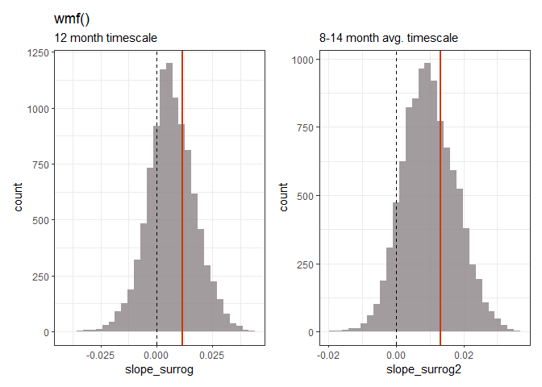
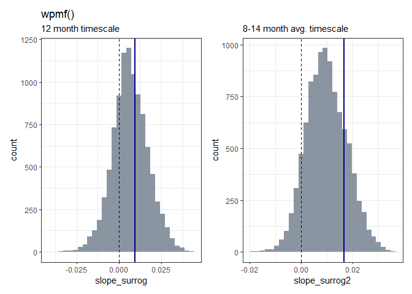

Q: Is there is an increase in annual timescale synchrony of mosquitos?
================
Amy Bauer,
last edited 2023-09-06

------------------------------------------------------------------------

The results below were generated using the following script on UF’s
HiPer Gator: `Cx_tarsalis_surr_par10k.R`. This script covers step 1 to
6, using both the wmf() and wpmf() function.

An unedited version of the code is shared in `/R Scripts`.

### Step by Step Instructions:

1.  If x is the wmf object for your mosquitos, x\$values should be a
    complex matrix for which Mod(x\$values) is what is plotted as the
    wmf
2.  Extract either 12-month timescale (or whatever timescale is closest)
    as a function of time, OR the average across 8-14 months. This is
    synchrony at or near the annual timescale, as a function of time.
3.  Regress (linear) against time, take the slope call it slope_real
4.  Get synchrony preserving aaft surrogates of your mosquito data
5.  Repeat steps 2 and 3 for that, getting slope_surrog\[1\]
6.  Repeat 9999 times, to get slope_surrog\[2\] through
    slope_surrog\[10000\]
7.  Make a histogram of slope_surrog -should cluster around 0. Plot the
    values slope_real on this histogram and see where it sits. If it’s
    way out in the right tail, there’s a significant increase in
    annual-timescale synchrony for this system
8.  Plot the wmf of one of the surrogate datasets to make sure it looks
    like the wmf of the real data but “evened out” over time. The
    timescale structure should be preserved, more or less. Also the
    total synchrony.

<details>
<summary>
Note on the execution of the steps above
</summary>

Previously shared results were generated using the `wpmf` function
despite the instructions refering to `wmf` an object - reading the
instructions, we originally thought this was necessary because of the
‘aaft’ preserved synchrony mentioned in Step 4.

Upon reading the instructions again, we realized that this may have been
a misunderstanding on our end, and Step 4 likely pertained to the
`surrog()` function used to get surrogate data sets. Below, \[Part I:
wmf\] will contain the results obtained using the `wmf` function, and
\[Part II: wpmf\] will contain results of using the `wpmf` function.

</details>

#### load data:

``` r
# all HPG output files returned in Cx_tarsalis_surr_par10k.R:
list.files(path = "data/output")
```

    ## [1] "Cx_sur_132540.RData"                  
    ## [2] "Slopes_wmf_Cxtarsalis_132540.csv"     
    ## [3] "Slopes_wmf_sur_aaft_10000_132540.csv" 
    ## [4] "Slopes_wpmf_Cxtarsalis_132540.csv"    
    ## [5] "Slopes_wpmf_sur_aaft_10000_132540.csv"

All output files of `Cx_tarsalis_surr_par10k.R` that were retrieved from
HiPerGator are available as .zip file [<u>download
here</u>](https://uflorida-my.sharepoint.com/:u:/g/personal/amelybauer_ufl_edu/ERkLfC-DhUhLqY5bjONt0WQBrcjxQauSsiz_7dxRV6O42w?e=wwOpvT)

``` r
load("data/output/Cx_sur_132540.RData")
# list all data objects saved in HPG .RData output
ls()
```

    ## [1] "gwmf"             "gwpmf"            "real_slopes_wmf"  "real_slopes_wpmf"
    ## [5] "sur"              "sur_slopes_wmf"   "sur_slopes_wpmf"  "sur_wmf_list"    
    ## [9] "sur_wpmf_list"

## slope histograms

<!-- -->

<!-- -->

The dashed line marks `x = 0.0`, the red (wmf)/blue (wpmf) line
represents the real slope for the mosquito data for the respective
timescale.
