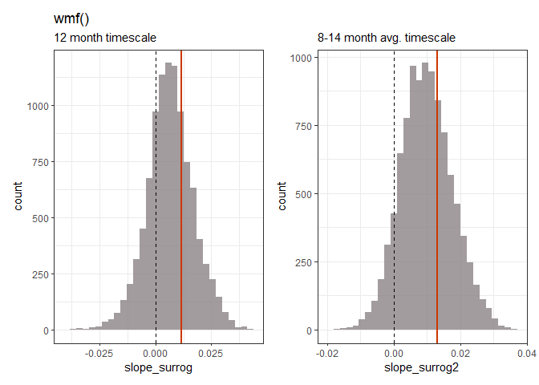
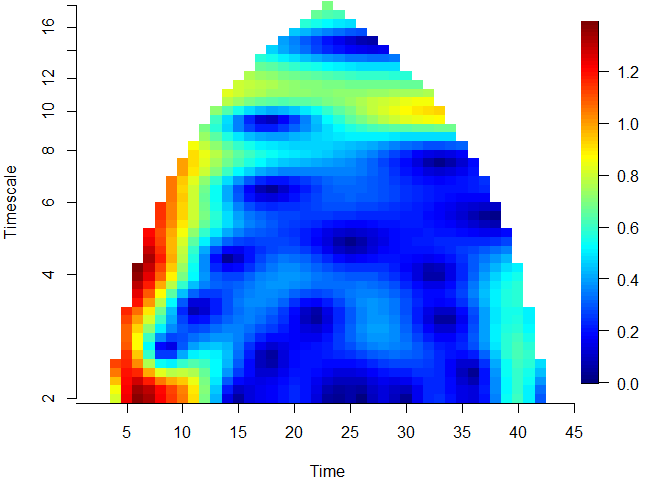
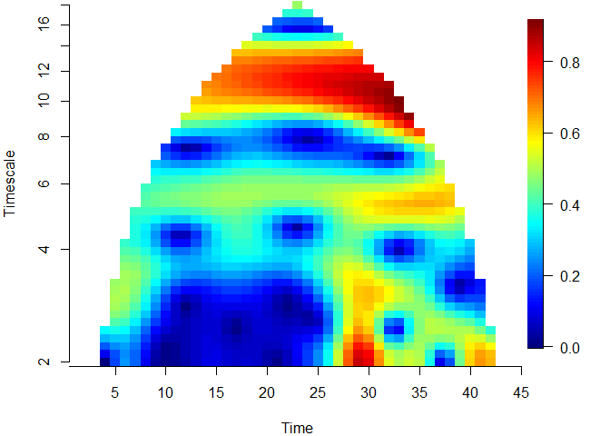
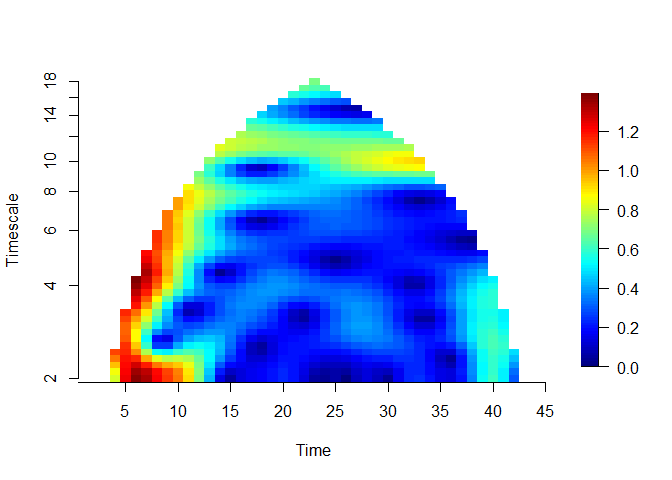
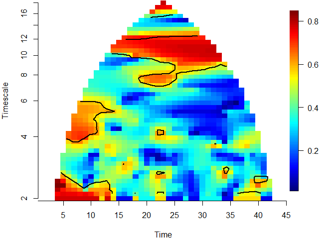
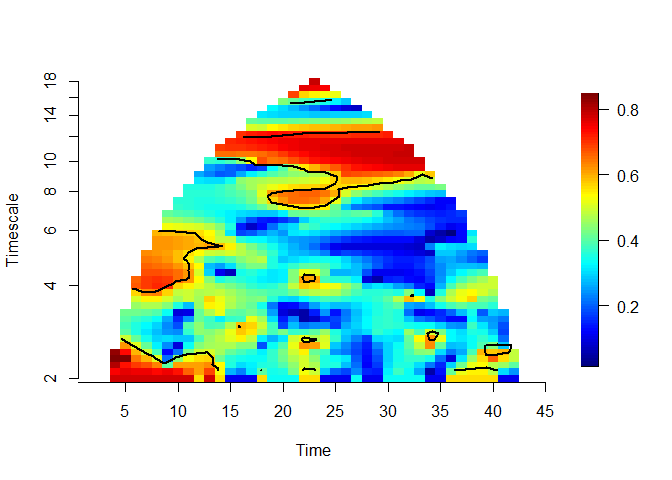

Q: Is there is an increase in annual timescale synchrony of mosquitos?
================
Amy Bauer,
last edited 2023-09-06

<details>
<summary>
Show code: load and prep <i>Cx. tarsalis</i> data
</summary>

``` r
times<-1:45

############# cx tarsalis data ############# 

dat<-as.matrix(read.csv("data/neon_cx_tarsalis.csv", header = T))
dat2<-dat[,-1] ## removes tBin
dat2<-dat2[,-3] ## removes JORN
 
dat2<-t(dat2) # transpose data

# clean data:  
x<-cleandat(dat2,times,3)$cdat
# 3: time series are (individually) linearly detrended and de-meaned, and variances are standardized to 1
```

</details>

## Step by Step Instructions:

<b>Note</b>: Previously shared results were generated using the `wpmf`
function despite the instructions refering to `wmf` an object - reading
the instructions, we originally thought this was necessary because of
the ‘aaft’ preserved synchrony mentioned in Step 4.

Upon reading the instructions again, we realized that this may have been
a misunderstanding on our end, and Step 4 likely pertained to the
`surrog()` function used to get surrogate data sets. Below, [Part I:
wmf](#part-i-wmf) will contain the results obtained using the `wmf`
function, and [Part II: wpmf](#part-ii-wpmf) will contain results of
using the `wpmf` function.

### Part I: wmf

#### Step 1 mos wmf

*If x is the wmf object for your mosquitos, x\$values should be a
complex matrix for which Mod(x\$values) is what is plotted as the wmf*

<details>
<summary>
Show code
</summary>

``` r
moswmf<-wmf(x,times = times)

# get value matrix
gwmf<-abs(moswmf$value)
```

</details>

##### wmf plot:

<!-- -->

##### Details:

<details>
<summary>
Show synchrony value matrix
</summary>

|           |           |           |           |           |           |           |           |           |           |           |           |           |           |           |           |           |           |           |           |           |           |           |           |           |           |           |           |           |           |           |           |           |           |           |           |           |           |           |           |           |           |           |           |           |           |
|----------:|----------:|----------:|----------:|----------:|----------:|----------:|----------:|----------:|----------:|----------:|----------:|----------:|----------:|----------:|----------:|----------:|----------:|----------:|----------:|----------:|----------:|----------:|----------:|----------:|----------:|----------:|----------:|----------:|----------:|----------:|----------:|----------:|----------:|----------:|----------:|----------:|----------:|----------:|----------:|----------:|----------:|----------:|----------:|----------:|----------:|
|       NaN |       NaN |       NaN |       NaN |       NaN |       NaN |       NaN |       NaN |       NaN |       NaN |       NaN |       NaN |       NaN |       NaN |       NaN |       NaN |       NaN |       NaN |       NaN |       NaN |       NaN |       NaN |       NaN |       NaN |       NaN |       NaN |       NaN |       NaN |       NaN |       NaN |       NaN |       NaN |       NaN |       NaN |       NaN |       NaN |       NaN |       NaN |       NaN |       NaN |       NaN |       NaN |       NaN |       NaN |       NaN |       NaN |
|       NaN |       NaN |       NaN |       NaN |       NaN |       NaN |       NaN |       NaN |       NaN |       NaN |       NaN |       NaN |       NaN |       NaN |       NaN |       NaN |       NaN |       NaN |       NaN |       NaN |       NaN |       NaN |       NaN |       NaN |       NaN |       NaN |       NaN |       NaN |       NaN |       NaN |       NaN |       NaN |       NaN |       NaN |       NaN |       NaN |       NaN |       NaN |       NaN |       NaN |       NaN |       NaN |       NaN |       NaN |       NaN |       NaN |
|       NaN |       NaN |       NaN |       NaN |       NaN |       NaN |       NaN |       NaN |       NaN |       NaN |       NaN |       NaN |       NaN |       NaN |       NaN |       NaN |       NaN |       NaN |       NaN |       NaN |       NaN |       NaN |       NaN |       NaN |       NaN |       NaN |       NaN |       NaN |       NaN |       NaN |       NaN |       NaN |       NaN |       NaN |       NaN |       NaN |       NaN |       NaN |       NaN |       NaN |       NaN |       NaN |       NaN |       NaN |       NaN |       NaN |
| 0.0057044 | 0.1050065 | 0.1984498 | 0.2781456 | 0.3437497 |       NaN |       NaN |       NaN |       NaN |       NaN |       NaN |       NaN |       NaN |       NaN |       NaN |       NaN |       NaN |       NaN |       NaN |       NaN |       NaN |       NaN |       NaN |       NaN |       NaN |       NaN |       NaN |       NaN |       NaN |       NaN |       NaN |       NaN |       NaN |       NaN |       NaN |       NaN |       NaN |       NaN |       NaN |       NaN |       NaN |       NaN |       NaN |       NaN |       NaN |       NaN |
| 0.1722083 | 0.1862438 | 0.2370376 | 0.2986043 | 0.3588795 | 0.4167900 | 0.4582681 | 0.4841162 | 0.4943801 | 0.4918296 | 0.4799794 |       NaN |       NaN |       NaN |       NaN |       NaN |       NaN |       NaN |       NaN |       NaN |       NaN |       NaN |       NaN |       NaN |       NaN |       NaN |       NaN |       NaN |       NaN |       NaN |       NaN |       NaN |       NaN |       NaN |       NaN |       NaN |       NaN |       NaN |       NaN |       NaN |       NaN |       NaN |       NaN |       NaN |       NaN |       NaN |
| 0.2504693 | 0.2443188 | 0.2619267 | 0.2972081 | 0.3426421 | 0.3953279 | 0.4389222 | 0.4711562 | 0.4897400 | 0.4958991 | 0.4920301 | 0.4931302 | 0.4708799 | 0.4420427 | 0.4114164 | 0.3850690 |       NaN |       NaN |       NaN |       NaN |       NaN |       NaN |       NaN |       NaN |       NaN |       NaN |       NaN |       NaN |       NaN |       NaN |       NaN |       NaN |       NaN |       NaN |       NaN |       NaN |       NaN |       NaN |       NaN |       NaN |       NaN |       NaN |       NaN |       NaN |       NaN |       NaN |
| 0.2062764 | 0.2074292 | 0.2218973 | 0.2487926 | 0.2865569 | 0.3347887 | 0.3791731 | 0.4162165 | 0.4428629 | 0.4594494 | 0.4668833 | 0.4775872 | 0.4621325 | 0.4352760 | 0.4023156 | 0.3718242 | 0.3659809 | 0.3656309 | 0.3795692 | 0.3942204 |       NaN |       NaN |       NaN |       NaN |       NaN |       NaN |       NaN |       NaN |       NaN |       NaN |       NaN |       NaN |       NaN |       NaN |       NaN |       NaN |       NaN |       NaN |       NaN |       NaN |       NaN |       NaN |       NaN |       NaN |       NaN |       NaN |
| 0.1035921 | 0.1173945 | 0.1381997 | 0.1667747 | 0.2040512 | 0.2500507 | 0.2935905 | 0.3320884 | 0.3643968 | 0.3913073 | 0.4118934 | 0.4339864 | 0.4274768 | 0.4033680 | 0.3671885 | 0.3308230 | 0.3219649 | 0.3319397 | 0.3654526 | 0.3984614 | 0.4231961 | 0.4164317 | 0.3973325 |       NaN |       NaN |       NaN |       NaN |       NaN |       NaN |       NaN |       NaN |       NaN |       NaN |       NaN |       NaN |       NaN |       NaN |       NaN |       NaN |       NaN |       NaN |       NaN |       NaN |       NaN |       NaN |       NaN |
| 0.0274920 | 0.0411289 | 0.0591009 | 0.0871708 | 0.1240673 | 0.1655048 | 0.2028419 | 0.2367679 | 0.2706681 | 0.3066583 | 0.3409864 | 0.3750790 | 0.3780642 | 0.3559374 | 0.3136760 | 0.2666220 | 0.2517012 | 0.2786949 | 0.3402766 | 0.3958482 | 0.4331638 | 0.4302968 | 0.4091762 | 0.3819357 | 0.3417963 | 0.2920466 |       NaN |       NaN |       NaN |       NaN |       NaN |       NaN |       NaN |       NaN |       NaN |       NaN |       NaN |       NaN |       NaN |       NaN |       NaN |       NaN |       NaN |       NaN |       NaN |       NaN |
| 0.0061687 | 0.0060262 | 0.0117816 | 0.0392839 | 0.0710983 | 0.1006756 | 0.1232849 | 0.1454349 | 0.1773540 | 0.2217995 | 0.2698504 | 0.3157136 | 0.3279294 | 0.3070856 | 0.2557951 | 0.1896787 | 0.1608046 | 0.2162351 | 0.3130053 | 0.3911660 | 0.4399663 | 0.4407194 | 0.4179613 | 0.3850918 | 0.3350468 | 0.2698403 | 0.1958066 | 0.1556207 |       NaN |       NaN |       NaN |       NaN |       NaN |       NaN |       NaN |       NaN |       NaN |       NaN |       NaN |       NaN |       NaN |       NaN |       NaN |       NaN |       NaN |       NaN |
| 0.0182243 | 0.0208570 | 0.0238337 | 0.0346019 | 0.0501737 | 0.0610613 | 0.0619553 | 0.0658863 | 0.0966255 | 0.1513473 | 0.2118973 | 0.2680900 | 0.2893866 | 0.2718614 | 0.2141820 | 0.1236980 | 0.0577099 | 0.1671634 | 0.2956340 | 0.3894841 | 0.4459567 | 0.4492202 | 0.4252823 | 0.3880477 | 0.3300114 | 0.2517737 | 0.1537557 | 0.0898758 | 0.1982861 | 0.3285774 |       NaN |       NaN |       NaN |       NaN |       NaN |       NaN |       NaN |       NaN |       NaN |       NaN |       NaN |       NaN |       NaN |       NaN |       NaN |       NaN |
| 0.0411744 | 0.0431817 | 0.0451591 | 0.0477788 | 0.0504851 | 0.0484268 | 0.0332543 | 0.0011618 | 0.0482225 | 0.1105207 | 0.1765326 | 0.2388925 | 0.2689542 | 0.2600377 | 0.2088876 | 0.1215346 | 0.0545987 | 0.1672860 | 0.2982512 | 0.3943464 | 0.4528068 | 0.4570304 | 0.4325256 | 0.3927465 | 0.3297913 | 0.2438397 | 0.1303646 | 0.0260258 | 0.1763111 | 0.3141961 | 0.4377433 | 0.5221827 |       NaN |       NaN |       NaN |       NaN |       NaN |       NaN |       NaN |       NaN |       NaN |       NaN |       NaN |       NaN |       NaN |       NaN |
| 0.0676618 | 0.0679346 | 0.0672590 | 0.0660384 | 0.0643676 | 0.0617881 | 0.0553660 | 0.0504895 | 0.0657657 | 0.1090247 | 0.1668197 | 0.2288451 | 0.2660054 | 0.2701625 | 0.2382820 | 0.1829286 | 0.1580223 | 0.2184089 | 0.3216748 | 0.4062517 | 0.4610230 | 0.4647911 | 0.4405108 | 0.4002829 | 0.3360294 | 0.2493429 | 0.1393472 | 0.0512062 | 0.1736295 | 0.3046049 | 0.4264627 | 0.5148397 | 0.5848733 | 0.6199854 |       NaN |       NaN |       NaN |       NaN |       NaN |       NaN |       NaN |       NaN |       NaN |       NaN |       NaN |       NaN |
| 0.0889347 | 0.0870132 | 0.0839206 | 0.0800886 | 0.0767502 | 0.0760890 | 0.0773438 | 0.0831335 | 0.0984149 | 0.1295660 | 0.1759085 | 0.2335218 | 0.2749926 | 0.2924164 | 0.2820809 | 0.2550253 | 0.2505898 | 0.2859379 | 0.3569059 | 0.4224492 | 0.4698375 | 0.4724380 | 0.4493109 | 0.4105833 | 0.3482265 | 0.2665812 | 0.1728305 | 0.1116735 | 0.1875409 | 0.2991702 | 0.4145251 | 0.5052666 | 0.5828827 | 0.6266758 | 0.6565118 | 0.6691020 |       NaN |       NaN |       NaN |       NaN |       NaN |       NaN |       NaN |       NaN |       NaN |       NaN |
| 0.0915999 | 0.0892522 | 0.0835917 | 0.0761126 | 0.0702562 | 0.0711071 | 0.0797296 | 0.0960907 | 0.1190978 | 0.1503776 | 0.1914075 | 0.2451035 | 0.2886454 | 0.3165005 | 0.3236949 | 0.3165853 | 0.3248874 | 0.3467625 | 0.3918984 | 0.4381298 | 0.4775066 | 0.4793113 | 0.4583253 | 0.4225190 | 0.3640351 | 0.2900834 | 0.2132586 | 0.1644693 | 0.2085629 | 0.2957631 | 0.4014999 | 0.4936991 | 0.5791180 | 0.6320526 | 0.6687479 | 0.6848365 | 0.6888406 |       NaN |       NaN |       NaN |       NaN |       NaN |       NaN |       NaN |       NaN |       NaN |
| 0.0785042 | 0.0770475 | 0.0673086 | 0.0527108 | 0.0399087 | 0.0430700 | 0.0648302 | 0.0947102 | 0.1273951 | 0.1629424 | 0.2033126 | 0.2552706 | 0.3000742 | 0.3351015 | 0.3543844 | 0.3599747 | 0.3757513 | 0.3892562 | 0.4164978 | 0.4481031 | 0.4819120 | 0.4844612 | 0.4665747 | 0.4343788 | 0.3802788 | 0.3137365 | 0.2495150 | 0.2055085 | 0.2275893 | 0.2914463 | 0.3867152 | 0.4804105 | 0.5741228 | 0.6365632 | 0.6801798 | 0.6996762 | 0.7040926 | 0.6939575 |       NaN |       NaN |       NaN |       NaN |       NaN |       NaN |       NaN |       NaN |
| 0.0700061 | 0.0685373 | 0.0572284 | 0.0383209 | 0.0138439 | 0.0210305 | 0.0557141 | 0.0921114 | 0.1284443 | 0.1656772 | 0.2061117 | 0.2578692 | 0.3042828 | 0.3440833 | 0.3702826 | 0.3819547 | 0.3998153 | 0.4069934 | 0.4237201 | 0.4481965 | 0.4812879 | 0.4870579 | 0.4730910 | 0.4444534 | 0.3940017 | 0.3327613 | 0.2759513 | 0.2323772 | 0.2385671 | 0.2832995 | 0.3694821 | 0.4657912 | 0.5685565 | 0.6407148 | 0.6910982 | 0.7137631 | 0.7184158 | 0.7062098 | 0.6779038 | 0.6290987 |       NaN |       NaN |       NaN |       NaN |       NaN |       NaN |
| 0.0715705 | 0.0697588 | 0.0644219 | 0.0563947 | 0.0491398 | 0.0520547 | 0.0689905 | 0.0946660 | 0.1244975 | 0.1583145 | 0.1977711 | 0.2503611 | 0.2994469 | 0.3424278 | 0.3707266 | 0.3818698 | 0.3956599 | 0.3967529 | 0.4098157 | 0.4362278 | 0.4748984 | 0.4867776 | 0.4772630 | 0.4515090 | 0.4031449 | 0.3442765 | 0.2899888 | 0.2438611 | 0.2381002 | 0.2690309 | 0.3493619 | 0.4504497 | 0.5632048 | 0.6450590 | 0.7018043 | 0.7272423 | 0.7318946 | 0.7175700 | 0.6853291 | 0.6305118 | 0.5445343 |       NaN |       NaN |       NaN |       NaN |       NaN |
| 0.0637442 | 0.0631988 | 0.0660808 | 0.0691002 | 0.0705243 | 0.0733065 | 0.0794645 | 0.0918910 | 0.1116281 | 0.1401357 | 0.1790795 | 0.2343550 | 0.2875660 | 0.3322087 | 0.3576856 | 0.3613472 | 0.3639906 | 0.3579902 | 0.3743109 | 0.4126780 | 0.4635113 | 0.4840408 | 0.4790380 | 0.4550466 | 0.4068335 | 0.3472812 | 0.2912132 | 0.2400703 | 0.2247669 | 0.2473084 | 0.3264496 | 0.4353184 | 0.5589785 | 0.6501689 | 0.7125927 | 0.7402519 | 0.7446120 | 0.7281370 | 0.6921663 | 0.6317695 | 0.5372947 | 0.3958381 |       NaN |       NaN |       NaN |       NaN |
| 0.0341525 | 0.0408054 | 0.0560075 | 0.0682948 | 0.0730761 | 0.0725599 | 0.0701203 | 0.0728518 | 0.0856781 | 0.1120455 | 0.1543374 | 0.2157009 | 0.2741223 | 0.3181276 | 0.3355640 | 0.3245874 | 0.3079505 | 0.2926163 | 0.3203583 | 0.3811926 | 0.4495412 | 0.4800232 | 0.4789414 | 0.4553439 | 0.4053835 | 0.3424836 | 0.2811087 | 0.2226048 | 0.1986906 | 0.2179210 | 0.3016796 | 0.4217402 | 0.5568890 | 0.6566094 | 0.7237344 | 0.7529139 | 0.7566431 | 0.7380061 | 0.6985857 | 0.6331854 | 0.5311170 | 0.3766403 | 0.1950777 |       NaN |       NaN |       NaN |
| 0.0078290 | 0.0290959 | 0.0529286 | 0.0666794 | 0.0671629 | 0.0576337 | 0.0442050 | 0.0382450 | 0.0490268 | 0.0808583 | 0.1333436 | 0.2039654 | 0.2666194 | 0.3065709 | 0.3113137 | 0.2795890 | 0.2342523 | 0.2047835 | 0.2560629 | 0.3488951 | 0.4367420 | 0.4764195 | 0.4779280 | 0.4533096 | 0.4000955 | 0.3320245 | 0.2629558 | 0.1947847 | 0.1612724 | 0.1819645 | 0.2771714 | 0.4114877 | 0.5579914 | 0.6649001 | 0.7354584 | 0.7653250 | 0.7680484 | 0.7472626 | 0.7047459 | 0.6350575 | 0.5265899 | 0.3608118 | 0.1532016 | 0.2061206 |       NaN |       NaN |
| 0.0532705 | 0.0604372 | 0.0717671 | 0.0760627 | 0.0674705 | 0.0491070 | 0.0272335 | 0.0065669 | 0.0222427 | 0.0682834 | 0.1324195 | 0.2098717 | 0.2722831 | 0.3045137 | 0.2946949 | 0.2408999 | 0.1585811 | 0.1009322 | 0.1988507 | 0.3258923 | 0.4293579 | 0.4750228 | 0.4771174 | 0.4501909 | 0.3928527 | 0.3189942 | 0.2416118 | 0.1621173 | 0.1150358 | 0.1424676 | 0.2565597 | 0.4066519 | 0.5632923 | 0.6754752 | 0.7479348 | 0.7775479 | 0.7788685 | 0.7559744 | 0.7107835 | 0.6376501 | 0.5242531 | 0.3497799 | 0.1159351 | 0.1900873 | 0.3793884 |       NaN |
| 0.1047441 | 0.1080894 | 0.1074417 | 0.0981710 | 0.0780023 | 0.0532179 | 0.0361555 | 0.0372525 | 0.0562968 | 0.1000041 | 0.1640922 | 0.2400443 | 0.2958691 | 0.3180920 | 0.2966277 | 0.2300385 | 0.1264889 | 0.0257159 | 0.1807882 | 0.3221766 | 0.4308113 | 0.4772430 | 0.4774858 | 0.4471915 | 0.3855424 | 0.3066076 | 0.2227401 | 0.1331312 | 0.0640304 | 0.1067409 | 0.2449357 | 0.4093432 | 0.5736311 | 0.6886430 | 0.7612599 | 0.7896047 | 0.7891178 | 0.7641861 | 0.7168032 | 0.6411742 | 0.5245500 | 0.3448284 | 0.0924846 | 0.1839362 | 0.3821927 | 0.4786411 |
| 0.1648461 | 0.1657969 | 0.1529521 | 0.1249733 | 0.0835639 | 0.0374380 | 0.0314594 | 0.0717182 | 0.1146317 | 0.1653481 | 0.2256796 | 0.2940720 | 0.3382972 | 0.3499833 | 0.3227392 | 0.2593227 | 0.1796457 | 0.1330814 | 0.2199676 | 0.3416283 | 0.4424378 | 0.4837268 | 0.4795974 | 0.4450916 | 0.3794099 | 0.2970597 | 0.2108914 | 0.1187802 | 0.0251854 | 0.0916851 | 0.2475608 | 0.4212362 | 0.5895609 | 0.7045527 | 0.7754447 | 0.8014713 | 0.7987811 | 0.7719129 | 0.7228687 | 0.6457712 | 0.5277815 | 0.3468349 | 0.0962122 | 0.1895094 | 0.3879183 |       NaN |
| 0.2385628 | 0.2392765 | 0.2136510 | 0.1655515 | 0.1035414 | 0.0525988 | 0.0799859 | 0.1406991 | 0.1989310 | 0.2545074 | 0.3087053 | 0.3661637 | 0.3955554 | 0.3964277 | 0.3672652 | 0.3151642 | 0.2664968 | 0.2412511 | 0.2905346 | 0.3792976 | 0.4630503 | 0.4942064 | 0.4834555 | 0.4439986 | 0.3745814 | 0.2904959 | 0.2068140 | 0.1243092 | 0.0593288 | 0.1128272 | 0.2672766 | 0.4431395 | 0.6112593 | 0.7231720 | 0.7904076 | 0.8130737 | 0.8078096 | 0.7791367 | 0.7289959 | 0.6514997 | 0.5340722 | 0.3560533 | 0.1258483 | 0.2063774 |       NaN |       NaN |
| 0.3495780 | 0.3527231 | 0.3214837 | 0.2688691 | 0.2155070 | 0.1921184 | 0.2117901 | 0.2592107 | 0.3119000 | 0.3608707 | 0.4030010 | 0.4460220 | 0.4579226 | 0.4467283 | 0.4156601 | 0.3741426 | 0.3483690 | 0.3349004 | 0.3655377 | 0.4258281 | 0.4896073 | 0.5076204 | 0.4885269 | 0.4433482 | 0.3700242 | 0.2848022 | 0.2064730 | 0.1416594 | 0.1102123 | 0.1584226 | 0.3030590 | 0.4748213 | 0.6384950 | 0.7442794 | 0.8059727 | 0.8242872 | 0.8161198 | 0.7858031 | 0.7351488 | 0.6583282 | 0.5433542 | 0.3720595 | 0.1685312 |       NaN |       NaN |       NaN |
| 0.5219262 | 0.5236696 | 0.4926051 | 0.4442026 | 0.3984037 | 0.3774427 | 0.3801011 | 0.4044671 | 0.4378846 | 0.4700302 | 0.4940780 | 0.5189947 | 0.5110216 | 0.4859197 | 0.4511332 | 0.4173827 | 0.4091007 | 0.4070971 | 0.4314119 | 0.4726732 | 0.5184245 | 0.5224513 | 0.4939543 | 0.4421943 | 0.3640321 | 0.2764763 | 0.2031729 | 0.1590945 | 0.1584907 | 0.2138712 | 0.3514514 | 0.5151651 | 0.6706540 | 0.7674723 | 0.8218727 | 0.8349374 | 0.8235932 | 0.7918207 | 0.7412376 | 0.6661340 | 0.5553736 | 0.3938887 |       NaN |       NaN |       NaN |       NaN |
| 0.7215467 | 0.7118388 | 0.6759722 | 0.6252774 | 0.5756048 | 0.5465840 | 0.5314710 | 0.5347649 | 0.5481358 | 0.5610590 | 0.5645922 | 0.5688309 | 0.5394389 | 0.4990208 | 0.4591374 | 0.4320139 | 0.4401256 | 0.4536467 | 0.4819424 | 0.5140602 | 0.5462286 | 0.5371696 | 0.4989114 | 0.4397205 | 0.3550849 | 0.2620798 | 0.1904300 | 0.1695880 | 0.2026494 | 0.2733001 | 0.4087323 | 0.5625061 | 0.7068095 | 0.7921866 | 0.8377567 | 0.8448032 | 0.8300777 | 0.7970626 | 0.7471217 | 0.6747095 | 0.5697166 |       NaN |       NaN |       NaN |       NaN |       NaN |
| 0.8454906 | 0.8246373 | 0.7802768 | 0.7215110 | 0.6644821 | 0.6307965 | 0.6115144 | 0.6101977 | 0.6157374 | 0.6155519 | 0.6005301 | 0.5832635 | 0.5320290 | 0.4755804 | 0.4302488 | 0.4111102 | 0.4382959 | 0.4739315 | 0.5153364 | 0.5470611 | 0.5707727 | 0.5506556 | 0.5030017 | 0.4358228 | 0.3428351 | 0.2397282 | 0.1635006 | 0.1715666 | 0.2439129 | 0.3348307 | 0.4718914 | 0.6149486 | 0.7458095 | 0.8177268 | 0.8532026 | 0.8536233 | 0.8353916 | 0.8013690 | 0.7526138 | 0.6837732 |       NaN |       NaN |       NaN |       NaN |       NaN |       NaN |
| 0.8152876 | 0.7968071 | 0.7448275 | 0.6746496 | 0.6128531 | 0.5889525 | 0.5927332 | 0.6141121 | 0.6307515 | 0.6273595 | 0.5980683 | 0.5599755 | 0.4872204 | 0.4136725 | 0.3621761 | 0.3543004 | 0.4064745 | 0.4716278 | 0.5332160 | 0.5711386 | 0.5910360 | 0.5624782 | 0.5065621 | 0.4315807 | 0.3290293 | 0.2107457 | 0.1197581 | 0.1693393 | 0.2852675 | 0.3981014 | 0.5386613 | 0.6705667 | 0.7863625 | 0.8432994 | 0.8677320 | 0.8611033 | 0.8393285 | 0.8045533 |       NaN |       NaN |       NaN |       NaN |       NaN |       NaN |       NaN |       NaN |
| 0.6715644 | 0.6613924 | 0.5935613 | 0.4978301 | 0.4262056 | 0.4315765 | 0.4935586 | 0.5638752 | 0.6054393 | 0.6055874 | 0.5662132 | 0.5097925 | 0.4167720 | 0.3230307 | 0.2605725 | 0.2684987 | 0.3546560 | 0.4548140 | 0.5397986 | 0.5874900 | 0.6070789 | 0.5729313 | 0.5107213 | 0.4293876 | 0.3180935 | 0.1823697 | 0.0586366 | 0.1741799 | 0.3305834 | 0.4632666 | 0.6072617 | 0.7274956 | 0.8271087 | 0.8680493 | 0.8808286 | 0.8669262 | 0.8416644 |       NaN |       NaN |       NaN |       NaN |       NaN |       NaN |       NaN |       NaN |       NaN |
| 0.5391859 | 0.5289776 | 0.4352766 | 0.2879582 | 0.1619124 | 0.2286228 | 0.3812455 | 0.5025105 | 0.5649390 | 0.5678422 | 0.5222412 | 0.4540503 | 0.3464508 | 0.2294320 | 0.1390020 | 0.1705709 | 0.3013762 | 0.4348840 | 0.5406364 | 0.5982065 | 0.6196281 | 0.5827822 | 0.5170930 | 0.4324830 | 0.3166419 | 0.1710189 | 0.0190753 | 0.2004453 | 0.3832847 | 0.5304257 | 0.6761439 | 0.7839570 | 0.8666761 | 0.8910951 | 0.8919577 | 0.8707637 |       NaN |       NaN |       NaN |       NaN |       NaN |       NaN |       NaN |       NaN |       NaN |       NaN |
| 0.5017171 | 0.4893388 | 0.4023989 | 0.2617003 | 0.1235832 | 0.1905388 | 0.3494855 | 0.4706296 | 0.5292437 | 0.5278205 | 0.4805985 | 0.4129740 | 0.3070606 | 0.1822773 | 0.0426687 | 0.1079605 | 0.2723289 | 0.4233242 | 0.5408520 | 0.6053324 | 0.6295017 | 0.5927818 | 0.5271151 | 0.4437791 | 0.3308742 | 0.1946329 | 0.1095706 | 0.2540003 | 0.4450690 | 0.5992456 | 0.7438079 | 0.8382590 | 0.9037248 | 0.9115625 |       NaN |       NaN |       NaN |       NaN |       NaN |       NaN |       NaN |       NaN |       NaN |       NaN |       NaN |       NaN |
| 0.5265638 | 0.5133001 | 0.4649541 | 0.3946792 | 0.3361091 | 0.3428391 | 0.4061348 | 0.4713098 | 0.4995674 | 0.4860308 | 0.4419747 | 0.3887807 | 0.3060891 | 0.2107106 | 0.1268810 | 0.1514512 | 0.2840946 | 0.4264137 | 0.5433096 | 0.6100247 | 0.6370400 | 0.6031057 | 0.5412636 | 0.4643987 | 0.3627549 | 0.2517282 | 0.2096314 | 0.3294249 | 0.5153452 | 0.6687554 | 0.8086968 | 0.8887954 |       NaN |       NaN |       NaN |       NaN |       NaN |       NaN |       NaN |       NaN |       NaN |       NaN |       NaN |       NaN |       NaN |       NaN |
| 0.5058136 | 0.4958694 | 0.4887351 | 0.4778273 | 0.4625047 | 0.4600146 | 0.4660125 | 0.4715119 | 0.4600114 | 0.4308807 | 0.3936602 | 0.3639164 | 0.3168170 | 0.2632246 | 0.2208746 | 0.2323552 | 0.3244493 | 0.4415976 | 0.5475537 | 0.6120496 | 0.6417279 | 0.6129680 | 0.5585351 | 0.4928480 | 0.4087087 | 0.3274023 | 0.3141997 | 0.4178040 | 0.5915082 | 0.7373172 |       NaN |       NaN |       NaN |       NaN |       NaN |       NaN |       NaN |       NaN |       NaN |       NaN |       NaN |       NaN |       NaN |       NaN |       NaN |       NaN |
| 0.3606896 | 0.3753414 | 0.4295263 | 0.4819209 | 0.5061688 | 0.5065847 | 0.4803305 | 0.4405161 | 0.3931746 | 0.3495336 | 0.3220500 | 0.3200492 | 0.3121282 | 0.2980072 | 0.2855799 | 0.2989307 | 0.3683189 | 0.4596432 | 0.5501248 | 0.6097775 | 0.6421432 | 0.6205939 | 0.5764941 | 0.5253880 | 0.4619294 | 0.4090131 | 0.4179821 | 0.5109684 |       NaN |       NaN |       NaN |       NaN |       NaN |       NaN |       NaN |       NaN |       NaN |       NaN |       NaN |       NaN |       NaN |       NaN |       NaN |       NaN |       NaN |       NaN |
| 0.1044536 | 0.2054647 | 0.3520273 | 0.4582127 | 0.5050074 | 0.5013096 | 0.4498679 | 0.3756428 | 0.2982976 | 0.2406570 | 0.2249753 | 0.2539036 | 0.2847991 | 0.3052892 | 0.3177038 | 0.3386172 | 0.3978906 | 0.4700533 | 0.5460297 | 0.6006770 | 0.6362588 | 0.6235693 | 0.5918388 | 0.5571989 | 0.5152016 | 0.4879228 |       NaN |       NaN |       NaN |       NaN |       NaN |       NaN |       NaN |       NaN |       NaN |       NaN |       NaN |       NaN |       NaN |       NaN |       NaN |       NaN |       NaN |       NaN |       NaN |       NaN |
| 0.1876640 | 0.2543947 | 0.3762069 | 0.4671769 | 0.4990138 | 0.4767963 | 0.4032710 | 0.3053382 | 0.2033822 | 0.1223633 | 0.1160542 | 0.1808175 | 0.2444832 | 0.2902298 | 0.3206358 | 0.3492522 | 0.4045494 | 0.4649367 | 0.5305638 | 0.5821468 | 0.6219994 | 0.6194207 | 0.6011827 |       NaN |       NaN |       NaN |       NaN |       NaN |       NaN |       NaN |       NaN |       NaN |       NaN |       NaN |       NaN |       NaN |       NaN |       NaN |       NaN |       NaN |       NaN |       NaN |       NaN |       NaN |       NaN |       NaN |
| 0.4409794 | 0.4512322 | 0.4851814 | 0.5108080 | 0.5007223 | 0.4534396 | 0.3674066 | 0.2654922 | 0.1610116 | 0.0592177 | 0.0388473 | 0.1317742 | 0.2076589 | 0.2628519 | 0.3009844 | 0.3333893 | 0.3861799 | 0.4404293 | 0.5007941 | 0.5524238 |       NaN |       NaN |       NaN |       NaN |       NaN |       NaN |       NaN |       NaN |       NaN |       NaN |       NaN |       NaN |       NaN |       NaN |       NaN |       NaN |       NaN |       NaN |       NaN |       NaN |       NaN |       NaN |       NaN |       NaN |       NaN |       NaN |
| 0.6065272 | 0.5962589 | 0.5773176 | 0.5455736 | 0.4932020 | 0.4242018 | 0.3368112 | 0.2499394 | 0.1718021 | 0.1078030 | 0.0847734 | 0.1274687 | 0.1840762 | 0.2310899 | 0.2657521 | 0.2961133 |       NaN |       NaN |       NaN |       NaN |       NaN |       NaN |       NaN |       NaN |       NaN |       NaN |       NaN |       NaN |       NaN |       NaN |       NaN |       NaN |       NaN |       NaN |       NaN |       NaN |       NaN |       NaN |       NaN |       NaN |       NaN |       NaN |       NaN |       NaN |       NaN |       NaN |
| 0.6660285 | 0.6498967 | 0.6039788 | 0.5361024 | 0.4533514 | 0.3686380 | 0.2851718 | 0.2199698 | 0.1739998 | 0.1414591 | 0.1259756 |       NaN |       NaN |       NaN |       NaN |       NaN |       NaN |       NaN |       NaN |       NaN |       NaN |       NaN |       NaN |       NaN |       NaN |       NaN |       NaN |       NaN |       NaN |       NaN |       NaN |       NaN |       NaN |       NaN |       NaN |       NaN |       NaN |       NaN |       NaN |       NaN |       NaN |       NaN |       NaN |       NaN |       NaN |       NaN |
| 0.6389149 | 0.6242637 | 0.5673849 | 0.4811462 | 0.3802971 |       NaN |       NaN |       NaN |       NaN |       NaN |       NaN |       NaN |       NaN |       NaN |       NaN |       NaN |       NaN |       NaN |       NaN |       NaN |       NaN |       NaN |       NaN |       NaN |       NaN |       NaN |       NaN |       NaN |       NaN |       NaN |       NaN |       NaN |       NaN |       NaN |       NaN |       NaN |       NaN |       NaN |       NaN |       NaN |       NaN |       NaN |       NaN |       NaN |       NaN |       NaN |
|       NaN |       NaN |       NaN |       NaN |       NaN |       NaN |       NaN |       NaN |       NaN |       NaN |       NaN |       NaN |       NaN |       NaN |       NaN |       NaN |       NaN |       NaN |       NaN |       NaN |       NaN |       NaN |       NaN |       NaN |       NaN |       NaN |       NaN |       NaN |       NaN |       NaN |       NaN |       NaN |       NaN |       NaN |       NaN |       NaN |       NaN |       NaN |       NaN |       NaN |       NaN |       NaN |       NaN |       NaN |       NaN |       NaN |
|       NaN |       NaN |       NaN |       NaN |       NaN |       NaN |       NaN |       NaN |       NaN |       NaN |       NaN |       NaN |       NaN |       NaN |       NaN |       NaN |       NaN |       NaN |       NaN |       NaN |       NaN |       NaN |       NaN |       NaN |       NaN |       NaN |       NaN |       NaN |       NaN |       NaN |       NaN |       NaN |       NaN |       NaN |       NaN |       NaN |       NaN |       NaN |       NaN |       NaN |       NaN |       NaN |       NaN |       NaN |       NaN |       NaN |
|       NaN |       NaN |       NaN |       NaN |       NaN |       NaN |       NaN |       NaN |       NaN |       NaN |       NaN |       NaN |       NaN |       NaN |       NaN |       NaN |       NaN |       NaN |       NaN |       NaN |       NaN |       NaN |       NaN |       NaN |       NaN |       NaN |       NaN |       NaN |       NaN |       NaN |       NaN |       NaN |       NaN |       NaN |       NaN |       NaN |       NaN |       NaN |       NaN |       NaN |       NaN |       NaN |       NaN |       NaN |       NaN |       NaN |

</details>

#### Step 2 mos wmf timescale

*Extract either 12-month timescale (or whatever timescale is closest) as
a function of time, OR the average across 8-14 months. This is synchrony
at or near the annual timescale, as a function of time.*

<details>
<summary>
Show code
</summary>

``` r
# 12 month time scale
gwmf12<-gwmf[12,]
gwmf12<-gwmf12[-46]

# 8-14 month timescales average
gwmf8_14<-colMeans(gwmf[8:14,], na.rm = T)
gwmf8_14<-gwmf8_14[-46]
```

</details>

##### Details:

<details>
<summary>
Show extracted values
</summary>

12 month values:

``` r
gwmf12
```

    ##  [1] 0.04117435 0.04318171 0.04515911 0.04777879 0.05048507 0.04842678
    ##  [7] 0.03325430 0.00116184 0.04822252 0.11052066 0.17653262 0.23889247
    ## [13] 0.26895418 0.26003765 0.20888757 0.12153459 0.05459872 0.16728599
    ## [19] 0.29825115 0.39434637 0.45280675 0.45703043 0.43252558 0.39274649
    ## [25] 0.32979129 0.24383968 0.13036455 0.02602581 0.17631112 0.31419611
    ## [31] 0.43774334 0.52218272        NaN        NaN        NaN        NaN
    ## [37]        NaN        NaN        NaN        NaN        NaN        NaN
    ## [43]        NaN        NaN        NaN

8-14 month average values

``` r
gwmf8_14
```

    ##  [1] 0.05046400 0.05479090 0.06132210 0.07453387 0.09157047 0.10908517
    ##  [7] 0.12109096 0.13070890 0.16020679 0.20288910 0.25055549 0.29916118
    ## [13] 0.31897274 0.30869557 0.26858457 0.21004431 0.17934163 0.23795227
    ## [19] 0.32731435 0.39971528 0.44656432 0.44727538 0.42458565 0.39311462
    ## [25] 0.33681695 0.26223741 0.15842091 0.08688040 0.18394190 0.31163715
    ## [31] 0.42624372 0.51409633 0.58387800 0.62333057 0.65651185 0.66910196
    ## [37]        NaN        NaN        NaN        NaN        NaN        NaN
    ## [43]        NaN        NaN        NaN

</details>

#### Step 3 mos wmf slope

*Regress (linear) against time, take the slope call it slope_real*

<details>
<summary>
Show code
</summary>

``` r
# 12 month time scale
out1<-lm(gwmf12 ~ times)
slope_real<- out1$coefficients[2]

# 8-14 month timescales average
out2<-lm(gwmf8_14 ~ times)
slope_real2 <- out2$coefficients[2]

slopes_wmf <- cbind(slope_real, slope_real2)
```

</details>

##### real slopes

|       | slope_real | slope_real2 |
|:------|-----------:|------------:|
| times |  0.0115137 |     0.01314 |

#### Step 4 generate surrogates

*Get synchrony preserving aaft surrogates of your mosquito data*

<details>
<summary>
Show code
</summary>

``` r
## Get synchrony preserving aaft surrogate data of your mosquito data
nsurrogs <- 1 # for code check
surrtype <- "aaft"
syncpres <- TRUE
sur <- surrog(x,nsurrogs,surrtype,syncpres)

# with x being the prep. mosquito data:

    # dat<-as.matrix(read.csv("neon_cx_tarsalis.csv", header = T))
    # dat2<-dat[,-1]
    # dat2<-dat2[,-3]
    # dat2<-t(dat2)
    # x<-cleandat(dat2,times,3)$cdat

## this is a demo of the used code, we generated 10,000 surr data sets using a looped setup
```

</details>

#### Step 5 sur wmf slope

*Repeat steps 2 and 3 for that, getting slope_surrog\[1\]*

<details>
<summary>
Show code
</summary>

``` r
df_slope_wmf <- data.frame(matrix(nrow = 0, ncol = 2))
colnames(df_slope_wmf) <- c("slope_surrog","slope_surrog2")

for (i in sur) {
  
  # surrogate data
  x <- i 
  
  # times<-1:45

  moswmf_s<-wmf(x,times = times)
  
  gwmfs<-abs(moswmf_s$value)
  
  # get timeseries values:
  
  gwmfs12<-gwmfs[12,] 
  gwmfs12<-gwmfs12[-46] 
  
  gwmfs8_14<-colMeans(gwmfs[8:14,], na.rm = T)
  gwmfs8_14<-gwmfs8_14[-46]
  
  # get slopes:
  
  out1s<-lm(gwmfs12 ~ times)
  slope_surrog <- out1s$coefficients[2]
  
  out2s<-lm(gwmfs8_14 ~ times)
  slope_surrog2 <- out2s$coefficients[2]
  
  slopes2 <- cbind(slope_surrog, slope_surrog2)
  df_slope_wmf <- rbind(df_slope_wmf, slopes2)
  
}
```

</details>

##### surrogate\[1\] slopes:

|       | slope_surrog | slope_surrog2 |
|:------|-------------:|--------------:|
| times |    0.0100609 |     0.0074491 |

#### Step 6

*Repeat 9999 times, to get slope_surrog\[2\] through
slope_surrog\[10000\]*

<b>Note:</b> Used a loop for this, following the code above

#### Step 7 wmf histogram

*Make a histogram of slope_surrog -should cluster around 0. Plot the
values slope_real on this histogram and see where it sits. If it’s way
out in the right tail, there’s a significant increase in
annual-timescale synchrony for this system*

##### histogram

<!-- -->

The dashed line is drawn at x=0.0, the red line represents the real
slope for the mosquito data for the respective timescale (wmf)

#### Step 8 wmf sur sample

*Plot the wmf of one of the surrogate datasets to make sure it looks
like the wmf of the real data but “evened out” over time. The timescale
structure should be preserved, more or less. Also the total synchrony.*

<b>Note</b>: Taking a look at the example surrogate data generated in
[Step 5 sur wmf slope](#step-5-sur-wmf-slope)

##### Compare surrogate (left) and mosquito (right) wmf plots side by side:



##### Details:

<details>
<summary>
Show surrogate data wmf plot
</summary>

<!-- -->

</details>
<details>
<summary>
Show surrogate data synchrony value matrix
</summary>

|           |           |           |           |           |           |           |           |           |           |           |           |           |           |           |           |           |           |           |           |           |           |           |           |           |           |           |           |           |           |           |           |           |           |           |           |           |           |           |           |           |           |           |           |           |           |
|----------:|----------:|----------:|----------:|----------:|----------:|----------:|----------:|----------:|----------:|----------:|----------:|----------:|----------:|----------:|----------:|----------:|----------:|----------:|----------:|----------:|----------:|----------:|----------:|----------:|----------:|----------:|----------:|----------:|----------:|----------:|----------:|----------:|----------:|----------:|----------:|----------:|----------:|----------:|----------:|----------:|----------:|----------:|----------:|----------:|----------:|
|       NaN |       NaN |       NaN |       NaN |       NaN |       NaN |       NaN |       NaN |       NaN |       NaN |       NaN |       NaN |       NaN |       NaN |       NaN |       NaN |       NaN |       NaN |       NaN |       NaN |       NaN |       NaN |       NaN |       NaN |       NaN |       NaN |       NaN |       NaN |       NaN |       NaN |       NaN |       NaN |       NaN |       NaN |       NaN |       NaN |       NaN |       NaN |       NaN |       NaN |       NaN |       NaN |       NaN |       NaN |       NaN |       NaN |
|       NaN |       NaN |       NaN |       NaN |       NaN |       NaN |       NaN |       NaN |       NaN |       NaN |       NaN |       NaN |       NaN |       NaN |       NaN |       NaN |       NaN |       NaN |       NaN |       NaN |       NaN |       NaN |       NaN |       NaN |       NaN |       NaN |       NaN |       NaN |       NaN |       NaN |       NaN |       NaN |       NaN |       NaN |       NaN |       NaN |       NaN |       NaN |       NaN |       NaN |       NaN |       NaN |       NaN |       NaN |       NaN |       NaN |
|       NaN |       NaN |       NaN |       NaN |       NaN |       NaN |       NaN |       NaN |       NaN |       NaN |       NaN |       NaN |       NaN |       NaN |       NaN |       NaN |       NaN |       NaN |       NaN |       NaN |       NaN |       NaN |       NaN |       NaN |       NaN |       NaN |       NaN |       NaN |       NaN |       NaN |       NaN |       NaN |       NaN |       NaN |       NaN |       NaN |       NaN |       NaN |       NaN |       NaN |       NaN |       NaN |       NaN |       NaN |       NaN |       NaN |
| 0.8195313 | 0.8574635 | 0.9508759 | 1.0486371 | 1.1130415 |       NaN |       NaN |       NaN |       NaN |       NaN |       NaN |       NaN |       NaN |       NaN |       NaN |       NaN |       NaN |       NaN |       NaN |       NaN |       NaN |       NaN |       NaN |       NaN |       NaN |       NaN |       NaN |       NaN |       NaN |       NaN |       NaN |       NaN |       NaN |       NaN |       NaN |       NaN |       NaN |       NaN |       NaN |       NaN |       NaN |       NaN |       NaN |       NaN |       NaN |       NaN |
| 1.2245712 | 1.2111893 | 1.2073136 | 1.1951749 | 1.1611477 | 1.1428204 | 1.0945639 | 1.0723031 | 1.0819063 | 1.1137765 | 1.1551349 |       NaN |       NaN |       NaN |       NaN |       NaN |       NaN |       NaN |       NaN |       NaN |       NaN |       NaN |       NaN |       NaN |       NaN |       NaN |       NaN |       NaN |       NaN |       NaN |       NaN |       NaN |       NaN |       NaN |       NaN |       NaN |       NaN |       NaN |       NaN |       NaN |       NaN |       NaN |       NaN |       NaN |       NaN |       NaN |
| 1.3737370 | 1.3450104 | 1.2710537 | 1.1590886 | 1.0253928 | 0.9313668 | 0.8656056 | 0.8745116 | 0.9308329 | 1.0003750 | 1.0665660 | 1.1841594 | 1.2435916 | 1.3030254 | 1.3561898 | 1.3838252 |       NaN |       NaN |       NaN |       NaN |       NaN |       NaN |       NaN |       NaN |       NaN |       NaN |       NaN |       NaN |       NaN |       NaN |       NaN |       NaN |       NaN |       NaN |       NaN |       NaN |       NaN |       NaN |       NaN |       NaN |       NaN |       NaN |       NaN |       NaN |       NaN |       NaN |
| 1.3239039 | 1.2977361 | 1.1771783 | 0.9854258 | 0.7605336 | 0.5870390 | 0.5241492 | 0.5997615 | 0.7138460 | 0.8117114 | 0.8897068 | 1.0103628 | 1.0897073 | 1.1726867 | 1.2448933 | 1.2841741 | 1.3310208 | 1.2823784 | 1.2337353 | 1.2066809 |       NaN |       NaN |       NaN |       NaN |       NaN |       NaN |       NaN |       NaN |       NaN |       NaN |       NaN |       NaN |       NaN |       NaN |       NaN |       NaN |       NaN |       NaN |       NaN |       NaN |       NaN |       NaN |       NaN |       NaN |       NaN |       NaN |
| 1.2206057 | 1.1965411 | 1.0564401 | 0.8243566 | 0.5370676 | 0.2593998 | 0.1811185 | 0.3617872 | 0.5098482 | 0.6025032 | 0.6670492 | 0.7760138 | 0.8745263 | 0.9834294 | 1.0751841 | 1.1260105 | 1.1770875 | 1.1451186 | 1.1166402 | 1.1078268 | 1.1356993 | 1.1443260 | 1.1441029 |       NaN |       NaN |       NaN |       NaN |       NaN |       NaN |       NaN |       NaN |       NaN |       NaN |       NaN |       NaN |       NaN |       NaN |       NaN |       NaN |       NaN |       NaN |       NaN |       NaN |       NaN |       NaN |       NaN |
| 1.1368696 | 1.1135947 | 0.9868423 | 0.7753100 | 0.5126466 | 0.2567599 | 0.1384048 | 0.2684176 | 0.3698953 | 0.4134607 | 0.4382566 | 0.5254353 | 0.6435825 | 0.7754362 | 0.8787684 | 0.9332620 | 0.9839771 | 0.9720786 | 0.9700435 | 0.9845437 | 1.0251582 | 1.0402316 | 1.0409599 | 1.0544343 | 1.0475918 | 1.0479861 |       NaN |       NaN |       NaN |       NaN |       NaN |       NaN |       NaN |       NaN |       NaN |       NaN |       NaN |       NaN |       NaN |       NaN |       NaN |       NaN |       NaN |       NaN |       NaN |       NaN |
| 1.0499674 | 1.0296997 | 0.9358456 | 0.7796232 | 0.5867122 | 0.4137761 | 0.2994237 | 0.2857345 | 0.2924780 | 0.2648755 | 0.2304972 | 0.2977208 | 0.4413944 | 0.5866131 | 0.6858276 | 0.7300630 | 0.7722321 | 0.7809146 | 0.8092904 | 0.8495163 | 0.9026625 | 0.9228906 | 0.9230108 | 0.9327195 | 0.9295035 | 0.9414429 | 0.9952020 | 0.9899282 |       NaN |       NaN |       NaN |       NaN |       NaN |       NaN |       NaN |       NaN |       NaN |       NaN |       NaN |       NaN |       NaN |       NaN |       NaN |       NaN |       NaN |       NaN |
| 0.9101759 | 0.8978830 | 0.8444719 | 0.7508876 | 0.6257090 | 0.5062036 | 0.3928843 | 0.3210618 | 0.2650790 | 0.1845445 | 0.0703390 | 0.1340901 | 0.3049935 | 0.4427207 | 0.5181733 | 0.5360832 | 0.5600285 | 0.5888286 | 0.6499266 | 0.7153439 | 0.7784774 | 0.8009236 | 0.7976929 | 0.8013145 | 0.8012814 | 0.8265384 | 0.8958038 | 0.9084479 | 0.9114522 | 0.8572135 |       NaN |       NaN |       NaN |       NaN |       NaN |       NaN |       NaN |       NaN |       NaN |       NaN |       NaN |       NaN |       NaN |       NaN |       NaN |       NaN |
| 0.6929546 | 0.6963130 | 0.6895097 | 0.6608986 | 0.6019646 | 0.5334165 | 0.4404753 | 0.3582236 | 0.2848142 | 0.2025709 | 0.1109782 | 0.1289842 | 0.2521743 | 0.3517937 | 0.3877702 | 0.3656394 | 0.3609225 | 0.4111271 | 0.5061666 | 0.5928860 | 0.6614277 | 0.6821632 | 0.6721354 | 0.6664897 | 0.6683294 | 0.7083523 | 0.7951203 | 0.8267069 | 0.8371953 | 0.7820432 | 0.7332853 | 0.6852597 |       NaN |       NaN |       NaN |       NaN |       NaN |       NaN |       NaN |       NaN |       NaN |       NaN |       NaN |       NaN |       NaN |       NaN |
| 0.4189324 | 0.4459957 | 0.4899241 | 0.5230683 | 0.5247684 | 0.5064199 | 0.4493819 | 0.3859651 | 0.3248651 | 0.2644631 | 0.2110136 | 0.2110588 | 0.2596422 | 0.3072849 | 0.3015530 | 0.2331418 | 0.1834749 | 0.2626453 | 0.3901067 | 0.4899863 | 0.5579989 | 0.5730782 | 0.5528015 | 0.5339615 | 0.5354636 | 0.5916418 | 0.6975901 | 0.7483290 | 0.7662372 | 0.7100136 | 0.6456079 | 0.5734880 | 0.6009146 | 0.7130722 |       NaN |       NaN |       NaN |       NaN |       NaN |       NaN |       NaN |       NaN |       NaN |       NaN |       NaN |       NaN |
| 0.1508517 | 0.2100197 | 0.3006759 | 0.3758260 | 0.4164722 | 0.4347458 | 0.4161388 | 0.3860273 | 0.3523570 | 0.3171357 | 0.2845077 | 0.2820511 | 0.2903830 | 0.2986273 | 0.2656383 | 0.1676996 | 0.0342855 | 0.1663369 | 0.3107475 | 0.4106253 | 0.4719442 | 0.4785428 | 0.4454705 | 0.4088512 | 0.4066840 | 0.4808184 | 0.6071433 | 0.6762666 | 0.7013801 | 0.6445407 | 0.5644895 | 0.4632258 | 0.4750214 | 0.6264308 | 0.7749990 | 0.8216345 |       NaN |       NaN |       NaN |       NaN |       NaN |       NaN |       NaN |       NaN |       NaN |       NaN |
| 0.0411606 | 0.0994169 | 0.1890398 | 0.2594110 | 0.3014925 | 0.3316962 | 0.3436147 | 0.3512078 | 0.3523309 | 0.3448309 | 0.3308355 | 0.3337223 | 0.3261083 | 0.3151799 | 0.2756643 | 0.1895199 | 0.0955789 | 0.1542475 | 0.2703453 | 0.3545893 | 0.4043772 | 0.4018201 | 0.3555269 | 0.2961981 | 0.2851256 | 0.3802683 | 0.5271635 | 0.6126604 | 0.6446259 | 0.5884875 | 0.4949426 | 0.3599907 | 0.3494758 | 0.5471041 | 0.7312553 | 0.7960925 | 0.8051124 |       NaN |       NaN |       NaN |       NaN |       NaN |       NaN |       NaN |       NaN |       NaN |
| 0.1310818 | 0.1335367 | 0.1572706 | 0.1800665 | 0.1909838 | 0.2110492 | 0.2458657 | 0.2908028 | 0.3268357 | 0.3461569 | 0.3507119 | 0.3644240 | 0.3567653 | 0.3432323 | 0.3102886 | 0.2484719 | 0.1931287 | 0.1973102 | 0.2598755 | 0.3179679 | 0.3541896 | 0.3444717 | 0.2881785 | 0.2028112 | 0.1732568 | 0.2951790 | 0.4604851 | 0.5587863 | 0.5970426 | 0.5437982 | 0.4418979 | 0.2727158 | 0.2284784 | 0.4809434 | 0.6943261 | 0.7728712 | 0.7859273 | 0.7538407 |       NaN |       NaN |       NaN |       NaN |       NaN |       NaN |       NaN |       NaN |
| 0.1561445 | 0.1539521 | 0.1436482 | 0.1219818 | 0.0877162 | 0.0865838 | 0.1516070 | 0.2286977 | 0.2884866 | 0.3254575 | 0.3443636 | 0.3706841 | 0.3732795 | 0.3684279 | 0.3473612 | 0.3038936 | 0.2648145 | 0.2436085 | 0.2634073 | 0.2946293 | 0.3185800 | 0.3059581 | 0.2473749 | 0.1421844 | 0.0742268 | 0.2327566 | 0.4092516 | 0.5150713 | 0.5587327 | 0.5111336 | 0.4089800 | 0.2172038 | 0.1231284 | 0.4345118 | 0.6659616 | 0.7526855 | 0.7674663 | 0.7327492 | 0.6662763 | 0.5803614 |       NaN |       NaN |       NaN |       NaN |       NaN |       NaN |
| 0.1747681 | 0.1722708 | 0.1518390 | 0.1155628 | 0.0642701 | 0.0447354 | 0.1163348 | 0.1924162 | 0.2504299 | 0.2880297 | 0.3126520 | 0.3503040 | 0.3698690 | 0.3810560 | 0.3738898 | 0.3428819 | 0.3109620 | 0.2752961 | 0.2675374 | 0.2780058 | 0.2935987 | 0.2832619 | 0.2323673 | 0.1328729 | 0.0344495 | 0.2014255 | 0.3744475 | 0.4811461 | 0.5289214 | 0.4896868 | 0.3967000 | 0.2110931 | 0.0914965 | 0.4132455 | 0.6472795 | 0.7360324 | 0.7501416 | 0.7119218 | 0.6389079 | 0.5435484 | 0.4621293 |       NaN |       NaN |       NaN |       NaN |       NaN |
| 0.2068054 | 0.2031975 | 0.1873289 | 0.1628144 | 0.1366569 | 0.1286309 | 0.1474091 | 0.1833890 | 0.2146595 | 0.2358991 | 0.2574979 | 0.3055514 | 0.3472332 | 0.3784703 | 0.3849753 | 0.3619609 | 0.3323108 | 0.2877589 | 0.2641706 | 0.2623093 | 0.2748109 | 0.2714317 | 0.2357513 | 0.1635029 | 0.1032099 | 0.2027706 | 0.3552082 | 0.4559160 | 0.5061483 | 0.4773571 | 0.4016296 | 0.2488755 | 0.1665890 | 0.4183491 | 0.6385770 | 0.7231742 | 0.7342771 | 0.6917987 | 0.6121328 | 0.5071145 | 0.4143563 | 0.4010166 |       NaN |       NaN |       NaN |       NaN |
| 0.2262439 | 0.2213795 | 0.2123171 | 0.1997849 | 0.1857475 | 0.1797092 | 0.1756475 | 0.1763489 | 0.1733430 | 0.1678941 | 0.1826925 | 0.2457042 | 0.3137341 | 0.3644907 | 0.3811865 | 0.3614421 | 0.3301975 | 0.2799356 | 0.2489879 | 0.2431282 | 0.2581444 | 0.2651891 | 0.2476833 | 0.2044379 | 0.1677228 | 0.2255331 | 0.3485237 | 0.4376571 | 0.4885150 | 0.4712652 | 0.4178211 | 0.3068530 | 0.2613600 | 0.4455257 | 0.6392928 | 0.7141420 | 0.7201058 | 0.6727747 | 0.5865550 | 0.4719004 | 0.3666232 | 0.3502547 | 0.4569925 |       NaN |       NaN |       NaN |
| 0.2038559 | 0.2017226 | 0.2027235 | 0.2038095 | 0.2013693 | 0.1993254 | 0.1852351 | 0.1629373 | 0.1280249 | 0.0860116 | 0.0984020 | 0.1912864 | 0.2839085 | 0.3466486 | 0.3663026 | 0.3441128 | 0.3072590 | 0.2525781 | 0.2201930 | 0.2178541 | 0.2407784 | 0.2604977 | 0.2608504 | 0.2417360 | 0.2207088 | 0.2555796 | 0.3498673 | 0.4241631 | 0.4739244 | 0.4683686 | 0.4391914 | 0.3687967 | 0.3530722 | 0.4875084 | 0.6481563 | 0.7087598 | 0.7077706 | 0.6551880 | 0.5627483 | 0.4388046 | 0.3197932 | 0.2994418 | 0.4194992 | 0.5695377 |       NaN |       NaN |
| 0.1366600 | 0.1434738 | 0.1621169 | 0.1824568 | 0.1967883 | 0.2058723 | 0.1939380 | 0.1643046 | 0.1144313 | 0.0438078 | 0.0635675 | 0.1757116 | 0.2721071 | 0.3321492 | 0.3454700 | 0.3150153 | 0.2683791 | 0.2084173 | 0.1781576 | 0.1861880 | 0.2218362 | 0.2552437 | 0.2714239 | 0.2711532 | 0.2616981 | 0.2838586 | 0.3543823 | 0.4129521 | 0.4602739 | 0.4659298 | 0.4609695 | 0.4273885 | 0.4375886 | 0.5373975 | 0.6634678 | 0.7066843 | 0.6973285 | 0.6393079 | 0.5412294 | 0.4087616 | 0.2749380 | 0.2491538 | 0.3840463 | 0.5431538 | 0.6548140 |       NaN |
| 0.0446872 | 0.0712029 | 0.1127086 | 0.1528802 | 0.1867132 | 0.2141102 | 0.2168790 | 0.1985765 | 0.1637964 | 0.1297682 | 0.1390745 | 0.2110292 | 0.2822269 | 0.3246876 | 0.3241152 | 0.2816049 | 0.2219448 | 0.1529347 | 0.1253921 | 0.1508466 | 0.2026991 | 0.2490994 | 0.2779994 | 0.2917090 | 0.2908778 | 0.3057361 | 0.3578242 | 0.4015080 | 0.4455978 | 0.4617547 | 0.4799737 | 0.4795474 | 0.5136929 | 0.5900939 | 0.6833954 | 0.7074513 | 0.6887559 | 0.6253248 | 0.5224265 | 0.3826940 | 0.2334789 | 0.2000596 | 0.3514177 | 0.5182018 | 0.6327447 | 0.6836435 |
| 0.0351713 | 0.0487115 | 0.0858721 | 0.1321944 | 0.1807883 | 0.2277645 | 0.2510247 | 0.2524571 | 0.2381493 | 0.2228179 | 0.2262350 | 0.2684189 | 0.3060831 | 0.3242215 | 0.3073051 | 0.2533206 | 0.1813127 | 0.0969695 | 0.0667531 | 0.1188388 | 0.1866947 | 0.2429000 | 0.2804794 | 0.3035997 | 0.3087526 | 0.3190243 | 0.3569657 | 0.3875132 | 0.4281741 | 0.4542617 | 0.4943631 | 0.5240956 | 0.5810525 | 0.6422432 | 0.7062013 | 0.7105222 | 0.6819545 | 0.6133401 | 0.5066456 | 0.3614292 | 0.1974031 | 0.1530700 | 0.3224252 | 0.4949542 | 0.6111234 |       NaN |
| 0.0582197 | 0.0578507 | 0.0838276 | 0.1297923 | 0.1860827 | 0.2472214 | 0.2878570 | 0.3069529 | 0.3080608 | 0.3017360 | 0.2997910 | 0.3229639 | 0.3325136 | 0.3283460 | 0.2981176 | 0.2382605 | 0.1627335 | 0.0685935 | 0.0210224 | 0.1023958 | 0.1776861 | 0.2377671 | 0.2792918 | 0.3075078 | 0.3161145 | 0.3229141 | 0.3496459 | 0.3690346 | 0.4066125 | 0.4424760 | 0.5033173 | 0.5608293 | 0.6397641 | 0.6917587 | 0.7303661 | 0.7153224 | 0.6767582 | 0.6033606 | 0.4940413 | 0.3455795 | 0.1694583 | 0.1098095 | 0.2978593 | 0.4736242 |       NaN |       NaN |
| 0.0048888 | 0.0483543 | 0.0946453 | 0.1462092 | 0.2049834 | 0.2722152 | 0.3219959 | 0.3514501 | 0.3611400 | 0.3583996 | 0.3514928 | 0.3622445 | 0.3524030 | 0.3325076 | 0.2948727 | 0.2367600 | 0.1707732 | 0.0940793 | 0.0611465 | 0.1101618 | 0.1775516 | 0.2342574 | 0.2749082 | 0.3043468 | 0.3140655 | 0.3175221 | 0.3346891 | 0.3446472 | 0.3799352 | 0.4260144 | 0.5067914 | 0.5901213 | 0.6901908 | 0.7373912 | 0.7546295 | 0.7212707 | 0.6729408 | 0.5952964 | 0.4845980 | 0.3354134 | 0.1528427 | 0.0743292 | 0.2783964 |       NaN |       NaN |       NaN |
| 0.0861005 | 0.0966051 | 0.1291733 | 0.1751343 | 0.2311198 | 0.2981250 | 0.3485441 | 0.3795622 | 0.3904900 | 0.3870192 | 0.3757799 | 0.3789679 | 0.3583233 | 0.3299859 | 0.2905065 | 0.2396800 | 0.1902796 | 0.1353201 | 0.1103786 | 0.1337453 | 0.1845266 | 0.2319178 | 0.2676281 | 0.2951830 | 0.3040539 | 0.3037096 | 0.3118112 | 0.3134955 | 0.3476564 | 0.4050950 | 0.5053532 | 0.6127208 | 0.7328735 | 0.7784289 | 0.7779784 | 0.7277991 | 0.6702241 | 0.5889660 | 0.4781266 | 0.3307656 | 0.1495993 | 0.0577236 |       NaN |       NaN |       NaN |       NaN |
| 0.1355248 | 0.1326160 | 0.1553427 | 0.1984849 | 0.2531378 | 0.3170854 | 0.3615770 | 0.3863102 | 0.3918992 | 0.3842523 | 0.3696760 | 0.3692898 | 0.3451110 | 0.3139844 | 0.2760178 | 0.2351589 | 0.2043523 | 0.1687489 | 0.1502891 | 0.1601806 | 0.1944291 | 0.2294556 | 0.2575897 | 0.2812444 | 0.2879092 | 0.2830215 | 0.2815545 | 0.2753017 | 0.3098727 | 0.3805814 | 0.5000705 | 0.6296262 | 0.7684650 | 0.8145014 | 0.7996117 | 0.7343641 | 0.6682870 | 0.5841062 | 0.4742819 | 0.3310389 | 0.1586025 |       NaN |       NaN |       NaN |       NaN |       NaN |
| 0.0907455 | 0.1041593 | 0.1509099 | 0.2081812 | 0.2654338 | 0.3233386 | 0.3564815 | 0.3691134 | 0.3647170 | 0.3508796 | 0.3347915 | 0.3346431 | 0.3123421 | 0.2810445 | 0.2448783 | 0.2150948 | 0.2048559 | 0.1895235 | 0.1793503 | 0.1824982 | 0.2031154 | 0.2253054 | 0.2449130 | 0.2639542 | 0.2678562 | 0.2576859 | 0.2452904 | 0.2303315 | 0.2674080 | 0.3540606 | 0.4924095 | 0.6419811 | 0.7976726 | 0.8454514 | 0.8189001 | 0.7404538 | 0.6667772 | 0.5803876 | 0.4725950 | 0.3353062 |       NaN |       NaN |       NaN |       NaN |       NaN |       NaN |
| 0.0285373 | 0.0854252 | 0.1561167 | 0.2190119 | 0.2704050 | 0.3153551 | 0.3326066 | 0.3299105 | 0.3131269 | 0.2926843 | 0.2783735 | 0.2831578 | 0.2662097 | 0.2334107 | 0.1952327 | 0.1771229 | 0.1918147 | 0.1992400 | 0.1985999 | 0.1981745 | 0.2077660 | 0.2181528 | 0.2298361 | 0.2449186 | 0.2464722 | 0.2306604 | 0.2053881 | 0.1793332 | 0.2221262 | 0.3279243 | 0.4841091 | 0.6509713 | 0.8212039 | 0.8712496 | 0.8353482 | 0.7455926 | 0.6653229 | 0.5774347 |       NaN |       NaN |       NaN |       NaN |       NaN |       NaN |       NaN |       NaN |
| 0.1546269 | 0.1649030 | 0.1987224 | 0.2370947 | 0.2681562 | 0.2941143 | 0.2943130 | 0.2760100 | 0.2455832 | 0.2186216 | 0.2115847 | 0.2283847 | 0.2191082 | 0.1800277 | 0.1299285 | 0.1249136 | 0.1723256 | 0.2028830 | 0.2104154 | 0.2068501 | 0.2069007 | 0.2071332 | 0.2127330 | 0.2258119 | 0.2265275 | 0.2056740 | 0.1658041 | 0.1234765 | 0.1777293 | 0.3053555 | 0.4769953 | 0.6577181 | 0.8397164 | 0.8919370 | 0.8485655 | 0.7493444 | 0.6635460 |       NaN |       NaN |       NaN |       NaN |       NaN |       NaN |       NaN |       NaN |       NaN |
| 0.2295429 | 0.2263477 | 0.2327066 | 0.2438254 | 0.2532144 | 0.2628584 | 0.2510150 | 0.2196747 | 0.1729486 | 0.1364121 | 0.1461218 | 0.1855525 | 0.1869377 | 0.1393242 | 0.0592887 | 0.0744074 | 0.1600846 | 0.2066747 | 0.2174622 | 0.2090352 | 0.1998943 | 0.1917129 | 0.1939909 | 0.2081512 | 0.2106408 | 0.1870367 | 0.1335291 | 0.0644431 | 0.1416507 | 0.2899889 | 0.4727264 | 0.6631713 | 0.8537742 | 0.9075869 | 0.8582444 | 0.7513165 |       NaN |       NaN |       NaN |       NaN |       NaN |       NaN |       NaN |       NaN |       NaN |       NaN |
| 0.2362423 | 0.2317106 | 0.2267864 | 0.2230053 | 0.2220994 | 0.2281780 | 0.2163178 | 0.1788693 | 0.1127692 | 0.0485420 | 0.0979359 | 0.1682618 | 0.1835503 | 0.1398991 | 0.0607861 | 0.0815869 | 0.1694378 | 0.2153662 | 0.2217869 | 0.2054174 | 0.1864941 | 0.1714264 | 0.1738626 | 0.1930600 | 0.2007530 | 0.1786815 | 0.1196113 | 0.0126470 | 0.1267146 | 0.2849719 | 0.4724989 | 0.6680140 | 0.8638141 | 0.9182792 |       NaN |       NaN |       NaN |       NaN |       NaN |       NaN |       NaN |       NaN |       NaN |       NaN |       NaN |       NaN |
| 0.1934801 | 0.1918808 | 0.1813346 | 0.1709103 | 0.1755178 | 0.1984260 | 0.2041768 | 0.1760736 | 0.1116763 | 0.0487957 | 0.1079540 | 0.1871761 | 0.2133180 | 0.1874374 | 0.1427817 | 0.1470720 | 0.2018547 | 0.2301989 | 0.2244742 | 0.1966953 | 0.1666038 | 0.1456895 | 0.1525224 | 0.1812260 | 0.1976615 | 0.1823268 | 0.1315407 | 0.0616915 | 0.1418087 | 0.2916231 | 0.4767964 | 0.6725968 |       NaN |       NaN |       NaN |       NaN |       NaN |       NaN |       NaN |       NaN |       NaN |       NaN |       NaN |       NaN |       NaN |       NaN |
| 0.1403135 | 0.1386562 | 0.1107802 | 0.0863145 | 0.1209446 | 0.1857465 | 0.2233627 | 0.2197433 | 0.1843031 | 0.1571428 | 0.1829289 | 0.2444792 | 0.2713018 | 0.2598215 | 0.2318049 | 0.2234523 | 0.2470836 | 0.2494596 | 0.2261277 | 0.1840140 | 0.1405513 | 0.1138464 | 0.1306210 | 0.1732133 | 0.2010192 | 0.1964703 | 0.1627928 | 0.1217293 | 0.1786844 | 0.3087128 |       NaN |       NaN |       NaN |       NaN |       NaN |       NaN |       NaN |       NaN |       NaN |       NaN |       NaN |       NaN |       NaN |       NaN |       NaN |       NaN |
| 0.1266845 | 0.1247500 | 0.0787396 | 0.0388605 | 0.1231313 | 0.2190821 | 0.2797947 | 0.2988969 | 0.2879854 | 0.2753002 | 0.2859928 | 0.3297827 | 0.3481968 | 0.3412612 | 0.3180842 | 0.2975958 | 0.2956871 | 0.2709908 | 0.2279717 | 0.1700564 | 0.1102941 | 0.0755248 | 0.1106631 | 0.1699755 | 0.2098586 | 0.2177023 | 0.2024606 | 0.1793112 |       NaN |       NaN |       NaN |       NaN |       NaN |       NaN |       NaN |       NaN |       NaN |       NaN |       NaN |       NaN |       NaN |       NaN |       NaN |       NaN |       NaN |       NaN |
| 0.1981681 | 0.2079534 | 0.1974156 | 0.1991920 | 0.2427660 | 0.3182513 | 0.3741278 | 0.3999201 | 0.4003241 | 0.3929941 | 0.3941094 | 0.4251396 | 0.4314421 | 0.4217658 | 0.3970631 | 0.3651619 | 0.3429557 | 0.2941881 | 0.2328159 | 0.1604220 | 0.0832621 | 0.0318680 | 0.0990485 | 0.1730110 | 0.2231529 | 0.2426310 |       NaN |       NaN |       NaN |       NaN |       NaN |       NaN |       NaN |       NaN |       NaN |       NaN |       NaN |       NaN |       NaN |       NaN |       NaN |       NaN |       NaN |       NaN |       NaN |       NaN |
| 0.3574379 | 0.3669006 | 0.3706334 | 0.3790333 | 0.4032161 | 0.4530280 | 0.4869487 | 0.5030282 | 0.5016973 | 0.4930045 | 0.4869261 | 0.5102772 | 0.5064708 | 0.4924685 | 0.4648875 | 0.4242297 | 0.3875064 | 0.3201062 | 0.2446720 | 0.1631613 | 0.0791869 | 0.0256998 | 0.1046221 |       NaN |       NaN |       NaN |       NaN |       NaN |       NaN |       NaN |       NaN |       NaN |       NaN |       NaN |       NaN |       NaN |       NaN |       NaN |       NaN |       NaN |       NaN |       NaN |       NaN |       NaN |       NaN |       NaN |
| 0.5307999 | 0.5259517 | 0.5247329 | 0.5285699 | 0.5390980 | 0.5698529 | 0.5802172 | 0.5792143 | 0.5685103 | 0.5550486 | 0.5449144 | 0.5664618 | 0.5594311 | 0.5452146 | 0.5179585 | 0.4735016 | 0.4289717 | 0.3497876 | 0.2663281 | 0.1832829 |       NaN |       NaN |       NaN |       NaN |       NaN |       NaN |       NaN |       NaN |       NaN |       NaN |       NaN |       NaN |       NaN |       NaN |       NaN |       NaN |       NaN |       NaN |       NaN |       NaN |       NaN |       NaN |       NaN |       NaN |       NaN |       NaN |
| 0.6026539 | 0.5898257 | 0.5874966 | 0.5929610 | 0.6008875 | 0.6226785 | 0.6168522 | 0.6003721 | 0.5794636 | 0.5621656 | 0.5533334 | 0.5801451 | 0.5799726 | 0.5734841 | 0.5528301 | 0.5110997 |       NaN |       NaN |       NaN |       NaN |       NaN |       NaN |       NaN |       NaN |       NaN |       NaN |       NaN |       NaN |       NaN |       NaN |       NaN |       NaN |       NaN |       NaN |       NaN |       NaN |       NaN |       NaN |       NaN |       NaN |       NaN |       NaN |       NaN |       NaN |       NaN |       NaN |
| 0.5110294 | 0.5102186 | 0.5273725 | 0.5526334 | 0.5727853 | 0.5949257 | 0.5811785 | 0.5538094 | 0.5252591 | 0.5075984 | 0.5067718 |       NaN |       NaN |       NaN |       NaN |       NaN |       NaN |       NaN |       NaN |       NaN |       NaN |       NaN |       NaN |       NaN |       NaN |       NaN |       NaN |       NaN |       NaN |       NaN |       NaN |       NaN |       NaN |       NaN |       NaN |       NaN |       NaN |       NaN |       NaN |       NaN |       NaN |       NaN |       NaN |       NaN |       NaN |       NaN |
| 0.3009033 | 0.3279763 | 0.3850212 | 0.4435760 | 0.4825455 |       NaN |       NaN |       NaN |       NaN |       NaN |       NaN |       NaN |       NaN |       NaN |       NaN |       NaN |       NaN |       NaN |       NaN |       NaN |       NaN |       NaN |       NaN |       NaN |       NaN |       NaN |       NaN |       NaN |       NaN |       NaN |       NaN |       NaN |       NaN |       NaN |       NaN |       NaN |       NaN |       NaN |       NaN |       NaN |       NaN |       NaN |       NaN |       NaN |       NaN |       NaN |
|       NaN |       NaN |       NaN |       NaN |       NaN |       NaN |       NaN |       NaN |       NaN |       NaN |       NaN |       NaN |       NaN |       NaN |       NaN |       NaN |       NaN |       NaN |       NaN |       NaN |       NaN |       NaN |       NaN |       NaN |       NaN |       NaN |       NaN |       NaN |       NaN |       NaN |       NaN |       NaN |       NaN |       NaN |       NaN |       NaN |       NaN |       NaN |       NaN |       NaN |       NaN |       NaN |       NaN |       NaN |       NaN |       NaN |
|       NaN |       NaN |       NaN |       NaN |       NaN |       NaN |       NaN |       NaN |       NaN |       NaN |       NaN |       NaN |       NaN |       NaN |       NaN |       NaN |       NaN |       NaN |       NaN |       NaN |       NaN |       NaN |       NaN |       NaN |       NaN |       NaN |       NaN |       NaN |       NaN |       NaN |       NaN |       NaN |       NaN |       NaN |       NaN |       NaN |       NaN |       NaN |       NaN |       NaN |       NaN |       NaN |       NaN |       NaN |       NaN |       NaN |
|       NaN |       NaN |       NaN |       NaN |       NaN |       NaN |       NaN |       NaN |       NaN |       NaN |       NaN |       NaN |       NaN |       NaN |       NaN |       NaN |       NaN |       NaN |       NaN |       NaN |       NaN |       NaN |       NaN |       NaN |       NaN |       NaN |       NaN |       NaN |       NaN |       NaN |       NaN |       NaN |       NaN |       NaN |       NaN |       NaN |       NaN |       NaN |       NaN |       NaN |       NaN |       NaN |       NaN |       NaN |       NaN |       NaN |

</details>
<details>
<summary>
Show extracted values for 12 month and 8-14 month timescales
</summary>

12 month values:

``` r
gwmfs12
```

    ##  [1] 0.6929546 0.6963130 0.6895097 0.6608986 0.6019646 0.5334165 0.4404753
    ##  [8] 0.3582236 0.2848142 0.2025709 0.1109782 0.1289842 0.2521743 0.3517937
    ## [15] 0.3877702 0.3656394 0.3609225 0.4111271 0.5061666 0.5928860 0.6614277
    ## [22] 0.6821632 0.6721354 0.6664897 0.6683294 0.7083523 0.7951203 0.8267069
    ## [29] 0.8371953 0.7820432 0.7332853 0.6852597       NaN       NaN       NaN
    ## [36]       NaN       NaN       NaN       NaN       NaN       NaN       NaN
    ## [43]       NaN       NaN       NaN

8-14 month average values

``` r
gwmfs8_14
```

    ##  [1] 0.7971939 0.7985781 0.7576728 0.6699958 0.5436201 0.4158174 0.3311182
    ##  [8] 0.3381739 0.3427624 0.3213648 0.2875202 0.3364792 0.4380994 0.5351293
    ## [15] 0.5875593 0.5845571 0.5817154 0.6181500 0.6789888 0.7358183 0.7904812
    ## [22] 0.8060223 0.7965963 0.7329618 0.7314756 0.7661300 0.7981719 0.8299357
    ## [29] 0.8040662 0.7484528 0.6477942 0.5739912 0.5379680 0.6697515 0.7749990
    ## [36] 0.8216345       NaN       NaN       NaN       NaN       NaN       NaN
    ## [43]       NaN       NaN       NaN

</details>

### Part II: wpmf

#### Step 1 mos wpmf

*If x is the wmf object for your mosquitos, x\$values should be a
complex matrix for which Mod(x\$values) is what is plotted as the wmf*

<details>
<summary>
Show code
</summary>

``` r
moswpmf<-wpmf(x,times = times,sigmethod = "aaft")

# get value matrix
gwpmf<-abs(moswpmf$value)
```

</details>

##### wpmf plot:

<!-- -->

##### Details:

<details>
<summary>
Show synchrony value matrix
</summary>

|           |           |           |           |           |           |           |           |           |           |           |           |           |           |           |           |           |           |           |           |           |           |           |           |           |           |           |           |           |           |           |           |           |           |           |           |           |           |           |           |           |           |           |           |           |          |
|----------:|----------:|----------:|----------:|----------:|----------:|----------:|----------:|----------:|----------:|----------:|----------:|----------:|----------:|----------:|----------:|----------:|----------:|----------:|----------:|----------:|----------:|----------:|----------:|----------:|----------:|----------:|----------:|----------:|----------:|----------:|----------:|----------:|----------:|----------:|----------:|----------:|----------:|----------:|----------:|----------:|----------:|----------:|----------:|----------:|---------:|
|       NaN |       NaN |       NaN |       NaN |       NaN |       NaN |       NaN |       NaN |       NaN |       NaN |       NaN |       NaN |       NaN |       NaN |       NaN |       NaN |       NaN |       NaN |       NaN |       NaN |       NaN |       NaN |       NaN |       NaN |       NaN |       NaN |       NaN |       NaN |       NaN |       NaN |       NaN |       NaN |       NaN |       NaN |       NaN |       NaN |       NaN |       NaN |       NaN |       NaN |       NaN |       NaN |       NaN |       NaN |       NaN |      NaN |
|       NaN |       NaN |       NaN |       NaN |       NaN |       NaN |       NaN |       NaN |       NaN |       NaN |       NaN |       NaN |       NaN |       NaN |       NaN |       NaN |       NaN |       NaN |       NaN |       NaN |       NaN |       NaN |       NaN |       NaN |       NaN |       NaN |       NaN |       NaN |       NaN |       NaN |       NaN |       NaN |       NaN |       NaN |       NaN |       NaN |       NaN |       NaN |       NaN |       NaN |       NaN |       NaN |       NaN |       NaN |       NaN |      NaN |
|       NaN |       NaN |       NaN |       NaN |       NaN |       NaN |       NaN |       NaN |       NaN |       NaN |       NaN |       NaN |       NaN |       NaN |       NaN |       NaN |       NaN |       NaN |       NaN |       NaN |       NaN |       NaN |       NaN |       NaN |       NaN |       NaN |       NaN |       NaN |       NaN |       NaN |       NaN |       NaN |       NaN |       NaN |       NaN |       NaN |       NaN |       NaN |       NaN |       NaN |       NaN |       NaN |       NaN |       NaN |       NaN |      NaN |
| 0.7777778 | 0.7457097 | 0.7995598 | 0.8402921 | 0.8233808 |       NaN |       NaN |       NaN |       NaN |       NaN |       NaN |       NaN |       NaN |       NaN |       NaN |       NaN |       NaN |       NaN |       NaN |       NaN |       NaN |       NaN |       NaN |       NaN |       NaN |       NaN |       NaN |       NaN |       NaN |       NaN |       NaN |       NaN |       NaN |       NaN |       NaN |       NaN |       NaN |       NaN |       NaN |       NaN |       NaN |       NaN |       NaN |       NaN |       NaN |      NaN |
| 0.7777778 | 0.7571097 | 0.7277905 | 0.8429410 | 0.7381530 | 0.6219477 | 0.4913163 | 0.4000554 | 0.3806206 | 0.3970237 | 0.4173276 |       NaN |       NaN |       NaN |       NaN |       NaN |       NaN |       NaN |       NaN |       NaN |       NaN |       NaN |       NaN |       NaN |       NaN |       NaN |       NaN |       NaN |       NaN |       NaN |       NaN |       NaN |       NaN |       NaN |       NaN |       NaN |       NaN |       NaN |       NaN |       NaN |       NaN |       NaN |       NaN |       NaN |       NaN |      NaN |
| 0.7777778 | 0.7541298 | 0.6962629 | 0.6432045 | 0.5937276 | 0.5063468 | 0.4130175 | 0.3549487 | 0.3502569 | 0.3782342 | 0.4151784 | 0.4540628 | 0.4984531 | 0.5643911 | 0.6685515 | 0.6626301 |       NaN |       NaN |       NaN |       NaN |       NaN |       NaN |       NaN |       NaN |       NaN |       NaN |       NaN |       NaN |       NaN |       NaN |       NaN |       NaN |       NaN |       NaN |       NaN |       NaN |       NaN |       NaN |       NaN |       NaN |       NaN |       NaN |       NaN |       NaN |       NaN |      NaN |
| 0.7777778 | 0.7491407 | 0.6799790 | 0.5894547 | 0.4938019 | 0.4063140 | 0.3411901 | 0.3129481 | 0.3245093 | 0.3621539 | 0.4127856 | 0.4710916 | 0.5396269 | 0.6260981 | 0.6934788 | 0.6918958 | 0.6801454 | 0.6610995 | 0.6399861 | 0.6274623 |       NaN |       NaN |       NaN |       NaN |       NaN |       NaN |       NaN |       NaN |       NaN |       NaN |       NaN |       NaN |       NaN |       NaN |       NaN |       NaN |       NaN |       NaN |       NaN |       NaN |       NaN |       NaN |       NaN |       NaN |       NaN |      NaN |
| 0.7777778 | 0.7372884 | 0.6305100 | 0.5117816 | 0.3879611 | 0.3184745 | 0.2897063 | 0.2794639 | 0.2939353 | 0.3323721 | 0.3934122 | 0.4664170 | 0.5433952 | 0.6367996 | 0.7083087 | 0.7011565 | 0.6784043 | 0.6535537 | 0.6309940 | 0.6200039 | 0.6214856 | 0.6191479 | 0.5894786 |       NaN |       NaN |       NaN |       NaN |       NaN |       NaN |       NaN |       NaN |       NaN |       NaN |       NaN |       NaN |       NaN |       NaN |       NaN |       NaN |       NaN |       NaN |       NaN |       NaN |       NaN |       NaN |      NaN |
| 0.7777778 | 0.7499664 | 0.4030776 | 0.2060527 | 0.1278106 | 0.2372783 | 0.2982574 | 0.2391728 | 0.2345804 | 0.2577544 | 0.3332583 | 0.4310872 | 0.5029546 | 0.5697298 | 0.7000939 | 0.6888057 | 0.6684684 | 0.6391327 | 0.6140237 | 0.6067046 | 0.6141245 | 0.6146160 | 0.5863854 | 0.5270154 | 0.4582296 | 0.4053858 |       NaN |       NaN |       NaN |       NaN |       NaN |       NaN |       NaN |       NaN |       NaN |       NaN |       NaN |       NaN |       NaN |       NaN |       NaN |       NaN |       NaN |       NaN |       NaN |      NaN |
| 0.7777778 | 0.7250904 | 0.6057735 | 0.4427958 | 0.2214712 | 0.0934254 | 0.2815401 | 0.2306443 | 0.1858783 | 0.1491092 | 0.0919779 | 0.3537238 | 0.4589649 | 0.4878428 | 0.5713679 | 0.6530477 | 0.6488028 | 0.6159524 | 0.5866831 | 0.5874757 | 0.6055553 | 0.6100152 | 0.5821772 | 0.5213729 | 0.4493146 | 0.3944345 | 0.3675122 | 0.3606921 |       NaN |       NaN |       NaN |       NaN |       NaN |       NaN |       NaN |       NaN |       NaN |       NaN |       NaN |       NaN |       NaN |       NaN |       NaN |       NaN |       NaN |      NaN |
| 0.7777778 | 0.6584632 | 0.6124059 | 0.5293655 | 0.4224153 | 0.3378111 | 0.2806289 | 0.3710891 | 0.3938164 | 0.2466698 | 0.0980143 | 0.2732017 | 0.4899958 | 0.4928549 | 0.5404483 | 0.6165890 | 0.6147755 | 0.5818193 | 0.5414852 | 0.5620262 | 0.5971172 | 0.6029810 | 0.5749267 | 0.5121010 | 0.4365332 | 0.3816229 | 0.3579891 | 0.3552583 | 0.3564828 | 0.3473903 |       NaN |       NaN |       NaN |       NaN |       NaN |       NaN |       NaN |       NaN |       NaN |       NaN |       NaN |       NaN |       NaN |       NaN |       NaN |      NaN |
| 0.5555556 | 0.6101895 | 0.6099006 | 0.5627478 | 0.4961286 | 0.4385407 | 0.3822456 | 0.4391710 | 0.4424610 | 0.4058549 | 0.4059518 | 0.4526660 | 0.4606138 | 0.4698524 | 0.5112757 | 0.5353533 | 0.5018154 | 0.5372509 | 0.4666754 | 0.5318139 | 0.5938710 | 0.5865232 | 0.5608353 | 0.4977524 | 0.4187946 | 0.3668495 | 0.3494974 | 0.3523833 | 0.3567059 | 0.3472515 | 0.3077130 | 0.2561305 |       NaN |       NaN |       NaN |       NaN |       NaN |       NaN |       NaN |       NaN |       NaN |       NaN |       NaN |       NaN |       NaN |      NaN |
| 0.7777778 | 0.6869541 | 0.6254367 | 0.5656943 | 0.5005661 | 0.4625651 | 0.4470059 | 0.4306361 | 0.3884829 | 0.3741921 | 0.4666431 | 0.5416173 | 0.5658241 | 0.4735453 | 0.4779821 | 0.4309912 | 0.2888496 | 0.2729858 | 0.3912340 | 0.4925111 | 0.6111343 | 0.5447096 | 0.5324436 | 0.4755558 | 0.3943427 | 0.3502812 | 0.3429095 | 0.3527210 | 0.3606931 | 0.3526287 | 0.3007258 | 0.2253121 | 0.2505895 | 0.3638746 |       NaN |       NaN |       NaN |       NaN |       NaN |       NaN |       NaN |       NaN |       NaN |       NaN |       NaN |      NaN |
| 0.5555556 | 0.5289120 | 0.5318320 | 0.4207772 | 0.4567054 | 0.4704056 | 0.4770189 | 0.4579355 | 0.3929615 | 0.3164432 | 0.5207477 | 0.5273815 | 0.5205174 | 0.4861060 | 0.4526094 | 0.3510801 | 0.1062015 | 0.2469415 | 0.3674512 | 0.4878631 | 0.5818322 | 0.4859739 | 0.4678496 | 0.4378583 | 0.3604875 | 0.3325630 | 0.3396393 | 0.3570582 | 0.3688919 | 0.3661669 | 0.3027127 | 0.1951488 | 0.2240372 | 0.3566334 | 0.6548041 | 0.6917463 |       NaN |       NaN |       NaN |       NaN |       NaN |       NaN |       NaN |       NaN |       NaN |      NaN |
| 0.1111111 | 0.2672691 | 0.3476690 | 0.3553576 | 0.4082192 | 0.4660761 | 0.5084661 | 0.5202472 | 0.4698960 | 0.3710474 | 0.4120031 | 0.4688155 | 0.4776168 | 0.4616995 | 0.4287646 | 0.3728778 | 0.0663194 | 0.3048439 | 0.3957755 | 0.5025328 | 0.5425043 | 0.4811916 | 0.3105950 | 0.3485949 | 0.3138721 | 0.3150731 | 0.3418719 | 0.3665931 | 0.3814674 | 0.3900594 | 0.3437351 | 0.1989480 | 0.2010038 | 0.3863414 | 0.6483898 | 0.6980323 | 0.7100520 |       NaN |       NaN |       NaN |       NaN |       NaN |       NaN |       NaN |       NaN |      NaN |
| 0.1111111 | 0.2257972 | 0.2987911 | 0.3393569 | 0.3847099 | 0.4343296 | 0.5456721 | 0.5786490 | 0.5806582 | 0.3740143 | 0.4041312 | 0.4305787 | 0.4422073 | 0.4306696 | 0.3981491 | 0.3633875 | 0.3438708 | 0.3937434 | 0.4329489 | 0.4759877 | 0.4761405 | 0.3610572 | 0.1748211 | 0.1417877 | 0.2531175 | 0.2999614 | 0.3527137 | 0.3841754 | 0.3990133 | 0.4226744 | 0.4401944 | 0.2563921 | 0.1815336 | 0.4464035 | 0.6405536 | 0.7046108 | 0.7179820 | 0.7035413 |       NaN |       NaN |       NaN |       NaN |       NaN |       NaN |       NaN |      NaN |
| 0.1111111 | 0.3078620 | 0.3218139 | 0.3323590 | 0.3630809 | 0.4365544 | 0.4829946 | 0.5501654 | 0.5719748 | 0.5203440 | 0.4236612 | 0.4093870 | 0.4238367 | 0.4096584 | 0.3701302 | 0.3400472 | 0.3603485 | 0.4262879 | 0.4586511 | 0.4518471 | 0.4232980 | 0.3384749 | 0.1924443 | 0.0730976 | 0.1872226 | 0.2895586 | 0.3756951 | 0.4182783 | 0.4286123 | 0.4581939 | 0.4597960 | 0.3174591 | 0.1539516 | 0.5335127 | 0.6418548 | 0.7118474 | 0.7265423 | 0.7168697 | 0.4982330 | 0.4087889 |       NaN |       NaN |       NaN |       NaN |       NaN |      NaN |
| 0.5555556 | 0.3986318 | 0.3503840 | 0.3346948 | 0.3217340 | 0.1869793 | 0.3166805 | 0.4583555 | 0.4936181 | 0.4575989 | 0.3938049 | 0.3409358 | 0.4348398 | 0.3990622 | 0.3546618 | 0.3167418 | 0.3380721 | 0.4233933 | 0.4720106 | 0.4202708 | 0.3819572 | 0.3221765 | 0.2308559 | 0.1299945 | 0.1392016 | 0.2853490 | 0.4128059 | 0.4851485 | 0.5108083 | 0.4916705 | 0.4670145 | 0.3633538 | 0.1795722 | 0.6740048 | 0.6519105 | 0.7200547 | 0.7350592 | 0.7290519 | 0.4887862 | 0.3995066 | 0.3086680 |       NaN |       NaN |       NaN |       NaN |      NaN |
| 0.3333333 | 0.3463410 | 0.3613735 | 0.3690690 | 0.3650855 | 0.3330090 | 0.2698562 | 0.3875229 | 0.3779146 | 0.2995753 | 0.2530812 | 0.2179571 | 0.3630192 | 0.3858287 | 0.3587171 | 0.3055702 | 0.3091107 | 0.3520658 | 0.3483451 | 0.3654285 | 0.3426961 | 0.3031784 | 0.2675976 | 0.2099608 | 0.1305366 | 0.2884355 | 0.4617519 | 0.5682992 | 0.6067162 | 0.5199816 | 0.4732460 | 0.3964620 | 0.3268721 | 0.6462142 | 0.6719124 | 0.7291809 | 0.7427037 | 0.7333187 | 0.5320897 | 0.3976271 | 0.3020034 | 0.3230280 |       NaN |       NaN |       NaN |      NaN |
| 0.3333333 | 0.3531627 | 0.3889090 | 0.4170183 | 0.4266605 | 0.3918927 | 0.3128421 | 0.4286195 | 0.1724724 | 0.1438920 | 0.0946779 | 0.1198813 | 0.2998219 | 0.3854657 | 0.3942578 | 0.3191477 | 0.3152949 | 0.3314119 | 0.2878217 | 0.3088123 | 0.3039218 | 0.2755529 | 0.2426753 | 0.2752584 | 0.1594354 | 0.3144888 | 0.5136881 | 0.6217602 | 0.6390139 | 0.5411954 | 0.4786547 | 0.4212616 | 0.3939976 | 0.6518973 | 0.6965201 | 0.7387376 | 0.7487946 | 0.7290876 | 0.5545514 | 0.4010426 | 0.2965548 | 0.2996676 | 0.4310895 |       NaN |       NaN |      NaN |
| 0.3333333 | 0.4237092 | 0.4441803 | 0.4690675 | 0.4944228 | 0.5142970 | 0.4893497 | 0.3636274 | 0.2772151 | 0.2290163 | 0.0652744 | 0.1284277 | 0.2957821 | 0.4146884 | 0.4812194 | 0.4342456 | 0.4373164 | 0.3642091 | 0.3017778 | 0.2795739 | 0.2694529 | 0.2529362 | 0.3054680 | 0.2969533 | 0.1964527 | 0.4115468 | 0.5518634 | 0.6474779 | 0.6521247 | 0.5556251 | 0.4834814 | 0.4405378 | 0.4758142 | 0.6735629 | 0.7190479 | 0.7479837 | 0.7530629 | 0.7216510 | 0.5663117 | 0.4076985 | 0.2923836 | 0.2749304 | 0.4060821 | 0.6868476 |       NaN |      NaN |
| 0.5555556 | 0.5290586 | 0.5005064 | 0.5036834 | 0.5448485 | 0.6194148 | 0.5139771 | 0.3735746 | 0.2154676 | 0.0487498 | 0.0522343 | 0.1768545 | 0.3257556 | 0.4558769 | 0.5791202 | 0.6108148 | 0.5139301 | 0.3970993 | 0.3165030 | 0.2654996 | 0.2397065 | 0.2439733 | 0.3172773 | 0.3953543 | 0.2932772 | 0.4197048 | 0.5663066 | 0.6543215 | 0.6574437 | 0.5652083 | 0.4894786 | 0.4548938 | 0.5547571 | 0.7051199 | 0.7370145 | 0.7562224 | 0.7556810 | 0.7148442 | 0.5741529 | 0.4160744 | 0.2895088 | 0.2467784 | 0.3846329 | 0.5651714 | 0.7599199 |      NaN |
| 0.5555556 | 0.4892570 | 0.4636448 | 0.4431038 | 0.4086765 | 0.6066672 | 0.4674099 | 0.4040493 | 0.2368799 | 0.0798901 | 0.1421611 | 0.2474495 | 0.3623929 | 0.4771704 | 0.5635069 | 0.5973314 | 0.5067898 | 0.4086320 | 0.3305090 | 0.2537230 | 0.2067305 | 0.2307066 | 0.3033933 | 0.3670924 | 0.3501716 | 0.4273199 | 0.5628256 | 0.6418659 | 0.6555092 | 0.5715606 | 0.5016269 | 0.4653614 | 0.5962999 | 0.7228154 | 0.7504393 | 0.7630173 | 0.7570779 | 0.7098767 | 0.5805560 | 0.4252564 | 0.2879275 | 0.2116685 | 0.3666065 | 0.5426350 | 0.7510897 | 0.782865 |
| 0.1111111 | 0.2809650 | 0.3481092 | 0.3482057 | 0.3796414 | 0.5107054 | 0.4973572 | 0.4499675 | 0.2359896 | 0.1477741 | 0.2428361 | 0.2971262 | 0.3826172 | 0.4808729 | 0.5363066 | 0.3822930 | 0.4169219 | 0.3932631 | 0.3451321 | 0.2231124 | 0.1599264 | 0.2086271 | 0.2830160 | 0.3468668 | 0.3681862 | 0.4206170 | 0.5434661 | 0.6008166 | 0.6434363 | 0.5740675 | 0.5294674 | 0.4760377 | 0.6307725 | 0.7320263 | 0.7600550 | 0.7682457 | 0.7577260 | 0.7068030 | 0.5865274 | 0.4347887 | 0.2876822 | 0.1673358 | 0.3459819 | 0.5291441 | 0.7409631 |      NaN |
| 0.1111111 | 0.2003920 | 0.3469237 | 0.3376004 | 0.2434258 | 0.2821286 | 0.3700403 | 0.3494125 | 0.1701632 | 0.1739943 | 0.1323355 | 0.2744237 | 0.3757484 | 0.4638033 | 0.5157025 | 0.3628489 | 0.2662416 | 0.3504957 | 0.3350348 | 0.1537524 | 0.1114162 | 0.1829306 | 0.2613558 | 0.3280204 | 0.3672286 | 0.3979711 | 0.4177730 | 0.5153086 | 0.6030747 | 0.5699430 | 0.5698847 | 0.5737701 | 0.6685145 | 0.7404740 | 0.7667841 | 0.7720324 | 0.7580198 | 0.7053731 | 0.5925238 | 0.4445046 | 0.2889147 | 0.1224874 | 0.3171200 | 0.5152899 |       NaN |      NaN |
| 0.1111111 | 0.1732909 | 0.2759844 | 0.3071841 | 0.2147966 | 0.2306856 | 0.2737001 | 0.2911596 | 0.2611898 | 0.2222831 | 0.2157341 | 0.2771720 | 0.3579232 | 0.4282616 | 0.4606081 | 0.3627071 | 0.2684200 | 0.3074642 | 0.2902910 | 0.1726357 | 0.0918264 | 0.1598937 | 0.2406006 | 0.3095948 | 0.3598299 | 0.3824204 | 0.2829303 | 0.4024334 | 0.4987286 | 0.5576119 | 0.5932699 | 0.6865578 | 0.7033631 | 0.7492137 | 0.7715023 | 0.7746426 | 0.7582452 | 0.7053144 | 0.5987724 | 0.4544015 | 0.2918487 | 0.0913689 | 0.2857249 |       NaN |       NaN |      NaN |
| 0.3333333 | 0.2313457 | 0.2112455 | 0.1958919 | 0.1771550 | 0.1866476 | 0.2244521 | 0.2726310 | 0.2918828 | 0.2820114 | 0.2774661 | 0.3015319 | 0.3457196 | 0.3863501 | 0.4111714 | 0.3212098 | 0.2768908 | 0.2785601 | 0.2498544 | 0.1650303 | 0.0919349 | 0.1430180 | 0.2222639 | 0.2918940 | 0.3513795 | 0.4027930 | 0.2164259 | 0.3211134 | 0.4401724 | 0.5386901 | 0.5955037 | 0.6795372 | 0.7256226 | 0.7573372 | 0.7748698 | 0.7763875 | 0.7585947 | 0.7063988 | 0.6053941 | 0.4645588 | 0.2967020 | 0.0765237 |       NaN |       NaN |       NaN |      NaN |
| 0.1111111 | 0.1497180 | 0.1217616 | 0.1221323 | 0.1337292 | 0.1437719 | 0.1670136 | 0.2978290 | 0.3286972 | 0.3254973 | 0.3197232 | 0.3270701 | 0.3469999 | 0.3555847 | 0.2864328 | 0.0959929 | 0.1839100 | 0.2413774 | 0.2161937 | 0.1539642 | 0.0949669 | 0.1327549 | 0.2075409 | 0.2750147 | 0.3377043 | 0.4101839 | 0.2014602 | 0.2801453 | 0.4088308 | 0.5160284 | 0.5862551 | 0.6716344 | 0.7365249 | 0.7640340 | 0.7773038 | 0.7775614 | 0.7591917 | 0.7084480 | 0.6124554 | 0.4750831 | 0.3035975 |       NaN |       NaN |       NaN |       NaN |      NaN |
| 0.1111111 | 0.1454034 | 0.1676828 | 0.1856140 | 0.2046791 | 0.2303511 | 0.2978902 | 0.3647631 | 0.3616355 | 0.3554910 | 0.3493478 | 0.3527052 | 0.3648930 | 0.3613536 | 0.3080817 | 0.0532239 | 0.1121773 | 0.1890563 | 0.1862137 | 0.1423731 | 0.0966452 | 0.1281835 | 0.1973955 | 0.2592602 | 0.3117464 | 0.3620694 | 0.1843445 | 0.2590130 | 0.3841700 | 0.4917289 | 0.5702327 | 0.6627315 | 0.7426304 | 0.7690647 | 0.7790438 | 0.7784098 | 0.7601114 | 0.7113224 | 0.6199893 | 0.4860724 |       NaN |       NaN |       NaN |       NaN |       NaN |      NaN |
| 0.3333333 | 0.3180506 | 0.3004037 | 0.2907625 | 0.2889716 | 0.2944040 | 0.3122140 | 0.3459422 | 0.3678208 | 0.3672592 | 0.3656522 | 0.3782017 | 0.3973235 | 0.3682626 | 0.2913257 | 0.1448999 | 0.1110154 | 0.1526636 | 0.1619593 | 0.1311273 | 0.0963372 | 0.1279557 | 0.1924534 | 0.2458385 | 0.2779833 | 0.2632137 | 0.1364604 | 0.2430431 | 0.3615492 | 0.4670986 | 0.5489443 | 0.6519370 | 0.7484502 | 0.7725298 | 0.7802290 | 0.7791194 | 0.7613943 | 0.7149093 |       NaN |       NaN |       NaN |       NaN |       NaN |       NaN |       NaN |      NaN |
| 0.3333333 | 0.3720788 | 0.3523967 | 0.3461657 | 0.3414962 | 0.3310004 | 0.3048400 | 0.3261467 | 0.3606307 | 0.3474007 | 0.3502380 | 0.4028693 | 0.4735952 | 0.3534178 | 0.2509797 | 0.1495623 | 0.1114809 | 0.1368622 | 0.1465544 | 0.1201536 | 0.0926929 | 0.1294813 | 0.1926844 | 0.2357501 | 0.2469731 | 0.2057837 | 0.1302173 | 0.2251876 | 0.3398816 | 0.4436013 | 0.5233401 | 0.6363005 | 0.7555996 | 0.7745085 | 0.7809498 | 0.7798228 | 0.7630549 |       NaN |       NaN |       NaN |       NaN |       NaN |       NaN |       NaN |       NaN |      NaN |
| 0.3333333 | 0.3353441 | 0.3472369 | 0.3672804 | 0.3857413 | 0.3994213 | 0.4124107 | 0.4482625 | 0.3454641 | 0.2805383 | 0.2054072 | 0.2572537 | 0.5819398 | 0.4339446 | 0.2243187 | 0.1285649 | 0.1146951 | 0.1378441 | 0.1421689 | 0.1079711 | 0.0820670 | 0.1248949 | 0.1971982 | 0.2275274 | 0.2216998 | 0.1779231 | 0.1262063 | 0.2040234 | 0.3195333 | 0.4237850 | 0.4970230 | 0.6023560 | 0.7617599 | 0.7749318 | 0.7812771 | 0.7806078 |       NaN |       NaN |       NaN |       NaN |       NaN |       NaN |       NaN |       NaN |       NaN |      NaN |
| 0.3333333 | 0.2591667 | 0.3004837 | 0.3703110 | 0.4375667 | 0.4863525 | 0.5334776 | 0.3849070 | 0.3313890 | 0.2213414 | 0.1082177 | 0.2401725 | 0.5263948 | 0.3301444 | 0.1507790 | 0.1142763 | 0.1349494 | 0.1563328 | 0.1522514 | 0.0899718 | 0.0763930 | 0.0943447 | 0.2049656 | 0.2146158 | 0.1996640 | 0.1606697 | 0.1178171 | 0.1796620 | 0.3015036 | 0.4114719 | 0.4796966 | 0.5168310 | 0.7600111 | 0.7737399 |       NaN |       NaN |       NaN |       NaN |       NaN |       NaN |       NaN |       NaN |       NaN |       NaN |       NaN |      NaN |
| 0.1111111 | 0.0484820 | 0.2178573 | 0.3393282 | 0.4428631 | 0.6237247 | 0.6222271 | 0.5014499 | 0.3367331 | 0.1933044 | 0.1255572 | 0.2719699 | 0.3491271 | 0.0687218 | 0.1249213 | 0.1581651 | 0.1788044 | 0.1918118 | 0.1873135 | 0.0799463 | 0.2279253 | 0.0500564 | 0.0834358 | 0.1850522 | 0.1791253 | 0.1498891 | 0.1107800 | 0.1514850 | 0.2863897 | 0.4106389 | 0.4818636 | 0.5758265 |       NaN |       NaN |       NaN |       NaN |       NaN |       NaN |       NaN |       NaN |       NaN |       NaN |       NaN |       NaN |       NaN |      NaN |
| 0.1111111 | 0.1341350 | 0.1506764 | 0.2096375 | 0.3032961 | 0.4101931 | 0.5137107 | 0.4271822 | 0.2960051 | 0.1579407 | 0.1500690 | 0.3432591 | 0.4310574 | 0.3482621 | 0.2692392 | 0.2434853 | 0.2352536 | 0.2344867 | 0.2505991 | 0.2832367 | 0.3199051 | 0.0732965 | 0.0500307 | 0.1429765 | 0.1618642 | 0.1467029 | 0.1141602 | 0.1214724 | 0.2729248 | 0.4233699 |       NaN |       NaN |       NaN |       NaN |       NaN |       NaN |       NaN |       NaN |       NaN |       NaN |       NaN |       NaN |       NaN |       NaN |       NaN |      NaN |
| 0.5555556 | 0.4070862 | 0.2935371 | 0.0902695 | 0.2154037 | 0.2785794 | 0.3288426 | 0.3295756 | 0.2435086 | 0.1227515 | 0.1985171 | 0.3876660 | 0.4903414 | 0.4642350 | 0.3838574 | 0.3243142 | 0.2882699 | 0.2652576 | 0.2617760 | 0.2880475 | 0.2977555 | 0.1156614 | 0.0175880 | 0.1127405 | 0.1524582 | 0.1527158 | 0.1356436 | 0.1137240 |       NaN |       NaN |       NaN |       NaN |       NaN |       NaN |       NaN |       NaN |       NaN |       NaN |       NaN |       NaN |       NaN |       NaN |       NaN |       NaN |       NaN |      NaN |
| 0.5555556 | 0.5144096 | 0.4186787 | 0.3055783 | 0.2619900 | 0.2859552 | 0.3060503 | 0.2993688 | 0.2320687 | 0.1296597 | 0.2765744 | 0.4129254 | 0.5257970 | 0.5160329 | 0.4494261 | 0.3845910 | 0.3292538 | 0.2768342 | 0.2381046 | 0.2523081 | 0.2901130 | 0.1289325 | 0.1260518 | 0.1247737 | 0.1547071 | 0.1668411 |       NaN |       NaN |       NaN |       NaN |       NaN |       NaN |       NaN |       NaN |       NaN |       NaN |       NaN |       NaN |       NaN |       NaN |       NaN |       NaN |       NaN |       NaN |       NaN |      NaN |
| 0.5555556 | 0.5467247 | 0.5192362 | 0.4482093 | 0.3817460 | 0.3341875 | 0.3354166 | 0.3476359 | 0.3751238 | 0.3238572 | 0.3410834 | 0.3835138 | 0.5640367 | 0.5329629 | 0.4827626 | 0.4273402 | 0.3600412 | 0.2754533 | 0.2031238 | 0.2172383 | 0.2972885 | 0.3619425 | 0.3059588 |       NaN |       NaN |       NaN |       NaN |       NaN |       NaN |       NaN |       NaN |       NaN |       NaN |       NaN |       NaN |       NaN |       NaN |       NaN |       NaN |       NaN |       NaN |       NaN |       NaN |       NaN |       NaN |      NaN |
| 0.5555556 | 0.5460408 | 0.5348163 | 0.5617950 | 0.5921190 | 0.3897215 | 0.3680883 | 0.3458683 | 0.3083884 | 0.2498549 | 0.1966092 | 0.3813885 | 0.4286682 | 0.5032346 | 0.4948403 | 0.4621856 | 0.3879072 | 0.2675554 | 0.1667368 | 0.2003057 |       NaN |       NaN |       NaN |       NaN |       NaN |       NaN |       NaN |       NaN |       NaN |       NaN |       NaN |       NaN |       NaN |       NaN |       NaN |       NaN |       NaN |       NaN |       NaN |       NaN |       NaN |       NaN |       NaN |       NaN |       NaN |      NaN |
| 0.5555556 | 0.4721243 | 0.4751331 | 0.6625400 | 0.5772667 | 0.4364637 | 0.3377797 | 0.2853206 | 0.2537371 | 0.2408131 | 0.2826492 | 0.3553199 | 0.4090011 | 0.4656076 | 0.4917952 | 0.4956494 |       NaN |       NaN |       NaN |       NaN |       NaN |       NaN |       NaN |       NaN |       NaN |       NaN |       NaN |       NaN |       NaN |       NaN |       NaN |       NaN |       NaN |       NaN |       NaN |       NaN |       NaN |       NaN |       NaN |       NaN |       NaN |       NaN |       NaN |       NaN |       NaN |      NaN |
| 0.1111111 | 0.2976297 | 0.4503137 | 0.5601140 | 0.5929734 | 0.2826957 | 0.2059751 | 0.1789381 | 0.1875344 | 0.2172802 | 0.2667645 |       NaN |       NaN |       NaN |       NaN |       NaN |       NaN |       NaN |       NaN |       NaN |       NaN |       NaN |       NaN |       NaN |       NaN |       NaN |       NaN |       NaN |       NaN |       NaN |       NaN |       NaN |       NaN |       NaN |       NaN |       NaN |       NaN |       NaN |       NaN |       NaN |       NaN |       NaN |       NaN |       NaN |       NaN |      NaN |
| 0.1111111 | 0.2460797 | 0.4007233 | 0.4879767 | 0.4866430 |       NaN |       NaN |       NaN |       NaN |       NaN |       NaN |       NaN |       NaN |       NaN |       NaN |       NaN |       NaN |       NaN |       NaN |       NaN |       NaN |       NaN |       NaN |       NaN |       NaN |       NaN |       NaN |       NaN |       NaN |       NaN |       NaN |       NaN |       NaN |       NaN |       NaN |       NaN |       NaN |       NaN |       NaN |       NaN |       NaN |       NaN |       NaN |       NaN |       NaN |      NaN |
|       NaN |       NaN |       NaN |       NaN |       NaN |       NaN |       NaN |       NaN |       NaN |       NaN |       NaN |       NaN |       NaN |       NaN |       NaN |       NaN |       NaN |       NaN |       NaN |       NaN |       NaN |       NaN |       NaN |       NaN |       NaN |       NaN |       NaN |       NaN |       NaN |       NaN |       NaN |       NaN |       NaN |       NaN |       NaN |       NaN |       NaN |       NaN |       NaN |       NaN |       NaN |       NaN |       NaN |       NaN |       NaN |      NaN |
|       NaN |       NaN |       NaN |       NaN |       NaN |       NaN |       NaN |       NaN |       NaN |       NaN |       NaN |       NaN |       NaN |       NaN |       NaN |       NaN |       NaN |       NaN |       NaN |       NaN |       NaN |       NaN |       NaN |       NaN |       NaN |       NaN |       NaN |       NaN |       NaN |       NaN |       NaN |       NaN |       NaN |       NaN |       NaN |       NaN |       NaN |       NaN |       NaN |       NaN |       NaN |       NaN |       NaN |       NaN |       NaN |      NaN |
|       NaN |       NaN |       NaN |       NaN |       NaN |       NaN |       NaN |       NaN |       NaN |       NaN |       NaN |       NaN |       NaN |       NaN |       NaN |       NaN |       NaN |       NaN |       NaN |       NaN |       NaN |       NaN |       NaN |       NaN |       NaN |       NaN |       NaN |       NaN |       NaN |       NaN |       NaN |       NaN |       NaN |       NaN |       NaN |       NaN |       NaN |       NaN |       NaN |       NaN |       NaN |       NaN |       NaN |       NaN |       NaN |      NaN |

</details>

#### Step 2 mos wpmf timescale

*Extract either 12-month timescale (or whatever timescale is closest) as
a function of time, OR the average across 8-14 months. This is synchrony
at or near the annual timescale, as a function of time.*

<details>
<summary>
Show code
</summary>

``` r
# 12 month time scale
gwpmf12<-gwpmf[12,]
gwpmf12<-gwpmf12[-46]

# 8-14 month timescales average
gwpmf8_14<-colMeans(gwpmf[8:14,], na.rm = T)
gwpmf8_14<-gwpmf8_14[-46]
```

</details>

##### Details:

<details>
<summary>
Show extracted values
</summary>

12 month values:

``` r
gwpmf12
```

    ##  [1] 0.5555556 0.6101895 0.6099006 0.5627478 0.4961286 0.4385407 0.3822456
    ##  [8] 0.4391710 0.4424610 0.4058549 0.4059518 0.4526660 0.4606138 0.4698524
    ## [15] 0.5112757 0.5353533 0.5018154 0.5372509 0.4666754 0.5318139 0.5938710
    ## [22] 0.5865232 0.5608353 0.4977524 0.4187946 0.3668495 0.3494974 0.3523833
    ## [29] 0.3567059 0.3472515 0.3077130 0.2561305       NaN       NaN       NaN
    ## [36]       NaN       NaN       NaN       NaN       NaN       NaN       NaN
    ## [43]       NaN       NaN       NaN

8-14 month average values

``` r
gwpmf8_14
```

    ##  [1] 0.7142857 0.6709806 0.5741337 0.4627450 0.3732940 0.3369287 0.3509147
    ##  [8] 0.3497304 0.3331594 0.2974851 0.3300007 0.4351564 0.5060380 0.5166758
    ## [15] 0.5660123 0.5681462 0.5010454 0.5068052 0.5140781 0.5554855 0.6035886
    ## [22] 0.5805667 0.5562995 0.4952760 0.4196170 0.3718561 0.3515095 0.3556226
    ## [29] 0.3606934 0.3533593 0.3037172 0.2255305 0.2373134 0.3602540 0.6548041
    ## [36] 0.6917463       NaN       NaN       NaN       NaN       NaN       NaN
    ## [43]       NaN       NaN       NaN

</details>

#### Step 3 mos wpmf slope

*Regress (linear) against time, take the slope call it slope_real*

<details>
<summary>
Show code
</summary>

``` r
# 12 month time scale
out1<-lm(gwpmf12 ~ times)
slope_real<- out1$coefficients[2]

# 8-14 month timescales average
out2<-lm(gwpmf8_14 ~ times)
slope_real2 <- out2$coefficients[2]

slopes_wpmf <- cbind(slope_real, slope_real2)
```

</details>

##### real slopes

|       | slope_real | slope_real2 |
|:------|-----------:|------------:|
| times | -0.0054038 |  -0.0021319 |

#### [Step 4 generate surrogates](#step-4-generate-surrogates)

<b>Note</b>: we’re using surrogate\[1\] data generated above (wmf Step
4).

#### Step 5 sur wpmf slope

*Repeat steps 2 and 3 for that, getting slope_surrog\[1\]*

<details>
<summary>
Show code
</summary>

``` r
df_slope_wpmf <- data.frame(matrix(nrow = 0, ncol = 2))
colnames(df_slope_wpmf) <- c("slope_surrog","slope_surrog2")

for (i in sur) {
  
  # surrogate data
  x <- i 
  
  # times<-1:45

  moswpmf_s<-wpmf(x,times = times,sigmethod = "aaft")
  
  gwpmfs<-abs(moswpmf_s$value)
  
  # get timeseries values:
  
  gwpmfs12<-gwpmfs[12,] 
  gwpmfs12<-gwpmfs12[-46] 
  
  gwpmfs8_14<-colMeans(gwpmfs[8:14,], na.rm = T)
  gwpmfs8_14<-gwpmfs8_14[-46]
  
  # get slopes:
  
  out1s<-lm(gwpmfs12 ~ times)
  slope_surrog <- out1s$coefficients[2]
  
  out2s<-lm(gwpmfs8_14 ~ times)
  slope_surrog2 <- out2s$coefficients[2]
  
  slopes2 <- cbind(slope_surrog, slope_surrog2)
  df_slope_wpmf <- rbind(df_slope_wpmf, slopes2)
  
}
```

</details>

##### surrogate\[1\] slopes

|       | slope_surrog | slope_surrog2 |
|:------|-------------:|--------------:|
| times |   -0.0054038 |    -0.0021319 |

#### Step 6

*Repeat 9999 times, to get slope_surrog\[2\] through
slope_surrog\[10000\]*

<b> Note: </b> Used a loop for this, following the code above

#### Step 7 wpmf histogram

*Make a histogram of slope_surrog -should cluster around 0. Plot the
values slope_real on this histogram and see where it sits. If it’s way
out in the right tail, there’s a significant increase in
annual-timescale synchrony for this system*

<!-- -->

The dashed line is drawn at x=0.0, the blue line represents the real
slope for the mosquito data for the respective timescale (wpmf)

#### Step 8 wpmf sur sample

*Plot the wmf of one of the surrogate datasets to make sure it looks
like the wmf of the real data but “evened out” over time. The timescale
structure should be preserved, more or less. Also the total synchrony.*

<b>Note</b>: Taking a look at the example surrogate data generated in
[Step 5 sur wpmf slope](#step-5-sur-wpmf-slope)

##### Compare surrogate (left) and mosquito (right) wpmf plots side by side:



##### Details:

<details>
<summary>
Show surrogate data wpmf plot
</summary>

<!-- -->

</details>
<details>
<summary>
Show surrogate data synchrony value matrix
</summary>

|           |           |           |           |           |           |           |           |           |           |           |           |           |           |           |           |           |           |           |           |           |           |           |           |           |           |           |           |           |           |           |           |           |           |           |           |           |           |           |           |           |           |           |           |           |          |
|----------:|----------:|----------:|----------:|----------:|----------:|----------:|----------:|----------:|----------:|----------:|----------:|----------:|----------:|----------:|----------:|----------:|----------:|----------:|----------:|----------:|----------:|----------:|----------:|----------:|----------:|----------:|----------:|----------:|----------:|----------:|----------:|----------:|----------:|----------:|----------:|----------:|----------:|----------:|----------:|----------:|----------:|----------:|----------:|----------:|---------:|
|       NaN |       NaN |       NaN |       NaN |       NaN |       NaN |       NaN |       NaN |       NaN |       NaN |       NaN |       NaN |       NaN |       NaN |       NaN |       NaN |       NaN |       NaN |       NaN |       NaN |       NaN |       NaN |       NaN |       NaN |       NaN |       NaN |       NaN |       NaN |       NaN |       NaN |       NaN |       NaN |       NaN |       NaN |       NaN |       NaN |       NaN |       NaN |       NaN |       NaN |       NaN |       NaN |       NaN |       NaN |       NaN |      NaN |
|       NaN |       NaN |       NaN |       NaN |       NaN |       NaN |       NaN |       NaN |       NaN |       NaN |       NaN |       NaN |       NaN |       NaN |       NaN |       NaN |       NaN |       NaN |       NaN |       NaN |       NaN |       NaN |       NaN |       NaN |       NaN |       NaN |       NaN |       NaN |       NaN |       NaN |       NaN |       NaN |       NaN |       NaN |       NaN |       NaN |       NaN |       NaN |       NaN |       NaN |       NaN |       NaN |       NaN |       NaN |       NaN |      NaN |
|       NaN |       NaN |       NaN |       NaN |       NaN |       NaN |       NaN |       NaN |       NaN |       NaN |       NaN |       NaN |       NaN |       NaN |       NaN |       NaN |       NaN |       NaN |       NaN |       NaN |       NaN |       NaN |       NaN |       NaN |       NaN |       NaN |       NaN |       NaN |       NaN |       NaN |       NaN |       NaN |       NaN |       NaN |       NaN |       NaN |       NaN |       NaN |       NaN |       NaN |       NaN |       NaN |       NaN |       NaN |       NaN |      NaN |
| 0.7777778 | 0.7457097 | 0.7995598 | 0.8402921 | 0.8233808 |       NaN |       NaN |       NaN |       NaN |       NaN |       NaN |       NaN |       NaN |       NaN |       NaN |       NaN |       NaN |       NaN |       NaN |       NaN |       NaN |       NaN |       NaN |       NaN |       NaN |       NaN |       NaN |       NaN |       NaN |       NaN |       NaN |       NaN |       NaN |       NaN |       NaN |       NaN |       NaN |       NaN |       NaN |       NaN |       NaN |       NaN |       NaN |       NaN |       NaN |      NaN |
| 0.7777778 | 0.7571097 | 0.7277905 | 0.8429410 | 0.7381530 | 0.6219477 | 0.4913163 | 0.4000554 | 0.3806206 | 0.3970237 | 0.4173276 |       NaN |       NaN |       NaN |       NaN |       NaN |       NaN |       NaN |       NaN |       NaN |       NaN |       NaN |       NaN |       NaN |       NaN |       NaN |       NaN |       NaN |       NaN |       NaN |       NaN |       NaN |       NaN |       NaN |       NaN |       NaN |       NaN |       NaN |       NaN |       NaN |       NaN |       NaN |       NaN |       NaN |       NaN |      NaN |
| 0.7777778 | 0.7541298 | 0.6962629 | 0.6432045 | 0.5937276 | 0.5063468 | 0.4130175 | 0.3549487 | 0.3502569 | 0.3782342 | 0.4151784 | 0.4540628 | 0.4984531 | 0.5643911 | 0.6685515 | 0.6626301 |       NaN |       NaN |       NaN |       NaN |       NaN |       NaN |       NaN |       NaN |       NaN |       NaN |       NaN |       NaN |       NaN |       NaN |       NaN |       NaN |       NaN |       NaN |       NaN |       NaN |       NaN |       NaN |       NaN |       NaN |       NaN |       NaN |       NaN |       NaN |       NaN |      NaN |
| 0.7777778 | 0.7491407 | 0.6799790 | 0.5894547 | 0.4938019 | 0.4063140 | 0.3411901 | 0.3129481 | 0.3245093 | 0.3621539 | 0.4127856 | 0.4710916 | 0.5396269 | 0.6260981 | 0.6934788 | 0.6918958 | 0.6801454 | 0.6610995 | 0.6399861 | 0.6274623 |       NaN |       NaN |       NaN |       NaN |       NaN |       NaN |       NaN |       NaN |       NaN |       NaN |       NaN |       NaN |       NaN |       NaN |       NaN |       NaN |       NaN |       NaN |       NaN |       NaN |       NaN |       NaN |       NaN |       NaN |       NaN |      NaN |
| 0.7777778 | 0.7372884 | 0.6305100 | 0.5117816 | 0.3879611 | 0.3184745 | 0.2897063 | 0.2794639 | 0.2939353 | 0.3323721 | 0.3934122 | 0.4664170 | 0.5433952 | 0.6367996 | 0.7083087 | 0.7011565 | 0.6784043 | 0.6535537 | 0.6309940 | 0.6200039 | 0.6214856 | 0.6191479 | 0.5894786 |       NaN |       NaN |       NaN |       NaN |       NaN |       NaN |       NaN |       NaN |       NaN |       NaN |       NaN |       NaN |       NaN |       NaN |       NaN |       NaN |       NaN |       NaN |       NaN |       NaN |       NaN |       NaN |      NaN |
| 0.7777778 | 0.7499664 | 0.4030776 | 0.2060527 | 0.1278106 | 0.2372783 | 0.2982574 | 0.2391728 | 0.2345804 | 0.2577544 | 0.3332583 | 0.4310872 | 0.5029546 | 0.5697298 | 0.7000939 | 0.6888057 | 0.6684684 | 0.6391327 | 0.6140237 | 0.6067046 | 0.6141245 | 0.6146160 | 0.5863854 | 0.5270154 | 0.4582296 | 0.4053858 |       NaN |       NaN |       NaN |       NaN |       NaN |       NaN |       NaN |       NaN |       NaN |       NaN |       NaN |       NaN |       NaN |       NaN |       NaN |       NaN |       NaN |       NaN |       NaN |      NaN |
| 0.7777778 | 0.7250904 | 0.6057735 | 0.4427958 | 0.2214712 | 0.0934254 | 0.2815401 | 0.2306443 | 0.1858783 | 0.1491092 | 0.0919779 | 0.3537238 | 0.4589649 | 0.4878428 | 0.5713679 | 0.6530477 | 0.6488028 | 0.6159524 | 0.5866831 | 0.5874757 | 0.6055553 | 0.6100152 | 0.5821772 | 0.5213729 | 0.4493146 | 0.3944345 | 0.3675122 | 0.3606921 |       NaN |       NaN |       NaN |       NaN |       NaN |       NaN |       NaN |       NaN |       NaN |       NaN |       NaN |       NaN |       NaN |       NaN |       NaN |       NaN |       NaN |      NaN |
| 0.7777778 | 0.6584632 | 0.6124059 | 0.5293655 | 0.4224153 | 0.3378111 | 0.2806289 | 0.3710891 | 0.3938164 | 0.2466698 | 0.0980143 | 0.2732017 | 0.4899958 | 0.4928549 | 0.5404483 | 0.6165890 | 0.6147755 | 0.5818193 | 0.5414852 | 0.5620262 | 0.5971172 | 0.6029810 | 0.5749267 | 0.5121010 | 0.4365332 | 0.3816229 | 0.3579891 | 0.3552583 | 0.3564828 | 0.3473903 |       NaN |       NaN |       NaN |       NaN |       NaN |       NaN |       NaN |       NaN |       NaN |       NaN |       NaN |       NaN |       NaN |       NaN |       NaN |      NaN |
| 0.5555556 | 0.6101895 | 0.6099006 | 0.5627478 | 0.4961286 | 0.4385407 | 0.3822456 | 0.4391710 | 0.4424610 | 0.4058549 | 0.4059518 | 0.4526660 | 0.4606138 | 0.4698524 | 0.5112757 | 0.5353533 | 0.5018154 | 0.5372509 | 0.4666754 | 0.5318139 | 0.5938710 | 0.5865232 | 0.5608353 | 0.4977524 | 0.4187946 | 0.3668495 | 0.3494974 | 0.3523833 | 0.3567059 | 0.3472515 | 0.3077130 | 0.2561305 |       NaN |       NaN |       NaN |       NaN |       NaN |       NaN |       NaN |       NaN |       NaN |       NaN |       NaN |       NaN |       NaN |      NaN |
| 0.7777778 | 0.6869541 | 0.6254367 | 0.5656943 | 0.5005661 | 0.4625651 | 0.4470059 | 0.4306361 | 0.3884829 | 0.3741921 | 0.4666431 | 0.5416173 | 0.5658241 | 0.4735453 | 0.4779821 | 0.4309912 | 0.2888496 | 0.2729858 | 0.3912340 | 0.4925111 | 0.6111343 | 0.5447096 | 0.5324436 | 0.4755558 | 0.3943427 | 0.3502812 | 0.3429095 | 0.3527210 | 0.3606931 | 0.3526287 | 0.3007258 | 0.2253121 | 0.2505895 | 0.3638746 |       NaN |       NaN |       NaN |       NaN |       NaN |       NaN |       NaN |       NaN |       NaN |       NaN |       NaN |      NaN |
| 0.5555556 | 0.5289120 | 0.5318320 | 0.4207772 | 0.4567054 | 0.4704056 | 0.4770189 | 0.4579355 | 0.3929615 | 0.3164432 | 0.5207477 | 0.5273815 | 0.5205174 | 0.4861060 | 0.4526094 | 0.3510801 | 0.1062015 | 0.2469415 | 0.3674512 | 0.4878631 | 0.5818322 | 0.4859739 | 0.4678496 | 0.4378583 | 0.3604875 | 0.3325630 | 0.3396393 | 0.3570582 | 0.3688919 | 0.3661669 | 0.3027127 | 0.1951488 | 0.2240372 | 0.3566334 | 0.6548041 | 0.6917463 |       NaN |       NaN |       NaN |       NaN |       NaN |       NaN |       NaN |       NaN |       NaN |      NaN |
| 0.1111111 | 0.2672691 | 0.3476690 | 0.3553576 | 0.4082192 | 0.4660761 | 0.5084661 | 0.5202472 | 0.4698960 | 0.3710474 | 0.4120031 | 0.4688155 | 0.4776168 | 0.4616995 | 0.4287646 | 0.3728778 | 0.0663194 | 0.3048439 | 0.3957755 | 0.5025328 | 0.5425043 | 0.4811916 | 0.3105950 | 0.3485949 | 0.3138721 | 0.3150731 | 0.3418719 | 0.3665931 | 0.3814674 | 0.3900594 | 0.3437351 | 0.1989480 | 0.2010038 | 0.3863414 | 0.6483898 | 0.6980323 | 0.7100520 |       NaN |       NaN |       NaN |       NaN |       NaN |       NaN |       NaN |       NaN |      NaN |
| 0.1111111 | 0.2257972 | 0.2987911 | 0.3393569 | 0.3847099 | 0.4343296 | 0.5456721 | 0.5786490 | 0.5806582 | 0.3740143 | 0.4041312 | 0.4305787 | 0.4422073 | 0.4306696 | 0.3981491 | 0.3633875 | 0.3438708 | 0.3937434 | 0.4329489 | 0.4759877 | 0.4761405 | 0.3610572 | 0.1748211 | 0.1417877 | 0.2531175 | 0.2999614 | 0.3527137 | 0.3841754 | 0.3990133 | 0.4226744 | 0.4401944 | 0.2563921 | 0.1815336 | 0.4464035 | 0.6405536 | 0.7046108 | 0.7179820 | 0.7035413 |       NaN |       NaN |       NaN |       NaN |       NaN |       NaN |       NaN |      NaN |
| 0.1111111 | 0.3078620 | 0.3218139 | 0.3323590 | 0.3630809 | 0.4365544 | 0.4829946 | 0.5501654 | 0.5719748 | 0.5203440 | 0.4236612 | 0.4093870 | 0.4238367 | 0.4096584 | 0.3701302 | 0.3400472 | 0.3603485 | 0.4262879 | 0.4586511 | 0.4518471 | 0.4232980 | 0.3384749 | 0.1924443 | 0.0730976 | 0.1872226 | 0.2895586 | 0.3756951 | 0.4182783 | 0.4286123 | 0.4581939 | 0.4597960 | 0.3174591 | 0.1539516 | 0.5335127 | 0.6418548 | 0.7118474 | 0.7265423 | 0.7168697 | 0.4982330 | 0.4087889 |       NaN |       NaN |       NaN |       NaN |       NaN |      NaN |
| 0.5555556 | 0.3986318 | 0.3503840 | 0.3346948 | 0.3217340 | 0.1869793 | 0.3166805 | 0.4583555 | 0.4936181 | 0.4575989 | 0.3938049 | 0.3409358 | 0.4348398 | 0.3990622 | 0.3546618 | 0.3167418 | 0.3380721 | 0.4233933 | 0.4720106 | 0.4202708 | 0.3819572 | 0.3221765 | 0.2308559 | 0.1299945 | 0.1392016 | 0.2853490 | 0.4128059 | 0.4851485 | 0.5108083 | 0.4916705 | 0.4670145 | 0.3633538 | 0.1795722 | 0.6740048 | 0.6519105 | 0.7200547 | 0.7350592 | 0.7290519 | 0.4887862 | 0.3995066 | 0.3086680 |       NaN |       NaN |       NaN |       NaN |      NaN |
| 0.3333333 | 0.3463410 | 0.3613735 | 0.3690690 | 0.3650855 | 0.3330090 | 0.2698562 | 0.3875229 | 0.3779146 | 0.2995753 | 0.2530812 | 0.2179571 | 0.3630192 | 0.3858287 | 0.3587171 | 0.3055702 | 0.3091107 | 0.3520658 | 0.3483451 | 0.3654285 | 0.3426961 | 0.3031784 | 0.2675976 | 0.2099608 | 0.1305366 | 0.2884355 | 0.4617519 | 0.5682992 | 0.6067162 | 0.5199816 | 0.4732460 | 0.3964620 | 0.3268721 | 0.6462142 | 0.6719124 | 0.7291809 | 0.7427037 | 0.7333187 | 0.5320897 | 0.3976271 | 0.3020034 | 0.3230280 |       NaN |       NaN |       NaN |      NaN |
| 0.3333333 | 0.3531627 | 0.3889090 | 0.4170183 | 0.4266605 | 0.3918927 | 0.3128421 | 0.4286195 | 0.1724724 | 0.1438920 | 0.0946779 | 0.1198813 | 0.2998219 | 0.3854657 | 0.3942578 | 0.3191477 | 0.3152949 | 0.3314119 | 0.2878217 | 0.3088123 | 0.3039218 | 0.2755529 | 0.2426753 | 0.2752584 | 0.1594354 | 0.3144888 | 0.5136881 | 0.6217602 | 0.6390139 | 0.5411954 | 0.4786547 | 0.4212616 | 0.3939976 | 0.6518973 | 0.6965201 | 0.7387376 | 0.7487946 | 0.7290876 | 0.5545514 | 0.4010426 | 0.2965548 | 0.2996676 | 0.4310895 |       NaN |       NaN |      NaN |
| 0.3333333 | 0.4237092 | 0.4441803 | 0.4690675 | 0.4944228 | 0.5142970 | 0.4893497 | 0.3636274 | 0.2772151 | 0.2290163 | 0.0652744 | 0.1284277 | 0.2957821 | 0.4146884 | 0.4812194 | 0.4342456 | 0.4373164 | 0.3642091 | 0.3017778 | 0.2795739 | 0.2694529 | 0.2529362 | 0.3054680 | 0.2969533 | 0.1964527 | 0.4115468 | 0.5518634 | 0.6474779 | 0.6521247 | 0.5556251 | 0.4834814 | 0.4405378 | 0.4758142 | 0.6735629 | 0.7190479 | 0.7479837 | 0.7530629 | 0.7216510 | 0.5663117 | 0.4076985 | 0.2923836 | 0.2749304 | 0.4060821 | 0.6868476 |       NaN |      NaN |
| 0.5555556 | 0.5290586 | 0.5005064 | 0.5036834 | 0.5448485 | 0.6194148 | 0.5139771 | 0.3735746 | 0.2154676 | 0.0487498 | 0.0522343 | 0.1768545 | 0.3257556 | 0.4558769 | 0.5791202 | 0.6108148 | 0.5139301 | 0.3970993 | 0.3165030 | 0.2654996 | 0.2397065 | 0.2439733 | 0.3172773 | 0.3953543 | 0.2932772 | 0.4197048 | 0.5663066 | 0.6543215 | 0.6574437 | 0.5652083 | 0.4894786 | 0.4548938 | 0.5547571 | 0.7051199 | 0.7370145 | 0.7562224 | 0.7556810 | 0.7148442 | 0.5741529 | 0.4160744 | 0.2895088 | 0.2467784 | 0.3846329 | 0.5651714 | 0.7599199 |      NaN |
| 0.5555556 | 0.4892570 | 0.4636448 | 0.4431038 | 0.4086765 | 0.6066672 | 0.4674099 | 0.4040493 | 0.2368799 | 0.0798901 | 0.1421611 | 0.2474495 | 0.3623929 | 0.4771704 | 0.5635069 | 0.5973314 | 0.5067898 | 0.4086320 | 0.3305090 | 0.2537230 | 0.2067305 | 0.2307066 | 0.3033933 | 0.3670924 | 0.3501716 | 0.4273199 | 0.5628256 | 0.6418659 | 0.6555092 | 0.5715606 | 0.5016269 | 0.4653614 | 0.5962999 | 0.7228154 | 0.7504393 | 0.7630173 | 0.7570779 | 0.7098767 | 0.5805560 | 0.4252564 | 0.2879275 | 0.2116685 | 0.3666065 | 0.5426350 | 0.7510897 | 0.782865 |
| 0.1111111 | 0.2809650 | 0.3481092 | 0.3482057 | 0.3796414 | 0.5107054 | 0.4973572 | 0.4499675 | 0.2359896 | 0.1477741 | 0.2428361 | 0.2971262 | 0.3826172 | 0.4808729 | 0.5363066 | 0.3822930 | 0.4169219 | 0.3932631 | 0.3451321 | 0.2231124 | 0.1599264 | 0.2086271 | 0.2830160 | 0.3468668 | 0.3681862 | 0.4206170 | 0.5434661 | 0.6008166 | 0.6434363 | 0.5740675 | 0.5294674 | 0.4760377 | 0.6307725 | 0.7320263 | 0.7600550 | 0.7682457 | 0.7577260 | 0.7068030 | 0.5865274 | 0.4347887 | 0.2876822 | 0.1673358 | 0.3459819 | 0.5291441 | 0.7409631 |      NaN |
| 0.1111111 | 0.2003920 | 0.3469237 | 0.3376004 | 0.2434258 | 0.2821286 | 0.3700403 | 0.3494125 | 0.1701632 | 0.1739943 | 0.1323355 | 0.2744237 | 0.3757484 | 0.4638033 | 0.5157025 | 0.3628489 | 0.2662416 | 0.3504957 | 0.3350348 | 0.1537524 | 0.1114162 | 0.1829306 | 0.2613558 | 0.3280204 | 0.3672286 | 0.3979711 | 0.4177730 | 0.5153086 | 0.6030747 | 0.5699430 | 0.5698847 | 0.5737701 | 0.6685145 | 0.7404740 | 0.7667841 | 0.7720324 | 0.7580198 | 0.7053731 | 0.5925238 | 0.4445046 | 0.2889147 | 0.1224874 | 0.3171200 | 0.5152899 |       NaN |      NaN |
| 0.1111111 | 0.1732909 | 0.2759844 | 0.3071841 | 0.2147966 | 0.2306856 | 0.2737001 | 0.2911596 | 0.2611898 | 0.2222831 | 0.2157341 | 0.2771720 | 0.3579232 | 0.4282616 | 0.4606081 | 0.3627071 | 0.2684200 | 0.3074642 | 0.2902910 | 0.1726357 | 0.0918264 | 0.1598937 | 0.2406006 | 0.3095948 | 0.3598299 | 0.3824204 | 0.2829303 | 0.4024334 | 0.4987286 | 0.5576119 | 0.5932699 | 0.6865578 | 0.7033631 | 0.7492137 | 0.7715023 | 0.7746426 | 0.7582452 | 0.7053144 | 0.5987724 | 0.4544015 | 0.2918487 | 0.0913689 | 0.2857249 |       NaN |       NaN |      NaN |
| 0.3333333 | 0.2313457 | 0.2112455 | 0.1958919 | 0.1771550 | 0.1866476 | 0.2244521 | 0.2726310 | 0.2918828 | 0.2820114 | 0.2774661 | 0.3015319 | 0.3457196 | 0.3863501 | 0.4111714 | 0.3212098 | 0.2768908 | 0.2785601 | 0.2498544 | 0.1650303 | 0.0919349 | 0.1430180 | 0.2222639 | 0.2918940 | 0.3513795 | 0.4027930 | 0.2164259 | 0.3211134 | 0.4401724 | 0.5386901 | 0.5955037 | 0.6795372 | 0.7256226 | 0.7573372 | 0.7748698 | 0.7763875 | 0.7585947 | 0.7063988 | 0.6053941 | 0.4645588 | 0.2967020 | 0.0765237 |       NaN |       NaN |       NaN |      NaN |
| 0.1111111 | 0.1497180 | 0.1217616 | 0.1221323 | 0.1337292 | 0.1437719 | 0.1670136 | 0.2978290 | 0.3286972 | 0.3254973 | 0.3197232 | 0.3270701 | 0.3469999 | 0.3555847 | 0.2864328 | 0.0959929 | 0.1839100 | 0.2413774 | 0.2161937 | 0.1539642 | 0.0949669 | 0.1327549 | 0.2075409 | 0.2750147 | 0.3377043 | 0.4101839 | 0.2014602 | 0.2801453 | 0.4088308 | 0.5160284 | 0.5862551 | 0.6716344 | 0.7365249 | 0.7640340 | 0.7773038 | 0.7775614 | 0.7591917 | 0.7084480 | 0.6124554 | 0.4750831 | 0.3035975 |       NaN |       NaN |       NaN |       NaN |      NaN |
| 0.1111111 | 0.1454034 | 0.1676828 | 0.1856140 | 0.2046791 | 0.2303511 | 0.2978902 | 0.3647631 | 0.3616355 | 0.3554910 | 0.3493478 | 0.3527052 | 0.3648930 | 0.3613536 | 0.3080817 | 0.0532239 | 0.1121773 | 0.1890563 | 0.1862137 | 0.1423731 | 0.0966452 | 0.1281835 | 0.1973955 | 0.2592602 | 0.3117464 | 0.3620694 | 0.1843445 | 0.2590130 | 0.3841700 | 0.4917289 | 0.5702327 | 0.6627315 | 0.7426304 | 0.7690647 | 0.7790438 | 0.7784098 | 0.7601114 | 0.7113224 | 0.6199893 | 0.4860724 |       NaN |       NaN |       NaN |       NaN |       NaN |      NaN |
| 0.3333333 | 0.3180506 | 0.3004037 | 0.2907625 | 0.2889716 | 0.2944040 | 0.3122140 | 0.3459422 | 0.3678208 | 0.3672592 | 0.3656522 | 0.3782017 | 0.3973235 | 0.3682626 | 0.2913257 | 0.1448999 | 0.1110154 | 0.1526636 | 0.1619593 | 0.1311273 | 0.0963372 | 0.1279557 | 0.1924534 | 0.2458385 | 0.2779833 | 0.2632137 | 0.1364604 | 0.2430431 | 0.3615492 | 0.4670986 | 0.5489443 | 0.6519370 | 0.7484502 | 0.7725298 | 0.7802290 | 0.7791194 | 0.7613943 | 0.7149093 |       NaN |       NaN |       NaN |       NaN |       NaN |       NaN |       NaN |      NaN |
| 0.3333333 | 0.3720788 | 0.3523967 | 0.3461657 | 0.3414962 | 0.3310004 | 0.3048400 | 0.3261467 | 0.3606307 | 0.3474007 | 0.3502380 | 0.4028693 | 0.4735952 | 0.3534178 | 0.2509797 | 0.1495623 | 0.1114809 | 0.1368622 | 0.1465544 | 0.1201536 | 0.0926929 | 0.1294813 | 0.1926844 | 0.2357501 | 0.2469731 | 0.2057837 | 0.1302173 | 0.2251876 | 0.3398816 | 0.4436013 | 0.5233401 | 0.6363005 | 0.7555996 | 0.7745085 | 0.7809498 | 0.7798228 | 0.7630549 |       NaN |       NaN |       NaN |       NaN |       NaN |       NaN |       NaN |       NaN |      NaN |
| 0.3333333 | 0.3353441 | 0.3472369 | 0.3672804 | 0.3857413 | 0.3994213 | 0.4124107 | 0.4482625 | 0.3454641 | 0.2805383 | 0.2054072 | 0.2572537 | 0.5819398 | 0.4339446 | 0.2243187 | 0.1285649 | 0.1146951 | 0.1378441 | 0.1421689 | 0.1079711 | 0.0820670 | 0.1248949 | 0.1971982 | 0.2275274 | 0.2216998 | 0.1779231 | 0.1262063 | 0.2040234 | 0.3195333 | 0.4237850 | 0.4970230 | 0.6023560 | 0.7617599 | 0.7749318 | 0.7812771 | 0.7806078 |       NaN |       NaN |       NaN |       NaN |       NaN |       NaN |       NaN |       NaN |       NaN |      NaN |
| 0.3333333 | 0.2591667 | 0.3004837 | 0.3703110 | 0.4375667 | 0.4863525 | 0.5334776 | 0.3849070 | 0.3313890 | 0.2213414 | 0.1082177 | 0.2401725 | 0.5263948 | 0.3301444 | 0.1507790 | 0.1142763 | 0.1349494 | 0.1563328 | 0.1522514 | 0.0899718 | 0.0763930 | 0.0943447 | 0.2049656 | 0.2146158 | 0.1996640 | 0.1606697 | 0.1178171 | 0.1796620 | 0.3015036 | 0.4114719 | 0.4796966 | 0.5168310 | 0.7600111 | 0.7737399 |       NaN |       NaN |       NaN |       NaN |       NaN |       NaN |       NaN |       NaN |       NaN |       NaN |       NaN |      NaN |
| 0.1111111 | 0.0484820 | 0.2178573 | 0.3393282 | 0.4428631 | 0.6237247 | 0.6222271 | 0.5014499 | 0.3367331 | 0.1933044 | 0.1255572 | 0.2719699 | 0.3491271 | 0.0687218 | 0.1249213 | 0.1581651 | 0.1788044 | 0.1918118 | 0.1873135 | 0.0799463 | 0.2279253 | 0.0500564 | 0.0834358 | 0.1850522 | 0.1791253 | 0.1498891 | 0.1107800 | 0.1514850 | 0.2863897 | 0.4106389 | 0.4818636 | 0.5758265 |       NaN |       NaN |       NaN |       NaN |       NaN |       NaN |       NaN |       NaN |       NaN |       NaN |       NaN |       NaN |       NaN |      NaN |
| 0.1111111 | 0.1341350 | 0.1506764 | 0.2096375 | 0.3032961 | 0.4101931 | 0.5137107 | 0.4271822 | 0.2960051 | 0.1579407 | 0.1500690 | 0.3432591 | 0.4310574 | 0.3482621 | 0.2692392 | 0.2434853 | 0.2352536 | 0.2344867 | 0.2505991 | 0.2832367 | 0.3199051 | 0.0732965 | 0.0500307 | 0.1429765 | 0.1618642 | 0.1467029 | 0.1141602 | 0.1214724 | 0.2729248 | 0.4233699 |       NaN |       NaN |       NaN |       NaN |       NaN |       NaN |       NaN |       NaN |       NaN |       NaN |       NaN |       NaN |       NaN |       NaN |       NaN |      NaN |
| 0.5555556 | 0.4070862 | 0.2935371 | 0.0902695 | 0.2154037 | 0.2785794 | 0.3288426 | 0.3295756 | 0.2435086 | 0.1227515 | 0.1985171 | 0.3876660 | 0.4903414 | 0.4642350 | 0.3838574 | 0.3243142 | 0.2882699 | 0.2652576 | 0.2617760 | 0.2880475 | 0.2977555 | 0.1156614 | 0.0175880 | 0.1127405 | 0.1524582 | 0.1527158 | 0.1356436 | 0.1137240 |       NaN |       NaN |       NaN |       NaN |       NaN |       NaN |       NaN |       NaN |       NaN |       NaN |       NaN |       NaN |       NaN |       NaN |       NaN |       NaN |       NaN |      NaN |
| 0.5555556 | 0.5144096 | 0.4186787 | 0.3055783 | 0.2619900 | 0.2859552 | 0.3060503 | 0.2993688 | 0.2320687 | 0.1296597 | 0.2765744 | 0.4129254 | 0.5257970 | 0.5160329 | 0.4494261 | 0.3845910 | 0.3292538 | 0.2768342 | 0.2381046 | 0.2523081 | 0.2901130 | 0.1289325 | 0.1260518 | 0.1247737 | 0.1547071 | 0.1668411 |       NaN |       NaN |       NaN |       NaN |       NaN |       NaN |       NaN |       NaN |       NaN |       NaN |       NaN |       NaN |       NaN |       NaN |       NaN |       NaN |       NaN |       NaN |       NaN |      NaN |
| 0.5555556 | 0.5467247 | 0.5192362 | 0.4482093 | 0.3817460 | 0.3341875 | 0.3354166 | 0.3476359 | 0.3751238 | 0.3238572 | 0.3410834 | 0.3835138 | 0.5640367 | 0.5329629 | 0.4827626 | 0.4273402 | 0.3600412 | 0.2754533 | 0.2031238 | 0.2172383 | 0.2972885 | 0.3619425 | 0.3059588 |       NaN |       NaN |       NaN |       NaN |       NaN |       NaN |       NaN |       NaN |       NaN |       NaN |       NaN |       NaN |       NaN |       NaN |       NaN |       NaN |       NaN |       NaN |       NaN |       NaN |       NaN |       NaN |      NaN |
| 0.5555556 | 0.5460408 | 0.5348163 | 0.5617950 | 0.5921190 | 0.3897215 | 0.3680883 | 0.3458683 | 0.3083884 | 0.2498549 | 0.1966092 | 0.3813885 | 0.4286682 | 0.5032346 | 0.4948403 | 0.4621856 | 0.3879072 | 0.2675554 | 0.1667368 | 0.2003057 |       NaN |       NaN |       NaN |       NaN |       NaN |       NaN |       NaN |       NaN |       NaN |       NaN |       NaN |       NaN |       NaN |       NaN |       NaN |       NaN |       NaN |       NaN |       NaN |       NaN |       NaN |       NaN |       NaN |       NaN |       NaN |      NaN |
| 0.5555556 | 0.4721243 | 0.4751331 | 0.6625400 | 0.5772667 | 0.4364637 | 0.3377797 | 0.2853206 | 0.2537371 | 0.2408131 | 0.2826492 | 0.3553199 | 0.4090011 | 0.4656076 | 0.4917952 | 0.4956494 |       NaN |       NaN |       NaN |       NaN |       NaN |       NaN |       NaN |       NaN |       NaN |       NaN |       NaN |       NaN |       NaN |       NaN |       NaN |       NaN |       NaN |       NaN |       NaN |       NaN |       NaN |       NaN |       NaN |       NaN |       NaN |       NaN |       NaN |       NaN |       NaN |      NaN |
| 0.1111111 | 0.2976297 | 0.4503137 | 0.5601140 | 0.5929734 | 0.2826957 | 0.2059751 | 0.1789381 | 0.1875344 | 0.2172802 | 0.2667645 |       NaN |       NaN |       NaN |       NaN |       NaN |       NaN |       NaN |       NaN |       NaN |       NaN |       NaN |       NaN |       NaN |       NaN |       NaN |       NaN |       NaN |       NaN |       NaN |       NaN |       NaN |       NaN |       NaN |       NaN |       NaN |       NaN |       NaN |       NaN |       NaN |       NaN |       NaN |       NaN |       NaN |       NaN |      NaN |
| 0.1111111 | 0.2460797 | 0.4007233 | 0.4879767 | 0.4866430 |       NaN |       NaN |       NaN |       NaN |       NaN |       NaN |       NaN |       NaN |       NaN |       NaN |       NaN |       NaN |       NaN |       NaN |       NaN |       NaN |       NaN |       NaN |       NaN |       NaN |       NaN |       NaN |       NaN |       NaN |       NaN |       NaN |       NaN |       NaN |       NaN |       NaN |       NaN |       NaN |       NaN |       NaN |       NaN |       NaN |       NaN |       NaN |       NaN |       NaN |      NaN |
|       NaN |       NaN |       NaN |       NaN |       NaN |       NaN |       NaN |       NaN |       NaN |       NaN |       NaN |       NaN |       NaN |       NaN |       NaN |       NaN |       NaN |       NaN |       NaN |       NaN |       NaN |       NaN |       NaN |       NaN |       NaN |       NaN |       NaN |       NaN |       NaN |       NaN |       NaN |       NaN |       NaN |       NaN |       NaN |       NaN |       NaN |       NaN |       NaN |       NaN |       NaN |       NaN |       NaN |       NaN |       NaN |      NaN |
|       NaN |       NaN |       NaN |       NaN |       NaN |       NaN |       NaN |       NaN |       NaN |       NaN |       NaN |       NaN |       NaN |       NaN |       NaN |       NaN |       NaN |       NaN |       NaN |       NaN |       NaN |       NaN |       NaN |       NaN |       NaN |       NaN |       NaN |       NaN |       NaN |       NaN |       NaN |       NaN |       NaN |       NaN |       NaN |       NaN |       NaN |       NaN |       NaN |       NaN |       NaN |       NaN |       NaN |       NaN |       NaN |      NaN |
|       NaN |       NaN |       NaN |       NaN |       NaN |       NaN |       NaN |       NaN |       NaN |       NaN |       NaN |       NaN |       NaN |       NaN |       NaN |       NaN |       NaN |       NaN |       NaN |       NaN |       NaN |       NaN |       NaN |       NaN |       NaN |       NaN |       NaN |       NaN |       NaN |       NaN |       NaN |       NaN |       NaN |       NaN |       NaN |       NaN |       NaN |       NaN |       NaN |       NaN |       NaN |       NaN |       NaN |       NaN |       NaN |      NaN |

</details>
<details>
<summary>
Show extracted values for 12 month and 8-14 month timescales
</summary>

12 month values:

``` r
gwpmfs12
```

    ##  [1] 0.5555556 0.6101895 0.6099006 0.5627478 0.4961286 0.4385407 0.3822456
    ##  [8] 0.4391710 0.4424610 0.4058549 0.4059518 0.4526660 0.4606138 0.4698524
    ## [15] 0.5112757 0.5353533 0.5018154 0.5372509 0.4666754 0.5318139 0.5938710
    ## [22] 0.5865232 0.5608353 0.4977524 0.4187946 0.3668495 0.3494974 0.3523833
    ## [29] 0.3567059 0.3472515 0.3077130 0.2561305       NaN       NaN       NaN
    ## [36]       NaN       NaN       NaN       NaN       NaN       NaN       NaN
    ## [43]       NaN       NaN       NaN

8-14 month average values

``` r
gwpmfs8_14
```

    ##  [1] 0.7142857 0.6709806 0.5741337 0.4627450 0.3732940 0.3369287 0.3509147
    ##  [8] 0.3497304 0.3331594 0.2974851 0.3300007 0.4351564 0.5060380 0.5166758
    ## [15] 0.5660123 0.5681462 0.5010454 0.5068052 0.5140781 0.5554855 0.6035886
    ## [22] 0.5805667 0.5562995 0.4952760 0.4196170 0.3718561 0.3515095 0.3556226
    ## [29] 0.3606934 0.3533593 0.3037172 0.2255305 0.2373134 0.3602540 0.6548041
    ## [36] 0.6917463       NaN       NaN       NaN       NaN       NaN       NaN
    ## [43]       NaN       NaN       NaN

</details>
